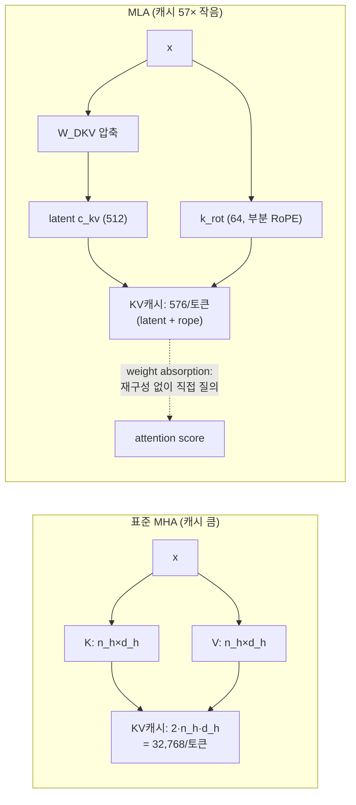

# 21 · MLA 기반 KV Cache 압축

## 요약 (3줄)
- MLA(Multi-head Latent Attention)는 K/V를 head별 full-rank로 저장하는 대신 **저차원 latent 벡터 하나로 공동 압축**해 KV 캐시를 수십 배 줄인다.
- 핵심 트릭은 (1) 압축된 latent만 캐시, (2) **부분 RoPE**(위치 정보용 소수 차원만 분리), (3) 추론 시 **weight absorption**으로 head 재구성 없이 latent에 직접 질의.
- colibrì는 GLM-5.2의 MLA를 C로 구현해 토큰당 **576 float**만 저장(GLM-5.2의 64 head 기준 32,768 대비 **57× 감소**).

## 배경 / 문제의식
- 표준 MHA는 토큰·레이어마다 `2·n_h·d_h` 원소의 KV를 저장 → 장문에서 폭증(DeepSeek-V2 예: 32K 컨텍스트에 단일 시퀀스가 ~128GB).
- MQA/GQA는 head를 공유해 KV를 줄이지만 성능이 MHA에 못 미침.
- **MLA**(DeepSeek-V2, arXiv:2405.04434)는 low-rank 공동 압축으로 **MHA급 성능 + MQA급 캐시**를 달성.
  - 근거: `data/topics/mla-kv/paper-deepseek-v2-arxiv-2405.04434.txt`, `paper-mha2mla-acl-2025.txt`.

## 개념 비교 (MHA vs MLA)

## MLA의 원리 (개념)
1. 입력 x를 `W_DKV`로 **latent `c_kv`(예: 512차원)** 로 압축 → 이것만 캐시.
2. 필요 시 `W_UK`, `W_UV`로 각 head의 k_nope/value를 재구성.
3. 위치 의존 성분은 분리(**decoupled/partial RoPE**): 소수 rope 차원(`d_h^R`)만 따로 두어 캐시. NoPE 차원은 압축·흡수 가능.
4. **Weight absorption**: `q·k_nope = (W_UK^T q)·c_kv` 항등식으로, 디코드 시 모든 context 토큰에 대해 k/v를 재구성하지 않고 query를 latent에 직접 투영.
   - DeepSeek-V2 설정: `d_c = 4·d_h = 512`, `d_h^R = d_h/2 = 64` → 576 원소/토큰/레이어. head 수에 무관하게 캐시 결정.

## colibrì의 구현 (코드 근거)
분석 대상: `external/colibri/c/glm.c`의 `attention()` (`:1113`).

### 1) latent KV 캐시 저장
- 토큰별로 `kv_a`로 압축 → latent `Lc`(정규화 후)와 rope 성분 `Rc`를 캐시에 저장.
- query도 `q_a`(LoRA) → `q_b`로 확장, rope 차원만 `rope_interleave`.
- 코드: `glm.c:1122`~`1135`. (`Lc`=`m->Lc[layer]`, `Rc`=`m->Rc[layer]`)
- README: 토큰당 **576 float** vs 32,768 → **57× 작음**(GLM-5.2는 64 head, GQA 없음). 근거: `README.md:27`.

### 2) 부분(interleaved) RoPE
- `rope_interleave` (`glm.c:632`)를 query의 rope 구간과 `Rc`(공유 k_rot)에만 적용 → NoPE/RoPE 분리.

### 3) Weight absorption (디코드 경로)
- `absorb`가 켜지고 `kv_lora<=512`이면(작은 S: 디코드/MTP 검증), k/v를 재구성하지 않고:
  - `qabs`에 `kv_b` row를 흡수(`qt_addrow`) → latent와 직접 내적으로 score 계산 → softmax → latent 가중합 후 `kv_b`로 context 투영.
  - 비용: `O(T·kv_lora)` (기존 `O(T·H·(nope+vh))` 대비 감소).
  - 코드: `glm.c:1191`~`1229`. 검증: TF 32/32, 생성 20/20 (README:33).
- S가 크면(prefill) 표준 경로: `kv_b`로 전체 토큰 k_nope+value를 한 번 재구성 후 causal attention — `glm.c:1230`~`1260`.

### 4) DSA sparse attention과의 결합
- lightning indexer가 per-query top-2048 causal key만 선택(`dsel`/`dnsel`) → attention이 선택된 key만 참조.
- 선택을 "전부 keep"으로 강제하면 dense와 token-exact 재현(검증). 코드: `glm.c:1136`~`1190`, `README.md:36`.

### 5) 압축 KV 지속화
- `.coli_kv`에 압축 MLA KV를 turn마다 append(~182KB/token) → 재시작 시 warm 복원, 재-prefill 없음. `kv_disk_append`(`:2095`)/`kv_disk_load`(`:2118`), `README.md:37`.

## 한계 및 트레이드오프
- absorption 경로는 `kv_lora<=512`, 작은 S에서만 활성(디코드 특화). 큰 배치는 재구성 경로 사용.
- 최적 `d_c`(latent 차원)에 대한 체계적 ablation은 원논문에도 부재(휴리스틱). 근거: `data/topics/mla-kv/` Xu'Blog 요약.
- 압축은 미세한 수치 차이를 유발할 수 있으나 colibrì는 흡수 경로를 dense와 exact 검증했다고 보고.

## 출처
- 코드: `external/colibri/c/glm.c:1113`(attention), `README.md:27`,`:33`,`:36`
- 논문: `data/topics/mla-kv/` (SOURCE.md 참조)
