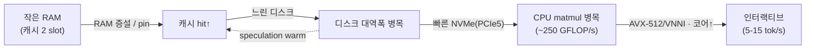

# 40 · 논리적 분석: 장점 · 단점 · Trade-off

colibrì 접근법을 시스템 관점에서 면밀히 분석한다. 근거는 `external/colibri/`(코드·README)와 `data/`(수집 자료).

## 요약 (3줄)
- colibrì의 본질은 **"메모리 용량 문제를 디스크 대역폭 문제로 치환"** 하는 것이다 — MoE의 희소 활성화 덕에 성립한다.
- 최대 장점은 **접근성**(H100급 없이 744B 구동)과 **의존성 제로**(단일 C), 최대 단점은 **낮은 처리량**(디스크 바운드).
- 모든 최적화는 결국 "디스크를 얼마나 안 읽느냐"(캐시 hit·양자화·speculation)로 수렴하며, 각 기법은 명확한 trade-off를 가진다.

## 1. 근본 통찰: 무엇을 무엇으로 바꾸는가
- 전통적 제약: **모델 크기 > 메모리 용량** → 실행 불가.
- colibrì의 치환: 안 쓰는 파라미터(routed expert)를 SSD에 두고, **필요 시 대역폭으로 지불**.
- 이 치환이 유효한 이유(MoE 희소성):
  - 744B 중 토큰당 활성 ~40B, 그중 토큰마다 바뀌는 routed expert는 ~11GB (`README.md:17`).
  - dense(~17B)는 재사용되므로 RAM 상주가 합리적.
- **결론**: colibrì는 "용량(GB) 병목"을 "대역폭(GB/s) 병목"으로 바꾼 것이다. 용량은 SSD로 값싸게 확장되지만, 대역폭은 느리다 → 이 한 문장에 모든 장단점이 파생된다.

## 2. 장점 (Strengths)

| # | 장점 | 근거 | 논리 |
|---|---|---|---|
| S1 | **극한의 접근성** | `README.md:5`,`:56` | 25GB RAM + NVMe로 프론티어급 744B 실행. GPU 불필요 |
| S2 | **의존성 제로 / 이식성** | `README.md:22`, `compat.h` | 단일 C 파일 + 헤더. BLAS·Python·GPU 런타임 불요. Linux/macOS/Windows 네이티브 |
| S3 | **비용 대비 규모** | `README.md:56` | "H100 팬 하나보다 싼 기계에서 정답 생성" |
| S4 | **정확성 우선 설계** | `README.md:26`,`:33` | transformers oracle에 token-exact 검증(TF 32/32, greedy 20/20) |
| S5 | **점진적 가속(학습형 캐시)** | `README.md:324`, `glm.c:2409` | `.coli_usage`로 hot expert를 학습·pin → 쓸수록 빨라짐 |
| S6 | **읽기 전용 스트리밍(SSD 수명)** | `README.md:58` | expert 읽기는 마모가 작음(쓰기 아님). swap만 피하면 됨 |
| S7 | **운영 편의(plan/doctor)** | `README.md:107`,`:116` | 실행 전 자원 계획·준비 점검을 read-only로 제공 |
| S8 | **표준 호환(OpenAI API)** | `README.md:171` | 기존 앱 연동 용이 |

## 3. 단점 (Weaknesses)

| # | 단점 | 근거 | 논리 |
|---|---|---|---|
| W1 | **낮은 처리량** | `README.md:53` | cold ~0.05–0.1 tok/s. 대화형으로는 느림 |
| W2 | **cold-start I/O 폭증** | `README.md:52` | 토큰당 ~11GB 랜덤 읽기(75층×8 expert) |
| W3 | **작은 RAM에서 캐시 무력화** | `README.md:398` | 24GB RAM은 2 slot/layer로 캐시 hit 낮음 → 디스크가 계속 병목 |
| W4 | **저장 공간 요구** | `README.md:48` | int4라도 ~370GB 로컬 NVMe 필요(네트워크/9p 불가) |
| W5 | **양자화 품질 불확실성** | `README.md:402` | int4 컨텍스트 62.5% (n=40, ±14pp) — 아직 결론 아님 |
| W6 | **비결정성(byte 재현성)** | `README.md:29` | shape 의존 정수 커널로 batched/GPU/MTP 경로가 스트림을 미세하게 바꿈 |
| W7 | **단일 시퀀스 실행** | `README.md:199` | 동시 요청은 큐잉(진짜 continuous batching 아님) |
| W8 | **CPU matmul 상한** | `README.md:372` | 캐시가 채워지면 이번엔 AVX2 커널 속도가 병목(≈250 GFLOP/s) |
| W9 | **가독성/유지보수** | `glm.c` ~2,400줄 단일 파일 | 이식성의 대가로 단일 파일 복잡도 |

## 4. Trade-off 심층 분석

각 최적화는 "디스크 읽기 감소"를 위해 **다른 자원을 지불**한다.

### T1. Expert LRU 캐시 크기 ↔ RAM
- 캐시를 키우면 hit↑ → 디스크 읽기↓ → 속도↑. 대가는 RAM.
- 자동 상한(`expert_avail`, `glm.c:2538`)이 OOM을 막지만, RAM이 작으면 근본적으로 hit이 낮다(W3).
- **결정 규칙**: 여유 RAM 전부를 캐시/pin에 투입하는 것이 거의 항상 이득(`README.md:320`).

### T2. 양자화 비트수(int2/4/8) ↔ 품질 · 전송량
- 낮은 비트 → expert 크기↓ → 전송량↓ → 속도↑. 대가는 정확도(W5).
- int4가 현재 스윗스팟(expert당 ~19MB). MTP head만은 **int8 필수**(int4면 speculation 붕괴, `README.md:67`).
- **비대칭 양자화 결정**: 같은 모델 안에서도 역할별로 비트를 달리 준다(expert=int4, MTP head=int8).

### T3. Speculative Decoding(MTP) ↔ cold 캐시
- warm 캐시에서는 유효 비용을 절반가량으로(2.2–2.8 tok/fw). 그러나 **cold에서는 검증 draft가 추가 expert를 라우팅**(~660→~1100 load/token, `README.md:29`) → 순 손해 가능.
- **조건부 이득**: speculation은 "캐시가 데워진 뒤" 켜야 이득. 자동 guard(<50% acceptance면 off)로 완화.

### T4. Prefetch(PILOT/WILLNEED) ↔ 디스크 포화도
- 예측 선반입은 compute와 I/O가 균형일 때만 이득. 디스크가 이미 포화면 중립~손해(`README.md:322`).
- **환경 의존**: 빠른 CPU + 중간 디스크에서 최대 효과.

### T5. Weight Absorption(MLA) ↔ 배치 크기
- 작은 S(decode/MTP 검증)에서는 k/v 재구성을 생략해 `O(T·kv_lora)`로 절감(`glm.c:1191`).
- 큰 S(prefill)에서는 재구성 경로가 더 효율 → `absorb` 자동 분기.
- **배치별 최적 경로 분기**가 핵심.

### T6. 정확성(재현성) ↔ 속도
- 최고 속도 설정(MTP on, CUDA expert, batched)은 byte-exact 재현성을 포기(W6).
- byte-exact가 필요하면 `DRAFT=0 IDOT=0 COLI_CUDA=0` → 느려짐.
- **용도별 선택**: 연구 재현 vs 실사용 속도.

### T7. GPU(CUDA expert tier) ↔ CPU 커널 성능
- expert를 매번 GPU로 올리면 디스크 병목이 PCIe 병목이 될 뿐(`README.md:239`) → resident tensor만 GPU.
- CPU가 강하면(AVX-512/VNNI) GPU tier 이득 ≈ 0%(`README.md:395`, #101). GPU는 CPU가 약할 때만 값어치.
- **GPU는 기본 가속기가 아니라 조건부 도구**.

## 5. 병목 이동 지도 (핵심 멘탈 모델)

- 실측 근거: 9950X 디스크 교체로 66% disk→57% matmul 전환(`README.md:392`), 9800X3D는 10GB/s에서도 여전히 disk-bound(`README.md:395`).
- **교훈**: colibrì 튜닝은 "지금 병목이 어디인가"를 먼저 측정(`iobench`, profile line)하고 그 병목을 공략하는 순서로 진행해야 한다.

## 6. 언제 쓰고, 언제 쓰지 말아야 하나
- **적합**: 로컬/오프라인 프라이버시, 배치·비대화형 작업, 고가 GPU 부재, 실험·연구, "느려도 되는" 고품질 답.
- **부적합**: 저지연 대화형 프로덕션, 고동시성 서빙, RAM·NVMe 여유 없는 환경, byte-exact 대량 재현이 필수인 파이프라인.

## 출처
- 코드: `external/colibri/c/glm.c`, `external/colibri/c/olmoe.c`, `README.md`
- 자료: `../data/` (SOURCE.md들)
