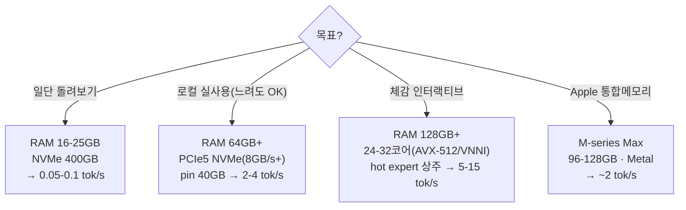

# 50 · 필요 자원 분석

colibrì로 GLM-5.2(744B, int4)를 구동할 때의 자원 요구를 항목별로 정리하고, 하드웨어 등급별 기대치를 제시한다.

## 요약 (3줄)
- **필수 4요소**: (1) 로컬 NVMe ~370GB, (2) RAM ≥16GB(권장 클수록 좋음), (3) AVX2/NEON CPU + OpenMP, (4) OS(Linux/WSL2/macOS/Win11).
- 속도를 좌우하는 두 축은 **RAM 용량**(캐시 hit)과 **NVMe 랜덤 읽기 대역폭**이며, 그 다음이 **CPU matmul**.
- 최소 사양은 "돌아간다", 실사용 체감은 "RAM·NVMe·코어 셋을 함께 올려야" 나온다.

## 1. 저장(Storage)
| 항목 | 요구 | 근거 |
|---|---|---|
| 모델 용량(int4 컨테이너) | **~370GB** 로컬 여유 | `README.md:48` |
| 변환 중 임시(선택) | 샤드 단위(~5GB씩) 처리, 756GB 동시 불요 | `README.md:42` |
| 파일시스템 | ext4/NTFS/APFS 등 **로컬**. 네트워크/9p 마운트 금지 | `README.md:336` |
| 성능 지표 | **랜덤 읽기 대역폭(GB/s)**, 19MB×64 병렬 (`iobench`) | `README.md:343` |
- 디스크 성능 측정: `./iobench <shard> 19 64 8 1`(O_DIRECT, 실제 cold 수치) — `README.md:346`.
- cold decode는 토큰당 ~11GB를 읽으므로 **디스크 대역폭이 cold tok/s의 상한**을 사실상 결정.

## 2. 메모리(RAM)
| 항목 | 값 | 근거 |
|---|---|---|
| dense 상주(int4) | ~9.9GB | `README.md:49` |
| 최소 실행 | ≥16GB | `README.md:336` |
| chat 중 peak RSS(자동 캡) | ~20GB @ 25GB 머신 | `README.md:51` |
| 캐시/pin 여유 | 클수록 hit↑ (선형 이득) | `README.md:320` |
- RAM은 **expert LRU 캐시 + hot pin**의 크기를 결정 → 사실상 "cold 읽기를 얼마나 무료 캐시 hit으로 바꾸느냐".
- 자동 캡(`glm.c:2538`, `mem_available_gb :2505`)이 OOM을 막고 `MemAvailable`에서 안전 상한 산정.
- **작은 RAM의 함정**: 24GB에서는 2 slot/layer로 캡되어, 디스크가 빨라도 cold 유지(`README.md:398`).

## 3. 연산(CPU / 선택적 GPU)
| 항목 | 요구 | 근거 |
|---|---|---|
| 명령어셋 | x86 **AVX2**(정수 dot) 또는 ARM **NEON**(자동 fallback) | `Makefile`, `README.md:32` |
| 병렬 | **OpenMP**(gcc libgomp / clang+libomp) | `Makefile:7-19` |
| matmul 상한 | AVX2 커널 ~250 GFLOP/s, 토큰당 ~80 GFLOP | `README.md:372` |
| 가속(선택) | CUDA(resident tensor/hot expert tier), Metal(커뮤니티) | `README.md:239`,`:386` |
- GPU는 **조건부**: CPU가 약할 때만 이득. AVX-512/VNNI CPU면 GPU expert tier ≈ 0%(`README.md:395`).

## 4. OS / 툴체인
- Linux, WSL2, macOS, **Windows 11 네이티브(MinGW-w64)** 지원(`README.md:133`).
- 런타임은 순수 C. **Python은 변환기/서버/doctor 등 도구에서만**(우리 환경은 uv로 관리).
- 변환(`coli convert`)만 torch/safetensors/huggingface_hub/numpy 필요(`README.md:90`).

## 5. 하드웨어 등급별 기대치 (예측 + 실측)

> 예측치는 back-of-envelope(`README.md:365`), 실측치는 커뮤니티 벤치(`README.md:377`).

| 등급 | 사양 예 | 기대 tok/s | 성격 | 근거 |
|---|---|---|---|---|
| 최소 | 25GB RAM, ~1GB/s NVMe(WSL2 VHDX) | 0.05–0.1 (cold) | 검증된 baseline · 매우 느림 | `README.md:369` |
| 입문 Apple | M4 Pro, 48GB, Metal | ~0.30 | 소형 RAM에서도 CPU 대비 개선 | `README.md:388` |
| 중급 | 네이티브 Linux, PCIe4 NVMe(3–5GB/s), 32GB | ~0.5–1 | 실용 하한 | `README.md:370` |
| 고급 Apple | M5 Max, 128GB unified, Metal, pin 40GB+ | ~1.8–2.1 | 현재 최속 datapoint | `README.md:386` |
| 고급 x86 | PCIe5 NVMe(8–12GB/s), 64GB, pin ~40GB | ~2–4 | matmul 바운드로 이동 | `README.md:371` |
| 대용량 RAM | 128–430GB RAM, hit 98% | ~1–4 | 디스크 제거 → RAM·matmul 바운드 | `README.md:396` |
| 인터랙티브 | 위 + 24–32코어 또는 AVX-512/VNNI | ~5–15 | 커널이 승수 | `README.md:373` |

## 6. 실전 권장 구성(용도별)



## 7. 우리 로컬 환경의 판정
- Apple Silicon + libomp로 **엔진 빌드/`coli doctor`는 성공**했으나(`30-local-run-notes.md`),
  **실제 추론은 미실시**: ~370GB int4 가중치를 둘 NVMe 여유가 없어서다(사용자 확인).
- 이는 W4(저장 요구)의 직접 사례. 엔진·툴체인은 준비 완료 상태이므로, NVMe 확보 시 즉시 실행 가능.

## 8. 자원 계획 자동화(도구)
```bash
# 헤더만 읽어 dense/expert footprint, RAM reserve, 캐시 cap, VRAM tier를 산정
COLI_MODEL=/nvme/glm52_i4 uv run --no-sync python external/colibri/c/coli plan --json
# 실행 전 준비 점검(모델·config·토크나이저·RAM·CUDA)
COLI_MODEL=/nvme/glm52_i4 uv run --no-sync python external/colibri/c/coli doctor --json
```

## 출처
- `external/colibri/README.md`(§Honest numbers, §predictions, §Community benchmarks), `Makefile`, `glm.c`
