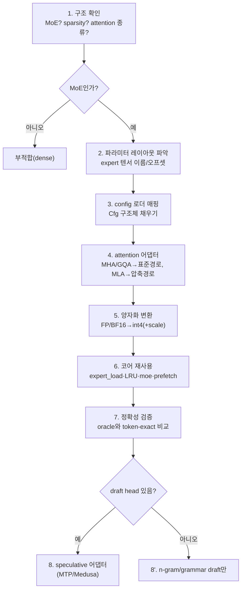

# 60 · 타 모델 적용 방안

colibrì의 "디스크 스트리밍" 접근을 다른 모델에 적용하려면 무엇이 필요한지 분석한다.
저장소 자체가 이미 **두 모델(GLM-5.2, OLMoE)** 을 같은 코어로 지원한다는 점이 출발점이다.

## 요약 (3줄)
- 스트리밍의 전제는 **MoE 희소 활성화**다 — 이것만 있으면 attention 방식(MHA/GQA/MLA)과 무관하게 코어가 재사용된다(`olmoe.c`가 증거).
- MLA/DSA/MTP는 **모델 고유 최적화**이며, 대상 모델이 지원할 때만 얹는 선택 레이어다.
- 적용 난이도는 "모델 구조가 얼마나 표준적인가 + 파라미터 레이아웃이 얼마나 명확한가"로 결정된다.

## 1. 저장소가 증명하는 일반화 (GLM-5.2 vs OLMoE)

| 구성요소 | GLM-5.2 (`glm.c`) | OLMoE (`olmoe.c`) | 성격 |
|---|---|---|---|
| Attention | MLA (q/kv-LoRA, 부분 RoPE) + DSA sparse | 표준 MHA/GQA(`n_kv_heads`) | **모델 고유** |
| KV 압축 | 압축 latent(576/token) | 일반 K/V 캐시 | 모델 고유 |
| Speculative | native MTP head(int8) | 없음 | 모델 고유(선택) |
| **Expert 스트리밍** | ✅ pread + 레이어별 LRU | ✅ pread+fadvise + 레이어별 LRU | **공통 코어(재사용)** |
| Expert 양자화 | int2/4/8, dequant-on-use | int8(1B/param), dequant-on-use | 공통 |
| 병렬 | OpenMP matmul(no BLAS) | OpenMP matmul(no BLAS) | 공통 |

- `olmoe.c:2-3` 주석: "GLM-5.2로 스케일하기 전에 **코어를 검증**하는 Stage A".
- `olmoe.c:32-35` 주석: expert를 int8로 양자화(4B→1B/param)하는 것이 "GLM-5.2를 15GB에 담는 메커니즘".
- **결론**: 스트리밍+LRU+양자화 코어는 이미 모델 독립적으로 재사용되고 있으며, 나머지(attention/spec)는 어댑터.

## 2. 어떤 모델이 잘 맞는가 (적합성 체크리스트)

| 조건 | 이유 | 이상적 |
|---|---|---|
| **MoE 구조** | 스트리밍의 전제(희소 활성화) | 필수 |
| **높은 sparsity**(활성/전체 비율 낮음) | 토큰당 읽을 expert↓ → 빠름 | 활성 5–10% 이하 |
| **fine-grained experts**(작은 expert 다수) | LRU·prefetch 입도 세밀, 캐시 효율↑ | 수백 expert/layer |
| **양자화 내성** | int4로 크기↓·품질 유지 | int4에서 품질 안정 |
| **KV 절감 attention**(MLA/GQA) | 긴 컨텍스트 RAM 절감(스트리밍과 독립적 이득) | MLA 최상, GQA 차선 |
| **명확한 파라미터 레이아웃** | expert 텐서를 파일 오프셋으로 pread | safetensors, expert별 분리 |
| **native draft head**(MTP/Medusa/EAGLE) | speculation으로 처리량 보완 | 있으면 가점 |

- Dense 모델은 부적합: 매 토큰 전체 파라미터가 활성 → 스트리밍하면 토큰당 "전체 모델"을 읽어야 함(치명적).
- 후보 계열: DeepSeek-V2/V3(MLA+MoE), Mixtral/OLMoE(GQA+MoE), Qwen-MoE 등.

## 3. 적용 절차 (신규 모델 온보딩)

### 각 단계의 재사용/신규 구분
- **재사용(공통 코어)**: `expert_load`(`glm.c:897`), LRU 캐시/batch-union/`moe`(`:1270`), prefetch(`:1070`,`:1460`), 양자화 커널(`:475`,`:512`), RAM 안전 캡(`:2538`), safetensors 로더(`st.h`), 토크나이저(`tok.h`).
- **신규(모델 어댑터)**: config 매핑(`load_cfg`), attention(`attention` 대체), expert 텐서 이름 규칙(`expert_load`의 `nm[]`), 양자화 변환 스크립트(`tools/convert_*`), (선택) draft head.

## 4. 세부 적용 포인트

### 4.1 파라미터 레이아웃 / 변환
- expert 가중치가 **파일에서 개별 텐서로 분리**돼 있어야 offset pread가 가능(`glm.c:905`의 이름 규칙 `model.layers.%d.mlp.experts.%d.<proj>.weight`).
- 변환기는 **샤드 단위 스트리밍 변환**(다운로드→dequant→int4 재양자화→삭제)으로 원본 전체를 동시에 두지 않도록(`convert_fp8_to_int4.py`, `README.md:42`) 설계 권장.
- per-row scale + int4/int8 컨테이너로 통일(`quantize_rows`, `glm.c:512`).

### 4.2 Attention 어댑터
- **MLA**: 압축 KV + weight absorption 경로 재사용 가능(`glm.c:1113`). 대상 모델이 MLA면 거의 그대로.
- **GQA/MHA**: `olmoe.c`의 표준 K/V 경로 참고. KV 절감은 스트리밍과 독립이므로, GQA만으로도 실행은 가능(RAM만 더 씀).
- 부분 RoPE·정규화 위치 등 세부는 모델별로 맞춰야 함.

### 4.3 Speculative(선택)
- 대상 모델에 **draft head가 있으면** MTP식 어댑터로 큰 이득(`glm.c:1589`). head는 정밀도 민감(int8 권장).
- 없으면 **n-gram/grammar draft**만으로도 부분 이득(`glm.c:1570`,`:1699`) — 특히 구조화 출력(JSON)에서 유효.

### 4.4 정확성 검증(필수)
- 소형 랜덤 fixture 또는 tiny-oracle로 **token-exact 비교**(TF/greedy)를 먼저 통과시키고 대형으로 확장(`olmoe.c` Stage A 방식, `README.md:26`).

## 5. 접근법 자체를 다른 프레임워크로 이식할 때
- colibrì 코드를 쓰지 않고 **아이디어만** 가져올 경우(예: llama.cpp/vLLM 확장):
  - 핵심은 (a) expert offload + on-demand load, (b) 라우팅 예측 prefetch, (c) 레이어별 LRU + hot pin, (d) 역할별 비대칭 양자화.
  - 선행연구와 정합: LRU·prefetch·batch 재사용은 MoE offloading 문헌의 표준 기법(`data/topics/moe-streaming/`의 arXiv:2312.17238, 2512.16473, 2602.03495).
  - colibrì의 차별점은 **SSD를 1차 경로로** 삼고 GPU/PCIe를 부차로 둔 것, 그리고 순수 C 무의존 구현.

## 6. 리스크 / 주의
- 양자화 품질은 모델마다 다름 → int4가 안 통하면 int8/그룹 스케일로 조정(용량↑).
- expert 크기가 크면(coarse-grained) 캐시 입도가 나빠져 hit이 낮아짐.
- 파라미터가 하나의 큰 텐서로 뭉쳐 있으면(분리 안 됨) offset pread 설계가 어려움 → 변환 단계에서 재배치 필요.
- 라이선스: 대상 모델 가중치/코드 라이선스 확인 필수.

## 출처
- 코드: `external/colibri/c/glm.c`, `external/colibri/c/olmoe.c`, `tools/convert_fp8_to_int4.py`
- 선행연구: `../data/topics/moe-streaming/`(SOURCE.md), `../data/topics/mla-kv/`, `../data/topics/speculative-decoding/`
