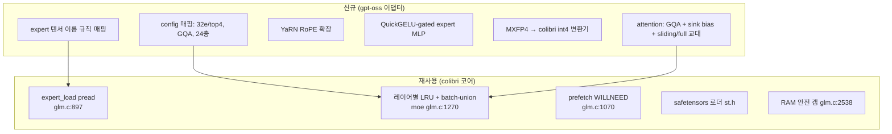

# 61 · 적용 설계서: gpt-oss-20b

colibrì 코어를 **gpt-oss-20b**(OpenAI open-weight MoE)에 이식하기 위한 구체 설계.
전제 프레임워크는 [`60`](./60-applying-to-other-models.md)의 온보딩 7단계.

## 요약 (3줄)
- gpt-oss-20b는 **MoE라 아키텍처상 적합**하나(32 expert top-4, GQA, 네이티브 4비트), 4비트로 **≈16GB면 통째로 RAM 적재**가 가능하다.
- 따라서 실익은 "대형 모델 스트리밍"이 아니라 **순수 C·무의존 포터블 엔진** 또는 **8GB급 초저사양 구동**에 있다(→ 스트리밍은 옵션).
- 이식의 실제 난이도는 **MXFP4 양자화 변환**, **attention sinks(softmax 분모 학습 bias)**, **sliding-window/dense 교대**, **YaRN**, GQA 경로 정합이며, expert 스트리밍 코어는 거의 그대로 재사용.

## 1. 대상 사양 (확인된 아키텍처)
| 항목 | 값 | 비고 |
|---|---|---|
| 총/활성 파라미터 | 20.9B / 3.6B | MoE 가중치가 90%+ |
| 레이어 | 24 | decoder-only |
| hidden_size | 2880 | |
| experts / top-k | 32 / 4 | 레이어당 |
| attention | GQA: 64 Q-head, 8 KV, head_dim 64 | |
| attention sinks | softmax 분모에 학습 bias(off-by-one) | 특수 |
| 위치 | RoPE + YaRN(128k) | |
| 패턴 | sliding window(128) ↔ full dense 교대 | GPT-3식 |
| norm / act | RMSNorm / QuickGELU gated | |
| 양자화 | MoE weight MXFP4(4.25 bit/param) | 네이티브 |
| vocab | 201,088 | |
- 근거: `data/topics/apply-gpt-oss/SOURCE.md` (OpenAI 모델카드 arXiv:2508.10925, HF, NVIDIA).

## 2. 적합성 판정
| 기준(`60 §2`) | gpt-oss-20b | 판정 |
|---|---|---|
| MoE 구조 | 예(32e top-4) | ✅ |
| sparsity | 3.6B/20.9B ≈ 17% 활성 | △ (GLM-5.2의 5%보다 높음 → 토큰당 읽을 비중↑) |
| fine-grained | 32 expert(중간 입도) | △ |
| 양자화 내성 | MXFP4 네이티브 학습 | ✅ |
| KV 절감 attention | GQA(8 KV) | ✅ (MLA만큼은 아님) |
| 분리된 expert 레이아웃 | HF safetensors | ✅ (변환 필요) |
| native draft head | 없음 | ➖ (n-gram/grammar draft만) |
- **핵심 반전(용량)**: MXFP4 4비트 기준 **≈16GB**. 대부분의 타깃에서 RAM 전량 적재가 더 빠르다.
  스트리밍은 RAM<~10GB인 극저사양에서만 실질 의미.

## 3. 재사용 vs 신규 (매핑)

## 4. 단계별 설계

### 4.1 Config 매핑 (`load_cfg` 대응)
- colibri `Cfg`에 gpt-oss 필드 매핑: `hidden=2880`, `n_layers=24`, `n_experts=32`, `topk=4`, `n_heads=64`, `n_kv_heads=8`, `head_dim=64`, `vocab=201088`.
- gpt-oss는 **모든 레이어가 MoE**(GLM처럼 first-3-dense 예외 없음) → dense_mlp 분기 제거/우회.

### 4.2 Attention 어댑터 (가장 큰 신규 작업)
`olmoe.c`의 표준 GQA 경로를 베이스로 다음을 추가:
1. **GQA**: 8 KV head를 64 Q head가 공유(그룹 8). KV 캐시는 `8×head_dim`만 저장 → colibri의 표준(비MLA) K/V 캐시 사용.
2. **Attention sinks**: softmax 분모에 head별 학습 bias 추가(정규화 시 "아무데도 attend 안 함" 허용). `attention()`의 softmax 직전에 sink 항 삽입.
3. **Sliding window / full 교대**: 짝수/홀수 레이어로 window(128)와 full을 번갈아. per-layer 플래그로 causal 마스크 범위 제한.
4. **YaRN**: RoPE 스케일링 파라미터로 128k 확장. `rope_interleave`에 YaRN 스케일 적용.
- MLA/DSA/weight-absorption 경로는 **미사용**(gpt-oss는 MLA 아님).

### 4.3 Expert MLP
- QuickGELU-gated GLU: `down( quickgelu(gate(x)) * up(x) )`. colibri `moe()`의 SiLU를 QuickGELU로 교체(활성함수 스위치).
- expert 3텐서(gate/up/down)를 `expert_load`가 pread → 기존 batch-union·LRU 그대로.

### 4.4 양자화 변환 (MXFP4 → colibri int4)
- gpt-oss MoE 가중치는 **MXFP4**(microscaling FP4: 32개 원소 블록당 공유 8-bit exponent scale).
- colibri 컨테이너는 **per-row int4 + float scale**(`quantize_rows` glm.c:512).
- 변환기 설계(`tools/convert_gptoss_to_int4.py` 신규):
  1. HF safetensors 샤드 스트리밍 로드(한 번에 하나).
  2. MXFP4 → float dequant(블록 scale 적용).
  3. colibri int4로 재양자화(per-row scale) + `.qs` scale 파일 생성.
  4. expert별 텐서를 offset이 명확하도록 기록 → 샤드 삭제(용량 관리).
- **주의**: 4.25bit→4bit 재양자화는 미세 품질 손실 가능 → OLMoE식 fp16 vs int4 A/B로 측정 권장.

### 4.5 Speculative (선택)
- gpt-oss는 native MTP/Medusa head **없음** → `mtp_draft` 미적용.
- 대신 **n-gram draft**(`glm.c:1570`) + **grammar draft**(`:1699`, JSON/함수호출)로 부분 이득.
- 추후 EAGLE류 draft head를 별도 학습해 붙이는 것은 향후 과제.

## 5. 검증 계획 (필수, token-exact)
1. `transformers`로 gpt-oss-20b tiny/부분 oracle 생성(teacher-forcing 로짓 저장).
2. 포팅 엔진으로 동일 입력 → **TF 32/32, greedy 20/20** 일치 목표(GLM 검증 방식, `README.md:26`).
3. 실패 시 격리 순서: attention sink → sliding-window 마스크 → YaRN → MXFP4 dequant.
4. 양자화 품질: OLMoE 하네스로 int4 vs 원본 A/B.

## 6. 자원 추정 (본 접근 적용 시)
| 항목 | 값 | 논리 |
|---|---|---|
| 디스크(int4) | ~11–12GB | 20.9B × ~0.5B/param(int4) |
| RAM 전량 적재 | ~14–16GB | **스트리밍 없이도 가능** |
| RAM 스트리밍 모드 | dense 상주 ~2–3GB + expert 캐시 | RAM<10GB 초저사양용 |
| 속도 | 전량 적재 시 디스크 무관, matmul 바운드 | 스트리밍보다 빠름 |
- **권장**: 일반 환경은 **전량 적재 모드**(colibri를 단순 포터블 C 엔진으로). 스트리밍은 RAM 극빈 환경에서만.

## 7. 리스크
- attention sinks + sliding-window + YaRN 3종이 동시 정확히 맞아야 token-exact 통과(디버깅 난이도↑).
- MXFP4 재양자화 품질 미검증.
- 스트리밍의 ROI가 낮음(모델이 작음) → "왜 스트리밍인가"에 대한 목적을 극저사양/포터빌리티로 명확히 한정해야 함.

## 출처
- 아키텍처: `data/topics/apply-gpt-oss/SOURCE.md`
- 코어 코드: `external/colibri/c/glm.c`, `olmoe.c`
