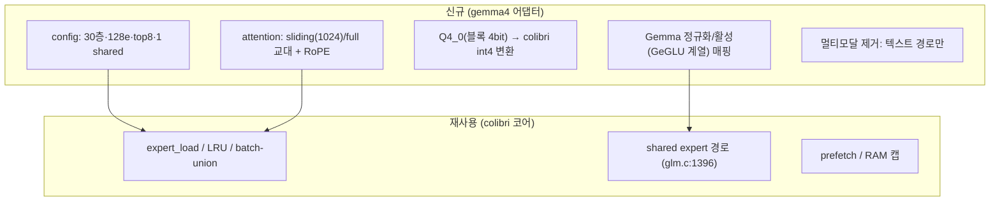

# 62 · 적용 설계서: gemma4 (31B) — 적합성 판정 포함

요구 대상은 "gemma4 31B"이나, **Gemma 4 31B는 Dense 모델**이다.
colibrì의 본질(expert 디스크 스트리밍)은 **MoE 전용**이므로, 먼저 적합성부터 판정하고 대안을 제시한다.

## 요약 (3줄)
- **Gemma 4 31B = Dense → colibrì 스트리밍 부적합**: 스트리밍할 "expert"가 없고, dense를 스트리밍하면 토큰마다 전체 모델을 읽어야 해 비현실적이다.
- 같은 계열 **Gemma 4 26B-A4B는 MoE**(25.2B/3.8B 활성, 128e 8활성+1 shared)라 **스트리밍 대상이 될 수 있다**.
- 단, 26B-A4B도 4비트로 **≈14GB면 RAM 전량 적재**가 가능하고 **멀티모달(비전 인코더)** 이라, colibrì 적용은 "텍스트 전용·초저사양·포터블 C 엔진" 목적으로 한정된다.

## 1. 아키텍처 확인 (Gemma 4 계열)
| 모델 | 구조 | 총/활성 | 레이어 | expert | 특이 | 4bit 용량 |
|---|---|---|---|---|---|---|
| **Gemma 4 31B** | **Dense** | 31B / 31B(전량) | — | 없음 | 최고 품질·파인튜닝 기반 | 17.5GB |
| **Gemma 4 26B-A4B** | **MoE** | 25.2B / 3.8B | 30 | 128 총, **8 활성 + 1 shared** | 저지연 지향 | 14.4GB |
| Gemma 4 12B (Unified) | Dense | 12B | — | 없음 | 인코더리스 멀티모달 | 6.7GB |
| E2B / E4B | Dense(per-layer embed) | 5B/8B(effective 2.3/4.5) | — | 없음 | 모바일/엣지 | 2.9/4.5GB |
- 공통: RMSNorm, RoPE, **sliding window(26B: 1024) ↔ full 교대**, 멀티모달(text+image, 비전 인코더 ~550M), 컨텍스트 256K, Apache-2.0.
- 근거: `data/topics/apply-gemma/SOURCE.md`(Gemma 4 기술리포트 arXiv:2607.02770, 모델카드, HF).

## 2. 적합성 판정 (핵심)

### 2.1 Gemma 4 31B (Dense) — ❌ 스트리밍 부적합
- colibrì 스트리밍은 "토큰당 소수 expert만 읽는다"는 MoE 희소성에 의존한다(`60 §2 원칙 1`).
- Dense는 **모든 파라미터가 매 토큰 활성** → 디스크에서 읽는다면 토큰마다 전체(17.5GB@int4)를 읽어야 함 → cold tok/s가 GLM-5.2보다도 나쁜 최악의 시나리오.
- **결론**: colibrì 코어를 31B Dense에 적용하는 것은 **권장하지 않음.**
  - 대안 A: 31B는 그냥 **전량 RAM/VRAM 적재**(17.5GB@int4)로 일반 엔진(llama.cpp 등) 사용.
  - 대안 B: 굳이 "메모리보다 큰 dense"를 디스크로 돌리려면 이는 **layer-streaming**(colibrì가 하지 않는 별개 기법)이며, 대화형 디코드에는 부적합.
  - 대안 C(권장): **26B-A4B MoE로 대체**하여 스트리밍 논의를 진행.

### 2.2 Gemma 4 26B-A4B (MoE) — ✅ 아키텍처 적합 (조건부 실익)
| 기준(`60 §2`) | 26B-A4B | 판정 |
|---|---|---|
| MoE | 예(128e, 8활성+1 shared) | ✅ |
| sparsity | 3.8B/25.2B ≈ 15% | △ |
| fine-grained | 128 expert(세밀) | ✅ |
| shared expert | 1개(GLM과 동일 패턴) | ✅ (colibri shared-expert 경로 재사용) |
| 양자화 내성 | Q4_0 공식 제공 | ✅ |
| KV 절감 | sliding window + (GQA 계열) | ✅ |
| 멀티모달 | 비전 인코더 포함 | ⚠️ 텍스트 전용 포팅 필요 |
- **용량 반전**: 4비트 ≈14GB → RAM 전량 적재가 일반적으로 더 빠름. 스트리밍은 RAM 극빈 환경에서만.

## 3. 26B-A4B 적용 설계 (MoE 대상)

### 3.1 Config 매핑
- `n_layers=30`, `n_experts=128`, `topk=8`, shared expert=1, sliding window=1024.
- colibri의 shared-expert 경로(`glm.c:1396`)와 first-N-dense 패턴을 Gemma의 레이어 구성에 맞게 조정.

### 3.2 Attention
- sliding window(1024) ↔ full 교대 마스크. Gemma는 RoPE + (계열에 따라) local/global 교대.
- MLA 아님 → 표준 K/V 캐시(`olmoe.c` 경로) 사용. weight absorption 미적용.

### 3.3 양자화 변환 (Q4_0 → colibri int4)
- Gemma 공식 Q4_0(32원소 블록당 1 scale, 4bit)를 dequant → colibri per-row int4로 재양자화.
- 신규 `tools/convert_gemma_to_int4.py`: HF safetensors 스트리밍 → dequant → int4 컨테이너 + `.qs`.

### 3.4 멀티모달 처리
- 비전 인코더(~550M)와 image 토큰 경로는 **텍스트 전용 포팅에서 제외**.
- 순수 텍스트 생성만 대상(colibri는 text-only 엔진, `README.md:199`).

### 3.5 Speculative
- Gemma4 native draft head 명시 없음 → n-gram/grammar draft만(gpt-oss와 동일 상황).

## 4. 검증 계획
- 31B Dense: colibri 적용 대상 아님 → 검증 불필요(대안 엔진 사용).
- 26B-A4B: `transformers` oracle로 **token-exact**(TF/greedy) 통과 후 확장. 격리 순서: sliding-window 마스크 → shared expert 합산 → 양자화.

## 5. 자원 추정
| 대상 | 디스크(int4) | RAM 전량 적재 | 스트리밍 실익 |
|---|---|---|---|
| 31B Dense | ~17.5GB | ~18–20GB | ❌ (부적합) |
| 26B-A4B MoE | ~14GB | ~14–16GB | 조건부(RAM<10GB일 때만) |

## 6. 권고 (경영 판단)
1. **"gemma4 31B에 colibrì 적용"은 기술적으로 부적절**하다(Dense). 이 점을 명확히 보고해야 한다.
2. 스트리밍을 꼭 gemma 계열로 실험하려면 **26B-A4B(MoE)** 를 대상으로 한다.
3. 다만 두 경우 모두 **모델이 작아 스트리밍의 본질적 이득이 낮다** → colibrì 적용 목적을 "포터블 C 엔진 / 초저사양 구동"으로 한정하거나, 스트리밍 검증은 **GLM-5.2처럼 RAM에 안 들어가는 대형 MoE**로 하는 것이 논리적으로 옳다(`70 §D2`).

## 출처
- 아키텍처: `data/topics/apply-gemma/SOURCE.md`
- 코어 코드: `external/colibri/c/glm.c`, `olmoe.c`
