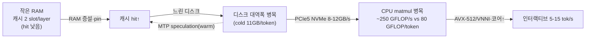

# 70 · 경영·기술 통합 브리프 (colibrì)

> 이 문서는 [`40`](./40-analysis-tradeoffs.md)·[`50`](./50-resource-requirements.md)·[`60`](./60-applying-to-other-models.md)을 **종합**한 의사결정용 브리프다.
> 요구에 따라 **요약하지 않고**, 세 분석의 판단 근거·수치·조건을 그대로 통합해 결론까지 연결한다.

---

## A. 한 문장 정의와 그 함의
colibrì는 **"모델 용량(GB) 병목을 디스크 대역폭(GB/s) 병목으로 치환한 순수 C MoE 추론 엔진"** 이다.
이 치환이 성립하는 유일한 이유는 **MoE 희소 활성화**다: 744B 중 토큰당 ~40B만 활성, 그중 토큰마다 바뀌는 routed expert는 ~11GB뿐이며, dense(~17B)는 재사용되므로 RAM에 상주시킨다(`40 §1`, `README.md:17`).
→ **따라서 colibrì의 모든 장점·단점·비용은 이 한 치환에서 파생된다.** 용량은 SSD로 값싸게 무한 확장되지만, 대역폭은 느리고, 그 느림을 캐시·양자화·speculation으로 되사오는 구조다.

---

## B. 경영 관점: 무엇을 사고 무엇을 파는가

### B1. 이 기술이 파는 가치 (왜 존재하는가)
- **자본 구조의 전환**: GPU(HBM) 자본지출 → 소비자 NVMe+RAM 운영비. "H100 팬 하나보다 싼 기계에서 744B 정답 생성"(`README.md:56`).
- **데이터 주권**: 완전 로컬/오프라인 추론 → 프라이버시·규제 대응(외부 API 미전송).
- **의존성 리스크 제거**: 단일 C, BLAS·Python·GPU 런타임 불요, Linux/macOS/Win11 네이티브(`40 §2 S2`).
- **점진적 자산화**: 사용할수록 hot expert가 학습·상주되어 빨라짐(`.coli_usage`, `40 §2 S5`).

### B2. 이 기술이 파는 것이 아닌 것 (오해 방지)
- **속도가 아니다.** cold ~0.05–0.1 tok/s(개발 baseline). 대화형 실시간·고동시성 서빙은 목표가 아니다(`40 §3 W1/W7`).
- **완성 제품이 아니다.** 1인 프로젝트, 품질 벤치(int4 62.5% @ n=40, ±14pp)는 아직 결론 전(`40 §3 W5`, `README.md:402`).
- **범용 최적해가 아니다.** dense 모델·소용량 모델에는 스트리밍 이점이 사라진다(뒤 D절).

### B3. 채택 의사결정 매트릭스
| 상황 | 판단 | 근거 |
|---|---|---|
| 고가 GPU 없음 + 오프라인 + "느려도 되는" 고품질 | **채택** | S1·S3, `50 §5` |
| 배치/비대화형(문서요약·코드생성·에이전트 장기작업) | **채택** | 처리량보다 규모·품질 우선 |
| 저지연 대화형 프로덕션 / 고동시성 | **비채택** | W1·W7 |
| RAM·로컬 NVMe(~370GB) 확보 불가 | **비채택** | W4, `50 §1` (← 우리 로컬의 현재 상태) |
| byte-exact 대량 재현이 필수인 파이프라인 | **조건부**(`DRAFT=0 IDOT=0 COLI_CUDA=0`, 속도 희생) | W6, T6 |

---

## C. 기술 관점: 성능은 "지금 병목이 어디냐"의 함수

colibrì 성능은 단일 수치가 아니라 **병목 이동의 문제**다. 자원을 올릴 때 병목이 순차적으로 옮겨간다.

### C1. 세 축의 우선순위와 실측 근거
1. **RAM 용량**(1순위): 캐시/pin 크기를 결정. 24GB는 2 slot/layer로 캡되어 디스크가 빨라도 cold(`40 §3 W3`, `README.md:398`).
2. **NVMe 랜덤 읽기 대역폭**(2순위): cold tok/s의 상한. 9950X에서 디스크만 ×5.8 교체 → 토큰 ×2.9, 병목이 66% disk→57% matmul로 전환(`README.md:392`).
3. **CPU matmul**(3순위): 캐시가 채워진 뒤의 상한. 10GB/s NVMe라도 AVX-512 CPU면 여전히 disk-bound이며 이때 GPU expert tier 이득 ≈0%(`README.md:395`).

### C2. 최적화별 trade-off (되사오는 비용)
| 최적화 | 디스크를 줄이는 대가로 지불하는 것 | 조건 |
|---|---|---|
| Expert LRU 캐시↑ | RAM | 여유 RAM 전부 투입이 거의 항상 이득(T1) |
| 양자화 int2/4/8 | 정확도 | int4 스윗스팟, **MTP head만 int8 필수**(T2, `README.md:67`) |
| MTP speculative | cold에서 추가 expert 읽기(~660→1100/token) | **캐시 warm 후에만 이득**(T3, `README.md:29`) |
| Prefetch(PILOT) | 계산 자원 | 디스크 미포화·CPU 여유 시만(T4) |
| Weight absorption | 코드 복잡도 | 작은 배치(decode/검증)에서만 활성(T5) |
| GPU expert tier | VRAM·PCIe | **CPU가 약할 때만** 값어치(T7) |
| 최고 속도 설정 | byte-exact 재현성 | 용도별 선택(T6) |

### C3. 필요 자원(구동 4요소, `50 §1~4`)
- 저장: 로컬 NVMe **~370GB**(ext4/NTFS/APFS, 네트워크 마운트 금지). 지표는 **랜덤 읽기 GB/s**.
- 메모리: dense 상주 9.9GB, 최소 16GB, chat peak ~20GB@25GB머신. **클수록 선형 이득**.
- 연산: x86 AVX2 또는 ARM NEON + OpenMP. matmul 상한 ~250 GFLOP/s.
- OS/툴체인: 순수 C 런타임. Python은 변환/서버/doctor에서만(우리 환경은 **uv**로 관리).

### C4. 하드웨어 등급별 기대치(`50 §5`, 예측+실측)
| 등급 | 사양 | tok/s | 성격 |
|---|---|---|---|
| 최소 | 25GB RAM·~1GB/s NVMe | 0.05–0.1 | 검증 baseline |
| 중급 | 32GB·PCIe4(3–5GB/s) | 0.5–1 | 실용 하한 |
| 고급 | 64GB·PCIe5(8–12GB/s)·pin 40GB | 2–4 | matmul 바운드로 이동 |
| Apple | M5 Max·128GB·Metal | ~2 | 현재 최속 datapoint |
| 인터랙티브 | 128GB·24–32코어(AVX-512/VNNI) | 5–15 | 커널이 승수 |

---

## D. 확장 관점: 이 접근을 어디에 옮길 수 있는가 (`60`)

### D1. 재사용 가능한 "코어" vs 모델별 "어댑터" (저장소가 이미 증명)
- **공통 코어(모델 독립, 재사용)**: expert 스트리밍(`expert_load` `glm.c:897`) + 레이어별 LRU(`moe :1270`) + batch-union + prefetch + 역할별 양자화 + safetensors 로더 + C 토크나이저.
- **모델 어댑터(고유)**: attention(MLA/GQA/MHA), KV 압축, config 매핑, expert 텐서 이름 규칙, 양자화 변환기, (선택) draft head.
- **증거**: 같은 저장소가 GLM-5.2(MLA+DSA+MTP)와 OLMoE(표준 GQA, 스펙 없음)를 동일 코어로 지원. `olmoe.c`는 "코어를 먼저 검증하고 GLM-5.2로 스케일"하는 Stage A로 명시(`olmoe.c:2-3`).

### D2. 적합성의 제1원칙 (스트리밍이 의미 있으려면)
1. **MoE 필수**: dense는 매 토큰 전체 파라미터 활성 → 스트리밍하면 토큰당 "전체 모델"을 읽어야 함(치명적).
2. **높은 sparsity + fine-grained expert**: 토큰당 읽을 양↓, 캐시 입도↑.
3. **모델이 RAM에 안 들어갈 만큼 커야 이득**: 작은 MoE는 그냥 전부 상주시키면 됨 → 스트리밍은 "RAM이 없을 때"만 가치.
4. **양자화 내성 + 분리된 expert 텐서 레이아웃**(offset pread 가능).

### D3. 대상 모델 판정(본 서베이 설계 대상)
| 모델 | 구조 | 스트리밍 적합성 | 결론 |
|---|---|---|---|
| **gpt-oss-20b** | MoE 20.9B/3.6B, 32e top-4, GQA, MXFP4 | 아키텍처 ✅ / 용량 작음(≈16GB) | 이식은 쉽지만 스트리밍 이점은 **극저 RAM에서만**. 상세: [`61`](./61-apply-gpt-oss-20b.md) |
| **gemma4 31B** | **Dense 31B** | ❌ (expert 없음) | 스트리밍 부적합 → 대안 제시. 상세: [`62`](./62-apply-gemma4.md) |
| gemma4 26B-A4B | MoE 25.2B/3.8B, 128e 8활성+1shared | 아키텍처 ✅ / 용량 작음(≈14GB) | 31B 대신 이쪽이 스트리밍 대상. 상세: [`62`](./62-apply-gemma4.md) |

> **경영적으로 중요한 반전**: gpt-oss-20b·gemma4-26B는 4비트로 **14–16GB면 통째로 RAM에 올라간다**. 즉 이들에 colibrì를 적용하는 실익은 "디스크 스트리밍으로 큰 모델을 돌리는 것"이 아니라, **(a) 순수 C·무의존 포터블 엔진**을 얻거나 **(b) 8GB급 초저사양에서 굳이 돌리는** 경우로 좁혀진다. 진짜 스트리밍 가치는 GLM-5.2처럼 **RAM에 절대 안 들어가는** 모델에서 나온다.

---

## E. 종합 결론 (경영+기술 한 판단)
1. **정체성**: colibrì는 "속도 제품"이 아니라 **"접근성·주권·이식성 제품"** 이다. KPI는 tok/s가 아니라 *"이 하드웨어에서 이 모델이 도는가"* 이다.
2. **채택 요건**: 로컬 NVMe(대형 모델 시 ~370GB) + 넉넉한 RAM + AVX2/NEON. 저지연·고동시성이 목표면 부적합.
3. **성능 운영법**: 병목을 먼저 측정(`iobench`, profile line)하고 RAM→디스크→커널 순으로 공략. speculation은 warm 후 on.
4. **확장 전략**: 코어는 모델 독립이므로 신규 MoE 온보딩은 "어댑터 작성 + token-exact 검증"으로 수렴. **단, 대상이 RAM에 안 들어갈 만큼 큰 MoE일 때만 스트리밍이 본질적 가치**를 가진다.
5. **우리 상황**: 엔진·툴체인은 이 로컬(arm64+libomp)에서 빌드·`doctor` 통과로 준비 완료. 대형 실추론은 저장자원 제약으로 보류. 다음 실검증은 소형 MoE로 코어 정확성만 확인하는 것이 합리적(본 세션 질의응답 참조).

## 출처
- 종합 원천: `docs/40`, `docs/50`, `docs/60`
- 코드/수치: `external/colibri/c/glm.c`, `olmoe.c`, `README.md`
- 대상 모델: [`61`](./61-apply-gpt-oss-20b.md), [`62`](./62-apply-gemma4.md)의 SOURCE
