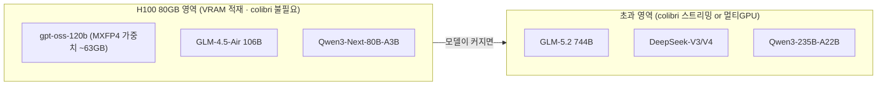

# 80 · OLMoE의 위상 · H100 서빙 모델 추천

두 질문에 답한다: (1) colibri의 골자가 OLMoE인가? OLMoE 자료가 더 필요한가? (2) 소형 모델은 스트리밍 실익이 낮다면, H100 서빙 환경(ThinkFlow)에 알맞게 올릴 추천 모델은?

## Q1. colibri의 골자는 OLMoE인가?

**아니다. OLMoE는 "골자"가 아니라 "코어 검증용 발판(scaffold)"이다.**

| 구분 | 파일 | 규모 | 역할 |
|---|---|---|---|
| **주 엔진(골자)** | `external/colibri/c/glm.c` | ~161KB, ~2,400줄 | GLM-5.2 744B 본체. MLA+DSA+MTP+스트리밍 전부 |
| **검증 발판** | `external/colibri/c/olmoe.c` | ~18KB, ~390줄 | 표준 GQA MoE로 **스트리밍 코어만 먼저 검증**(Stage A) |

- 근거(원 저자 주석, `olmoe.c:2-3`): *"engine.py의 포팅. 목표 Stage A: 참조(ref.json)와 **동일한 token id**를 생성 → GLM-5.2로 스케일하기 전에 코어를 검증."*
- 즉 OLMoE는 "디스크 스트리밍 + LRU + int8 dequant-on-use" 코어가 맞는지 **작은 모델로 먼저 확인**하려는 목적. 실제 제품 타깃과 대부분의 코드량·최적화(MLA/DSA/MTP)는 GLM-5.2 쪽이다.
- **비유**: OLMoE는 로켓 발사 전 "엔진 시험대", GLM-5.2가 실제 발사체.

### OLMoE 자료가 더 필요한가?
- **서베이(분석) 목적**: 크게 필요 없다. OLMoE는 콜리브리의 *결론*이 아니라 *검증 도구*이므로, 위상만 정확히 규정하면 충분.
- **실검증(실행) 목적**: OLMoE를 실제로 돌리려면 자료가 유용하므로, **참고자료를 최소한 확보**해 두었다(`data/olmoe/`).
  - 다만 이번 세션의 정확성 실검증은 OLMoE 대신 **tiny GLM oracle**로 수행했다(그 편이 *주 엔진 `glm.c`* 자체를 token-exact로 검증하므로 더 직접적). 결과는 [`31-engine-verification.md`](./31-engine-verification.md)의 32/32.
- 참고: OLMoE-1B-7B (Allen AI) = 6.9B 총 / 1.3B 활성, 64 expert top-8, fine-grained routing. `data/olmoe/SOURCE.md`.

---

## Q2. H100 서빙 환경(ThinkFlow)에 알맞은 추천 모델

> **가정**: ThinkFlow를 **단일 H100 80GB(또는 동급) 서빙 환경**으로 가정한다. 실제로 다중 H100/다른 VRAM이면 스윗스팟이 달라지니, 사양을 알려주면 재조정한다.

### 핵심 프레이밍: colibri 영역 vs H100 영역
- **colibri(디스크 스트리밍)** 는 "모델이 **VRAM/RAM에 안 들어갈 때**"를 위한 기법이다.
- **H100 서빙**은 "모델이 **VRAM에 들어갈 때**"의 영역 → 이때는 colibri가 **불필요**하고, vLLM/SGLang로 VRAM에 통째로 올리는 것이 압도적으로 빠르다.
- 따라서 "H100에 알맞게 올릴 모델" = **80GB VRAM을 잘 채우되 넘치지 않는 MoE**.

### 추천 1순위: **gpt-oss-120b**
- 117B / **5.1B 활성**, 128 expert top-4, **네이티브 MXFP4** → **단일 H100 80GB에 정확히 맞도록 설계됨**(MXFP4 가중치 ~63GB, KV 포함 서빙 시 ~73GB로 80GB 내 여유).
- 근거: OpenAI 모델카드/HF — "fits into a single 80GB GPU (H100/MI300X)". 처리량 NVFP4 ~1474 t/s(canitrun).
- 이유: **VRAM 활용도·품질·처리량의 균형이 H100에 최적화**. 소형 모델(20B)은 H100을 낭비, 초대형은 안 들어감 → 120b가 "알맞게 올릴" 정답.

### 추천 대안 (용도별)
| 모델 | 규모(활성) | Q4/FP4 VRAM | 특징 | 언제 |
|---|---|---|---|---|
| **gpt-oss-120b** | 117B (5.1B) | ~63GB(MXFP4 가중치) | H100 딱 맞음·고추론 | 범용 1순위 |
| **GLM-4.5-Air** | 106B | ~fit | MMLU-Pro 81.4·코딩 강함 | 코딩/에이전트 |
| **Qwen3-Next-80B-A3B** | 80B (3B) | ~49.5GB | 초희소·고처리량·여유 VRAM=긴 컨텍스트 | 대량/긴맥락 |
| **Qwen 3.5 122B-A10B** | 122B (10B) | NVFP4 fit | MMLU-Pro 86.7·최상위 품질 | 품질 최우선 |
| **Gemma 4 31B (Dense)** | 31B (31B 전량) | ~17.5GB Q4 / ~69.9GB bf16 | **MMLU-Pro 85.2·AIME 89.2·Arena 최상위·멀티모달(img/video)** | 품질·멀티모달 우선 |
| **Gemma 4 26B-A4B** | 25.2B (3.8B) | ~14.4GB | 멀티모달·저지연·VRAM 대량 여유 | 멀티모달/고동시성 |
| **Qwen3-30B-A3B** | 30B (3B) | ~20GB | 가볍고 빠름 | 저지연·다중 인스턴스 |

> **Gemma에 대한 정정·보강**: Gemma 4 계열의 **최대 모델은 31B Dense**이며, 100B급 대형 Gemma는 존재하지 않는다(라인업: E2B·E4B·12B·26B-A4B MoE·31B Dense). 따라서 "큰 Gemma"의 상한은 31B다. 품질만 보면 **Gemma 4 31B는 gpt-oss-120b보다 벤치가 높은 최상위권**(MMLU-Pro 85.2 vs 80.7, AIME 89.2)이고 **네이티브 멀티모달**이라, 문서 RAG(향후 이미지/영상 문서 포함) 관점에서 강력한 후보다. 그럼에도 아래 §Q2 최종 추천에서 gpt-oss-120b를 1순위로 둔 이유는 **품질이 아니라 마이그레이션 위험과 처리량 효율**이다(다음 항 설명). 참고: 이는 "H100 VRAM 서빙" 관점이며, colibri **스트리밍** 관점에서 31B Dense는 부적합하다(`docs/62`).

### 언제 colibri가 필요한가 (ThinkFlow 초과 시)
- **단일 H100로 안 되는** 프론티어 MoE를 굳이 그 박스에서 돌려야 할 때:
  - GLM-5.2 744B, DeepSeek-V3/V4, Qwen3-235B-A22B, Llama-4 Maverick, Kimi-K2 등.
  - 이 경우 선택지: (a) **멀티 H100**(정석, 빠름), 또는 (b) **colibri식 CPU+NVMe 스트리밍**(느리지만 GPU 부족 시 최후수단), 또는 (c) H100을 colibri의 **hot-expert VRAM tier**로만 활용(`README.md:239`).

### 왜 gpt-oss-120b가 1순위인가 (Gemma 31B와 정면 비교)
품질만 보면 Gemma 4 31B가 앞선다. 그럼에도 **ThinkFlow 맥락**에서 gpt-oss-120b를 1순위로 둔 이유는 3가지:
1. **마이그레이션 위험(가장 큼)**: ThinkFlow는 이미 `gpt-oss-20b`로 서빙 중이며, 프롬프트·챗 템플릿·툴호출 계약·출력 파서가 gpt-oss에 맞춰져 있다. 20b→120b는 **동일 패밀리·동일 토크나이저·동일 OpenAI API**라 이 계약을 그대로 유지(무재튜닝) → 운영 리스크 최소. Gemma로 가면 챗 템플릿·토크나이저·행동이 달라 **RAG 프롬프트 재튜닝 필수**.
2. **처리량 효율(sparsity)**: gpt-oss-120b는 117B 중 **5.1B만 활성(MoE)** → 같은 지연 예산에서 큰 용량. Gemma 31B는 **Dense = 매 토큰 31B 전량 활성** → 토큰당 연산이 무거워 동시성/처리량에서 불리.
3. **H100 VRAM 적합 설계**: 120b는 네이티브 MXFP4로 80GB에 맞도록 만들어짐. 31B는 Q4로 17.5GB(대량 유휴)·bf16으로 69.9GB(정밀↑ 가능하나 여전히 31B 용량).

### 그럼 Gemma 31B는 언제 고르나
- **품질/추론 최우선**이고 재튜닝을 감수할 때(벤치 최상위).
- **멀티모달 RAG**가 로드맵일 때: Gemma는 네이티브 text+image+video, **gpt-oss는 텍스트 전용**. 문서 RAG가 이미지/스캔/영상을 다루게 되면 Gemma가 결정적 우위.
- 이 경우 **Gemma 4 31B(Dense, 품질) 또는 26B-A4B(MoE, 처리량)** 를 선택.

### 결론(경영 판단)
1. **ThinkFlow 1순위 = gpt-oss-120b** — 이유는 품질이 아니라 **무재튜닝 스왑 + MoE 처리량 + H100 적합**. 순수 품질 최우선이면 Qwen 3.5 122B-A10B, **멀티모달·품질이면 Gemma 4 31B**, 처리량형 멀티모달이면 Gemma 4 26B-A4B.
2. 이 영역에선 **colibri를 쓰지 말 것**(VRAM 적재가 훨씬 빠름). colibri는 **H100로도 안 들어가는 초대형 MoE**에서만 가치.
3. 소형 모델(gpt-oss-20b)을 H100에 올리는 것은 **자원 낭비**이므로, VRAM을 잘 채우는 모델이 "알맞다".

> ThinkFlow의 실제 사양(H100 개수·VRAM·목표 지연/동시성)을 알려주면 위 표에서 정확한 1개를 확정해 드립니다.

## 출처
- H100 적재/처리량: canitrun.dev, localllms.dev, OpenAI gpt-oss 모델카드(arXiv:2508.10925) — `data/topics/apply-gpt-oss/SOURCE.md`
- OLMoE: `data/olmoe/SOURCE.md` (arXiv:2409.02060, HF allenai/OLMoE-1B-7B-0924)
- colibri: `external/colibri/c/olmoe.c`, `glm.c`, `README.md`
