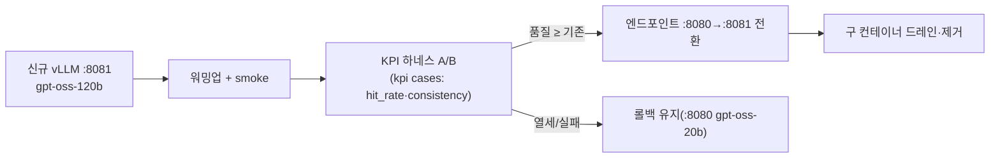

# 81 · (c) ThinkFlow H100 서빙 모델 업그레이드 설계서

colibri 서베이의 결론("H100 영역에서는 colibri 스트리밍 대신 VRAM 적재가 정답")을 실제 제품 **ThinkFlow**에 적용한다. 무중단 LLM 스왑으로 현행 `gpt-oss-20b`를 H100 80GB를 제대로 쓰는 MoE로 업그레이드한다.

> 근거 파일: `run_vllm.sh`, `env.sh`, PRD(A-001), 운영매뉴얼("LLM 엔드포인트 관리·무중단 런타임 변경"), 서버 실사양(사용자 제공).

## 1. 현황 (직접 확인)

### 1.1 서버 실사양
| 항목 | 사양 | 함의 |
|---|---|---|
| GPU | **NVIDIA H100 PCIe 80GB** ×1 (drv 580.159.03) | PCIe(≈2TB/s, SXM 아님)·단일카드 → **단일카드 적재 모델**만, TP 불가 |
| CPU | Xeon Silver 4310 @2.1GHz, 2×12C/48T | AVX-512 지원, 코어당 저속 → CPU 추론(colibri)엔 불리 |
| RAM | 251 GiB (가용 227) + Swap 8 | 넉넉 — BGE CPU 이전 여유 충분 |
| Disk | 3.5 TB (여유 3.2 TB) | int4 대형모델도 저장 가능(예: GLM-5.2 372GB) |
| OS | Ubuntu 22.04.5 · k5.15 · x86_64 | vLLM/CUDA 표준 |

### 1.2 현행 서빙 스택
- **LLM**: `openai/gpt-oss-20b` (vLLM v0.21.0, `--gpus all`, `--max-model-len 32768`, `--gpu-memory-utilization 0.85`, `--enable-prefix-caching`, `-p 8080:8000`).
- **RAG**: `bge-m3`(임베딩, GPU) + `bge-reranker-v2-m3`(리랭커, GPU) + Milvus + Postgres + RustFS.
- **품질 KPI**: `hit_rate`, `consistency`(정답률·일관성), `kpi_history.jsonl`.

### 1.3 문제
- **H100 80GB에 `gpt-oss-20b`(MXFP4 ≈13.5GB)** → GPU 용량의 ~17%만 사용. **~64GB 유휴**.
- 답변 품질의 상한이 20B 소형 모델에 걸려 있음(hit_rate 개선 여지). H100을 제대로 쓰면 **같은 박스에서 품질↑**.

## 2. 업그레이드 후보 (단일 H100 80GB 적재)

BGE 2종 공존을 감안한 VRAM 예산(80GB 기준, 대략치):

| 후보 | 규모(활성) | 가중치 | KV(32k) | BGE | 총합 | 마이그레이션 위험 | 비고 |
|---|---|---|---|---|---|---|---|
| **gpt-oss-120b** (1순위) | 117B(5.1B) | ~63GB MXFP4 | ~7–10GB | CPU로 이전 | ~73GB(GPU) | **낮음**(동일 vendor·동일 OpenAI API) | util↑0.92, BGE→CPU 권장 |
| **Qwen3-Next-80B-A3B-Instruct(FP8)** (안전대안) | 80B(3B) | ~49.5GB | ~15GB | ~4GB(GPU유지) | ~68GB | 중(프롬프트 재튜닝) | KV·VRAM 여유 큼, 3B활성=빠름 |
| **Gemma 4 31B (Dense)** (품질·멀티모달) | 31B(31B) | ~62GB bf16 / ~17.5GB Q4 | ~6–8GB | GPU유지 가능 | ~70GB(bf16) / ~26GB(Q4) | 중(프롬프트 재튜닝) | **벤치 최상위·네이티브 멀티모달**, 단 Dense=처리량 불리 |
| GLM-4.5-Air | 106B | ~60GB | ~8GB | CPU | ~68GB | 중 | 코딩·에이전트 강함 |

### 2.1 권장안
- **1순위: `gpt-oss-120b`** — 현행과 **동일 모델 패밀리·동일 OpenAI 호환 API**라 ThinkFlow의 프롬프트/파서/툴호출 계약 변경이 최소. 네이티브 MXFP4로 H100 단일카드에 맞도록 설계된 모델.
  - **BGE를 CPU로 이전**(48코어·227GB RAM이면 RAG 임베딩/리랭크 throughput 충분) → GPU 전량을 LLM에 할당.
  - `--gpu-memory-utilization 0.92` + KV 여유를 32k에서 실측 확인(아래 4장).
- **안전대안: `Qwen3-Next-80B-A3B`** — VRAM 여유가 크고 3B 활성이라 지연/처리량이 좋음. 단 Qwen 계열이라 ThinkFlow 프롬프트 재튜닝 필요. BGE를 GPU에 유지하고 싶을 때 유리.
- **품질·멀티모달 대안: `Gemma 4 31B (Dense)`** — 벤치 최상위(MMLU-Pro 85.2·AIME 89.2)이고 **네이티브 멀티모달(text/image/video)** 이라, 문서 RAG가 이미지/스캔/영상으로 확장되면 결정적 우위. bf16 ~62GB로 H100 단일 적재 가능(Q4면 17.5GB로 대량 여유). **트레이드오프**: (i) Dense라 매 토큰 31B 전량 활성 → gpt-oss-120b(5.1B 활성)보다 처리량/동시성 불리, (ii) Gemma 계열이라 챗 템플릿·프롬프트 재튜닝 필요. → **품질/멀티모달이 최우선이면 Gemma 31B, 무재튜닝·처리량이 우선이면 gpt-oss-120b.** (colibri 스트리밍 관점의 Gemma 부적합 판정은 `docs/62` 참조 — 여기선 VRAM 서빙이라 무관.)

## 3. 적용안: run_vllm.sh (drop-in, gpt-oss-120b)

현행(`ubuntu/vllm/run_vllm.sh`)을 최소 변경:

```bash
#!/usr/bin/env bash
# vLLM gpt-oss-120b 기동 (H100 80GB, BGE는 CPU로 분리)
set -euo pipefail
docker rm -f vllm 2>/dev/null || true
docker run -d --name vllm \
  --restart unless-stopped --gpus all --ipc host \
  -p 8080:8000 \
  -v /home/ubuntu/hf_cache:/root/.cache/huggingface \
  vllm/vllm-openai:v0.21.0 \
    --model openai/gpt-oss-120b \
    --served-model-name gpt-oss-20b \   # ← 동일 이름 유지 시 앱 config 무변경(과도기)
    --max-model-len 32768 \
    --gpu-memory-utilization 0.92 \
    --enable-prefix-caching
```
- `--served-model-name`을 기존 `gpt-oss-20b`로 유지하면 ThinkFlow config(단일 출처, `env.sh`)를 건드리지 않고 과도기 스왑 가능. 정식 반영 시 `gpt-oss-120b`로 개명.
- BGE는 별도 CPU 실행으로 이전(`THINKFLOW_EMBED_MODEL`/`RERANKER`는 경로 그대로, 디바이스만 CPU).

## 4. 무중단 롤아웃 & 검증 (매뉴얼의 "무중단 런타임 변경" 준수)



1. **병행 기동**: 신규 모델을 `:8081`로 띄워 기존 `:8080`(20b)과 공존(단, VRAM 동시 적재 불가 → 스왑형이면 blue/green 대신 프리로드→플립).
   - H100 1장이므로 **동시 상주 불가**. 대안: (i) 유휴 시간대 컷오버, 또는 (ii) 20b를 잠시 CPU/대기로 내리고 120b 적재.
2. **KPI A/B**: 기존 `kpi_history.jsonl` 케이스로 `hit_rate`/`consistency` 비교. **품질 회귀 없음** 확인 후 전환.
3. **컷오버**: LLM 엔드포인트(config 단일 출처) 전환 → 구 컨테이너 드레인.
4. **롤백**: 회귀 시 `run_vllm.sh`(20b)로 즉시 복귀.

### 4.0 리허설 스크립트
`scripts/thinkflow_swap_rehearsal.sh` — 단일 H100 제약(20b/120b 동시 상주 불가)을 반영해 3단 분리:
```bash
# ThinkFlow 박스에서:
bash scripts/thinkflow_swap_rehearsal.sh --preflight   # 무중단: 다운로드/용량/이미지/설정 사전점검
CONFIRM=yes bash scripts/thinkflow_swap_rehearsal.sh --cutover    # 유지보수 창: 20b↓ 120b↑ 스모크
CONFIRM=yes bash scripts/thinkflow_swap_rehearsal.sh --rollback   # 회귀 시 20b 복귀
```
- `--preflight`는 현행 서빙 무중단(네트워크 다운로드·용량·VRAM 산술·롤백자산만 확인).
- `--cutover`/`--rollback`은 파괴적이라 `CONFIRM=yes` 필수.

### 4.1 반드시 실측할 것
- 32k 컨텍스트에서 **KV OOM 여부**(util 0.90→0.92 조정).
- BGE CPU 이전 후 **RAG 지연**(임베딩/리랭크 p95) 허용범위인지.
- 답변 품질 KPI가 20b 대비 **개선**되는지(업그레이드의 존재 이유).

## 5. colibri는 ThinkFlow에 쓰는가? — 아니오(단, 이 박스는 실험 가능)
- 프로덕션 RAG는 **저지연**이 필수 → colibri의 CPU+디스크 스트리밍(단일 tok/s급)은 부적합.
- 다만 이 박스는 **227GB RAM + 3.2TB 디스크**라 GLM-5.2 744B int4(≈372GB)를 **저장·스트리밍 실험**할 물리적 여력은 있음(연구용, 비프로덕션). → `docs/83`의 실측 프로토콜을 이 박스에서 돌릴 수 있음.

## 6. 결론
1. ThinkFlow는 H100 80GB를 `gpt-oss-20b`로 **17%만** 쓰고 있다 → **`gpt-oss-120b`로 무중단 스왑**이 최소 위험·최대 이득.
2. BGE는 CPU로 이전해 GPU 전량을 LLM에 할당.
3. VRAM 여유·속도 우선이면 `Qwen3-Next-80B-A3B`(프롬프트 재튜닝 감수).
4. colibri는 프로덕션엔 부적합하나, 이 박스에서 **연구용 스트리밍 실측**은 가능.

## 출처
- ThinkFlow: `run_vllm.sh`, `env.sh`, PRD A-001, 운영매뉴얼 docx, 서버 실사양(사용자)
- 모델 적재/처리량: `docs/80-olmoe-and-h100-recommendations.md`, OpenAI gpt-oss 카드(arXiv:2508.10925)
