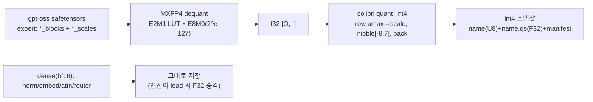

# 82 · (a) gpt-oss MXFP4 → colibri int4 변환기 프로토타입

`docs/61-apply-gpt-oss-20b.md §4.4`의 변환 스테이지를 실행 가능한 프로토타입으로 구체화한다. 스크립트: `scripts/mxfp4_to_int4_prototype.py`.

> 위치 설정: **ThinkFlow 관점에서 실익은 낮다**(gpt-oss-20b는 H100에 MXFP4 그대로 VRAM 적재가 최적, int4 디스크 스트리밍은 더 느림). 본 문서는 **colibri 어댑테이션 학습/연구용** 산출물이다. 실사용 업그레이드는 `docs/81`(gpt-oss-120b 스왑)을 따른다.

## 1. 문제 정의: 두 int4는 다르다
| | gpt-oss MXFP4 | colibri int4 |
|---|---|---|
| 원소 | E2M1 (4bit: 부호1·지수2·가수1) | 대칭 정수 nibble [-8,7] |
| 스케일 | **블록 공유** E8M0(32원소당 1 지수) | **행 공유** F32(row-wise) |
| 저장 | `*_blocks`(2 nibble/byte) + `*_scales`(E8M0) | `name`(U8 packed) + `name.qs`(F32) |
| dequant | `val = E2M1(nib) · 2^(e-127)` | `w = (nib-8) · scale_row` |

→ **직접 재해석 불가**. 반드시 `MXFP4 → f32 → colibri int4` 2단 변환.

## 2. 변환 파이프라인

- **양자화 수학은 colibri `tools/convert_fp8_to_int4.py`의 `quant_int4`와 동일**하게 맞춤 → 엔진의 dequant-on-use와 정합(토큰 재현성 확보 조건).
- E2M1 크기 LUT: `[0, .5, 1, 1.5, 2, 3, 4, 6]`(부호 별도). E8M0: `2^(e-127)`, `e=255`=NaN.

## 3. 구현·검증 (실행됨)
스크립트 `scripts/mxfp4_to_int4_prototype.py`:
- `dequant_mxfp4(blocks, scales)` — E2M1+E8M0 → f32(인터리브 nibble 복원, 블록 스케일 확장).
- `quant_int4(w)` — colibri와 동일한 row-scale·nibble packing.
- `--selftest` — 합성 MXFP4 블록으로 dequant + int4 round-trip 검증.
- `convert_checkpoint(--model --out)` — shard 단위 변환 스켈레톤(+`colibri_manifest.json`).

**selftest 결과(로컬 실행):**
```text
[selftest] MXFP4 dequant shape ok (5, 64)
[selftest] int4 round-trip max rel-err = 0.0714 (기대: <~0.15)
[selftest] packing 규약: nibble=[-8,7]+8, little-nibble first (glm.c와 동일)
[selftest] PASS
```
```bash
uv run --python 3.12 --with numpy python scripts/mxfp4_to_int4_prototype.py --selftest
```

## 4. 남은 작업(실 체크포인트 대상)
1. **weight 키/형상 확정**: gpt-oss의 `experts.gate_up_proj_blocks/_scales`, `down_proj_*`의 실제 축 순서(O/I 방향)와 grouped-expert 형상[E, ...]을 대상 체크포인트로 검증. 스켈레톤의 `reshape(-1, I)` 가정을 실측으로 교정.
2. **엔진 어댑터**: gpt-oss는 `glm_moe_dsa`가 아님(GQA+sliding-window attention, MLA/DSA 없음). colibri 실행에는 별도 엔진 경로 필요(`docs/61` §3~4). 변환기는 그 중 '양자화'만 담당.
3. **정확성 게이트**: 변환 후 tiny-oracle 방식(`docs/31`)으로 gpt-oss도 token-exact 검증 하네스 구축.
4. **품질 평가**: int4 재양자화(그룹→행 스케일 전환)의 perplexity 영향 측정. E8M0(블록)→F32(행) 전환은 이론상 손실 요인이므로 그룹 스케일 유지 옵션도 후보.

## 5. 왜 굳이? (연구 가치)
- colibri를 **다른 양자화 계보(MXFP4)** 모델로 확장하는 일반화 사례.
- H100로도 안 들어가는 **초대형 MXFP4 MoE**(가정)를 CPU+NVMe로 내리는 시나리오의 사전 검증.
- 단, gpt-oss-20b/120b 자체는 H100 VRAM 적재가 정답이므로 **프로덕션 목적 아님**(→ `docs/81`).

## 출처
- 스크립트: `scripts/mxfp4_to_int4_prototype.py`
- 포맷 참조: colibri `tools/convert_fp8_to_int4.py`, OCP Microscaling(MXFP4) 규격, gpt-oss 모델카드(arXiv:2508.10925)
- 어댑터 설계: `docs/61-apply-gpt-oss-20b.md`
