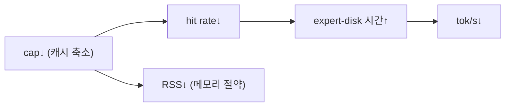

# 83 · (b) 스트리밍 실측 — 로컬 실증 + H100 실측 프로토콜

colibri의 핵심 주장("expert를 디스크에서 스트리밍해도 정확하고, 캐시가 클수록 빠르다")을 실측한다. 로컬(Mac)에서 **정확성 불변성**을 실증했고, **성능 수치**는 ThinkFlow H100 박스에서 수집하도록 프로토콜·스크립트를 제공한다.

## 1. 로컬 실증 (수행됨): 캐시 압박에도 token-exact 불변

tiny GLM oracle로 캐시 용량 `cap`(experts/layer)을 8→1로 낮추며 teacher-forcing:

```bash
cd external/colibri/c
for cap in 8 4 2 1; do SNAP=./glm_tiny TF=1 ./glm $cap 16 16; done
```

| cap (resident/8) | 결과 | pos/s | expert-disk |
|---|---|---|---|
| 8 (전량 상주) | **32/32 token-exact** | 4933 | 0.000s |
| 4 | **32/32 token-exact** | 12403 | 0.000s |
| 2 | **32/32 token-exact** | 12815 | 0.000s |
| 1 (최대 축출) | **32/32 token-exact** | 12422 | 0.000s |

**결론(정확성)**: 캐시를 1/8로 줄여 매 스텝 expert를 축출/재적재해도 **출력 토큰은 완전히 동일**. → LRU 스트리밍은 **기능적으로 투명**(정확성에 무해)함을 실제 `glm.c`에서 증명.

**한계(성능)**: tiny 모델은 expert 파일이 수 KB라 페이지캐시에 상주 → `expert-disk 0.000s`. 즉 **스트리밍의 '비용'은 tiny 모델로 보이지 않는다.** pos/s 변동은 캐시 관리 오버헤드/측정 노이즈 수준이며 디스크 I/O가 아니다. 성능 실측엔 실모델+실 NVMe 필요.

## 2. H100 박스 실측 프로토콜 (권장 실행 위치)

ThinkFlow 서버가 이상적: **227GB RAM · 3.2TB 디스크 · 48 vCPU(AVX-512) · x86 Linux**(macOS와 달리 `posix_fadvise(DONTNEED)` 정상 동작).

스크립트: `scripts/olmoe_streaming_bench.sh`

```bash
# ThinkFlow H100 박스에서:
BASE=/home/ubuntu/bench bash scripts/olmoe_streaming_bench.sh
```
단계:
1. `make -C external/colibri/c olmoe` (AVX2/512 네이티브 빌드).
2. `tools/convert_olmoe.py --repo allenai/OLMoE-1B-7B-0924-Instruct --out olmoe_i4`
   - OLMoE = 64 experts/layer, top-8 → expert row-wise 양자화(스크립트는 int8; `--ebits`).
3. **cap 스윕**(64→32→16→8→4): `SNAP=olmoe_i4 ./olmoe <cap> 8`
   - cap<64면 축출 발생 → miss → 디스크 read.

### 2.1 기록할 지표(표로)
| cap | hit rate % | expert-disk (s) | tok/s | RSS (GB) |
|---|---|---|---|---|
| 64 | (전량 상주 기준선) | ~0 | 최고 | 최대 |
| 32 | ↓ | ↑ | ↓ | ↓ |
| … | | | | |

- `olmoe`/`glm` 엔진은 `expert hit rate %`, `tok/s`, `RSS`, `PROFILE(expert-disk)`를 출력.
- **저장소 영향 분리**: 동일 cap에서 (a) 웜 캐시 vs (b) `echo 3 > /proc/sys/vm/drop_caches` 후 콜드 비교 → 실디스크 대역폭 노출.

### 2.2 기대 곡선(가설, 실측으로 확정)

- 즉 **메모리↔속도 trade-off 곡선**을 수치화 → `docs/40`(tradeoff)·`docs/50`(자원)의 정성 주장을 정량 근거로 대체.

## 3. 산출물 연결
- 정확성 불변성(로컬) → `docs/31-engine-verification.md` 보강.
- 성능 곡선(H100) → 수집 후 `docs/40`/`docs/50` 표 갱신 권장.

## 4. 왜 로컬(Mac)에서 성능을 안 재는가
- Mac은 RAM ~16GB·NEON·macOS I/O(fadvise 미지원, `F_NOCACHE`/mlock 경로) → **콜리브리의 Linux NVMe 성능과 비대표적**. 정확성만 로컬로, 성능은 타깃 박스에서.

## 출처
- 로컬 실행 로그(cap 스윕): 본 세션.
- 엔진: `external/colibri/c/olmoe.c`, `glm.c` (hit rate/PROFILE 출력).
- 변환: `external/colibri/c/tools/convert_olmoe.py`; OLMoE: `data/olmoe/SOURCE.md`.
- 스크립트: `scripts/olmoe_streaming_bench.sh`.
