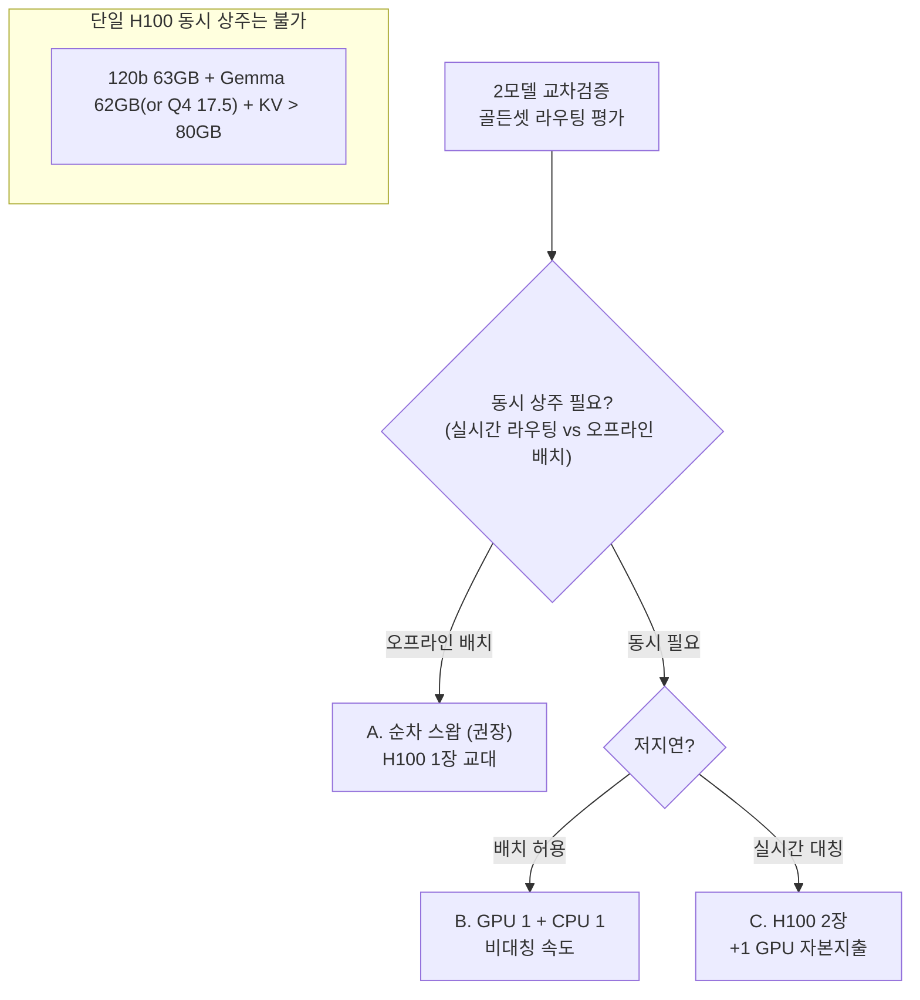

# 85 · 2모델 교차검증(골든셋 라우팅 평가) 자원 분석

질문: ThinkFlow의 **2모델 교차검증(골든셋 라우팅 평가)** 프로세스에서 두 모델을 올린다면, **colibri로 gpt-oss-120b와 Gemma 4 31B를 동시에 쓸 수 있나?** 불가하면 예상 필요자원은?

## 요약 (3줄)
- **colibri로 두 모델 동시 호스팅은 불가.** Gemma 31B는 **Dense → colibri(MoE expert 스트리밍) 원천 부적합**, gpt-oss-120b는 MoE지만 **colibri 어댑터 미구현**(현재 glm/olmoe 전용).
- 게다가 이 박스에선 **두 모델이 각각은 단일 H100(80GB)에 들어간다**(120b MXFP4 ~63GB, Gemma 31B bf16 ~62GB / Q4 ~17.5GB) → colibri("VRAM 초과" 전용)의 존재 이유 자체가 없음.
- 진짜 제약은 "**동시**"뿐: 63+62(또는 +17.5)는 80GB를 초과해 **한 H100에 동시 상주는 불가**. 골든셋 평가는 오프라인 배치이므로 **순차 스왑**이 가장 합리적.

## 1. colibri 적용 가능성 판정

| 모델 | 구조 | colibri 적용 | 이유 |
|---|---|---|---|
| **Gemma 4 31B** | **Dense** | ❌ 불가 | 스트리밍할 expert 없음. dense를 디스크 스트리밍하면 토큰마다 전체(17.5GB@int4)를 읽어야 함(=layer-streaming, colibri 미지원). `docs/62 §2.1` |
| **gpt-oss-120b** | MoE(128e/5.1B활성) | △ 이론상 가능, 현재 불가 | MoE라 원리는 맞으나 **엔진 어댑터 미구현**(GQA+sliding window, glm_moe_dsa 아님). `docs/61`, `docs/82` |

→ **"colibri로 120b + Gemma 31B 둘 다"는 불가.** 하나(Gemma)는 구조적으로, 하나(120b)는 구현 미비로.

## 2. 왜 애초에 colibri가 불필요한가 (핵심)
colibri는 "모델이 **VRAM/RAM에 안 들어갈 때**"의 기법이다(`docs/40`, `docs/70`). 그런데 이 박스(H100 80GB)에서:
- gpt-oss-120b: MXFP4 ~63GB → **단일 H100에 들어감**.
- Gemma 4 31B: bf16 ~62GB(또는 Q4 17.5GB) → **단일 H100에 들어감**.

즉 **각각은 그냥 vLLM로 VRAM에 올리는 게 압도적으로 빠르다.** 문제는 오직 **둘을 동시에** 올릴 수 없다는 것(합계 초과).

## 3. 2모델 동시 상주 가능성 (단일 H100 80GB)

VRAM 산술(단일 80GB):
- 120b(63) + Gemma Q4(17.5) = **80.5GB (KV·BGE 이전에 이미 초과)** → 불가.
- 120b(63) + Gemma bf16(62) = 125GB → 크게 초과.

## 4. 실행 구성별 예상 필요자원

| 구성 | GPU | 추가 RAM | 디스크 | 동시성 | 추가 HW | 적합 상황 |
|---|---|---|---|---|---|---|
| **A. 순차 스왑(GPU)** | H100 80GB ×1(교대) | 낮음 | 두 모델 ~80GB | ❌ | **없음** | **오프라인 골든셋 평가(권장)** |
| **B. GPU 1 + CPU 1** | H100 80GB ×1 | +20~65GB | ~80GB | ✅(비대칭) | **없음** | 동시 필요·지연 관대 |
| **C. H100 2장** | H100 80GB ×2 | 낮음 | ~80GB | ✅(대칭) | **H100 1장** | 실시간·저지연 대칭 |

### 4.A 순차 스왑 (권장 — 골든셋 평가는 배치)
- **필요자원**: H100 80GB 1장(한 번에 하나). RAM/디스크 여유(현 박스로 충분). **추가 하드웨어 0.**
- 절차: Phase1 `gpt-oss-120b` 적재 → 골든셋 전량 추론·기록 → 스왑 → Phase2 `Gemma 31B` 적재 → 동일 골든셋 추론 → 두 결과셋을 **오프라인 교차검증**(agreement/consistency/judge).
- 비용: 단계 전환 시 모델 재적재(수십 초~수 분). 동시성 없음(배치라 무방).
- 도구: `scripts/thinkflow_swap_rehearsal.sh`(모델명만 바꿔 재사용).

### 4.B 동시 (GPU 1 + CPU 1)
- **GPU 측**: 한 모델(예 Gemma 31B bf16 62GB, 또는 gpt-oss-120b 63GB) — vLLM.
- **CPU 측**: 나머지 모델을 CPU 추론.
  - `gpt-oss-120b`(MoE): int4 ~63GB를 **251GB RAM에 전량 적재**(디스크 스트리밍 최소). 48스레드 CPU matmul → **추정 3~8 tok/s**. colibri 어댑터가 있으면 colibri, 없으면 llama.cpp/vLLM-CPU(gpt-oss 지원 시).
  - `Gemma 31B`(Dense): llama.cpp CPU, Q4 ~17.5GB RAM → **추정 2~5 tok/s**.
- **필요자원**: H100 1장(62~63GB) + CPU 모델용 RAM(20~65GB) + 다수 코어. **현 박스(251GB RAM·48코어)로 수용, 추가 HW 0.**
- 주의: CPU 측 throughput이 낮아 **골든셋 규모가 크면 시간 소요**. 실시간 라우팅엔 부적합.

### 4.C 실시간 대칭 (H100 2장)
- 두 모델을 각 GPU에 상주 → 동시·저지연·대칭. **H100 1장 추가 자본지출** 필요.
- 또는 한 장에 소형 양자화 2개(예 Gemma Q4 17.5 + 다른 소형)만 가능 — 120b는 이 방식 불가.

## 5. colibri가 그래도 기여할 수 있는 유일 지점
- 구성 B에서 **gpt-oss-120b를 CPU 측에 올릴 때** colibri(어댑터 구현 시)가 후보. 그러나:
  - 이 박스는 120b가 **GPU에 통째로 들어가므로**(63<80GB), colibri CPU 스트리밍은 **더 느린 선택** → 실익 없음.
  - colibri가 실제로 유리한 지점은 **H100로도 안 들어가는 초대형 MoE**(GLM-5.2 744B 등)를 이 박스에서 굳이 돌릴 때뿐.

## 6. 권고
1. **2모델 교차검증엔 colibri를 쓰지 말 것.** Gemma(dense)는 부적합, 120b는 어댑터 미비이며, 무엇보다 **각 모델이 H100에 들어가므로 스트리밍이 불필요**.
2. **오프라인 골든셋 평가 → 구성 A(순차 스왑)** 가 정답: 추가 하드웨어 0, 가장 단순·정확.
3. **동시 실행이 꼭 필요하면 → 구성 B**(GPU+CPU, 비대칭 속도, 현 박스 수용) 또는 **구성 C**(H100 2장, 자본지출).
4. 라우팅 평가 특성(배치·지연 관대)상 A로 충분하며, 실시간 A/B 트래픽 분기가 필요할 때만 B/C를 검토.

## 출처
- 모델 크기·구조: `docs/80`, `docs/62`, `data/topics/apply-gpt-oss/`, `data/topics/apply-gemma/`
- colibri 적용 원칙: `docs/60`, `docs/61`, `docs/62`, `docs/82`
- 스왑 도구: `scripts/thinkflow_swap_rehearsal.sh`
