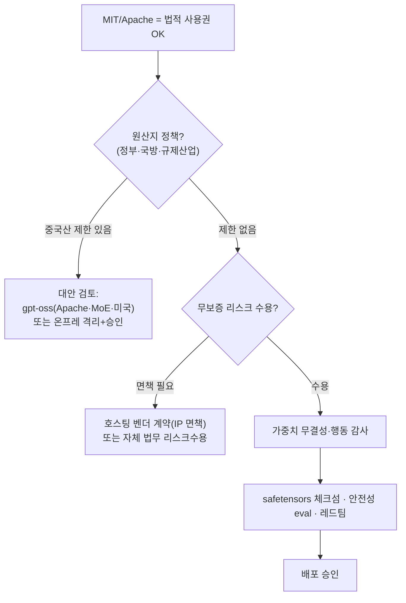

# 91 · 라이선스 · 보안/컴플라이언스 검토

질문: colibri로 쓰는 sLLM은 **MoE 스트리밍 가능 모델**이어야 하므로 Gemma(Dense)는 불가 — 맞다. 그리고 **GLM 모델은 보안 적합 라이선스 발급이 가능한가?**

## 요약 (3줄)
- **라이선스 "발급"은 불필요하다.** GLM-5.2 가중치는 **표준 MIT**(무수정, 수용조항·지역제한 없음), colibri 엔진은 **Apache-2.0** — 둘 다 **자체호스팅·수정·상업·재배포 허용**. 게이팅/승인 절차가 없다.
- 보안 관점 최대 강점: **완전 오프라인/에어갭 자체호스팅 → 데이터 미유출**. colibri는 텔레메트리 없는 C 엔진, vLLM도 온프레 가능.
- 단, **라이선스가 컴플라이언스를 완결하지 않는다**: (1) **원산지(중국 Zhipu AI)** 규제, (2) **무보증·무면책(AS IS)**, (3) 가중치 무결성/행동 감사 — 세 가지는 별도 검토 필요.

## 1. 라이선스 사실관계 (검증됨)

| 구성요소 | 라이선스 | 근거 | 의미 |
|---|---|---|---|
| **GLM-5.2 가중치** | **MIT** (© 2026 Zhipu AI) | HF `zai-org/GLM-5.2/LICENSE` | 상업·수정·재배포·자체호스팅 자유, copyleft 없음 |
| **colibri 엔진** | **Apache-2.0** | `external/colibri/LICENSE`, README "License" | 특허 grant 포함, NOTICE·변경고지 의무 |
| GLM-4.5/4.6/5/5.1 | MIT | Z.ai 계열 정책 | 동일(오픈웨이트 전략 일관) |

- **"발급" 개념 없음**: Llama류의 사용신청/MAU 상한/수용정책(AUP) 애드덤이 **없다**. MIT는 저작권·허가 고지만 유지하면 끝. Apache-2.0는 NOTICE 유지 + 변경 명시 + 특허조항.

## 2. 보안 관점 강점 (왜 자체호스팅이 유리한가)
- **데이터 거버넌스**: 가중치를 내부 인프라에 내려받아 **에어갭/온프레**로 구동 → 질의·문서가 **외부로 나가지 않음**. 폐쇄망 요건 충족 가능.
- **벤더 종속 없음**: API 요금·정책 변경·서비스 종료 리스크 제거(오픈웨이트 소유).
- **무결성 안전 포맷**: GLM-5.2는 **safetensors**(코드 실행 없는 텐서 컨테이너)로 배포 → pickle류 임의코드 위험 없음. 체크섬 검증 권장.
- **엔진 투명성**: colibri는 소스 공개(Apache) C 엔진 → 감사 가능, 네트워크 콜 없음(오프라인).

## 3. 반드시 별도 검토할 컴플라이언스 항목 (라이선스로 해결 안 됨)

1. **원산지/지정학 규제 (가장 중요)**: Zhipu AI는 중국 기업이다. **정부·국방·금융·규제산업**은 라이선스와 무관하게 **모델 원산지 제한**(조달·수출·보안정책)을 둘 수 있다. MIT 허용 ≠ 조직 보안정책 통과. → **법무/보안팀 사전 승인 필수.**
2. **무보증·무면책(AS IS)**: MIT/Apache 모두 **품질보증·IP 침해 면책 없음**. 상용 호스팅 벤더(일부는 IP 면책 제공)와 달리, 학습데이터 관련 IP 클레임 리스크는 **도입자가 부담**. 법무 리스크 수용 판단 필요.
3. **가중치/행동 감사**: 오픈웨이트도 임베디드 행동(백도어·정렬편향)을 100% 배제 증명은 불가 → **안전성 평가·레드팀·출력 감사** 권장. (safetensors라 실행형 악성코드 위험은 낮음.)
4. **Apache-2.0 의무(엔진)**: colibri 재배포 시 **LICENSE/NOTICE 유지, 변경사항 명시**. 사내 사용만이면 부담 적음.

## 4. 원산지가 걸림돌일 때의 대안 (colibri 제약과 함께)
colibri는 **MoE 전용**이므로 대안도 MoE여야 한다:

| 대안 | 라이선스 | 원산지 | colibri 적합 | 비고 |
|---|---|---|---|---|
| **gpt-oss-120b/20b** | **Apache-2.0** | 미국(OpenAI) | MoE ✅ (어댑터 필요) | 원산지 민감 조직의 1순위 대체 |
| Qwen3 계열 MoE | Apache-2.0 | 중국(Alibaba) | MoE ✅ | 원산지 이슈는 GLM과 동일 |
| Gemma 4 | Apache-2.0 | 미국(Google) | ❌ Dense/일부 26B-MoE | 26B-A4B만 MoE, 그러나 소형이라 스트리밍 실익 낮음 |
| Llama 4 (MoE) | Llama Community(제한) | 미국(Meta) | MoE ✅ | MAU>700M 제한·AUP 있음 |

→ **원산지 무제한이면 GLM-5.2(MIT)가 최적**(라이선스·성능·colibri 정합). **중국산 제한이 있으면 gpt-oss(Apache, MoE)** 가 colibri 유지하면서 원산지 리스크를 해소하는 최선 대체(단 엔진 어댑터 필요, `docs/61/82`).

## 5. 결론 (경영/보안 판단)
1. **GLM-5.2는 "보안 적합 라이선스"를 이미 갖췄다** — MIT(무수정·무제한), 발급/승인 절차 불필요, **자체호스팅으로 데이터 미유출**. 엔진(colibri)도 Apache-2.0로 문제없음.
2. 그러나 **라이선스 통과 ≠ 보안 승인**. 실제 도입 게이트는 (a) **중국 원산지 정책**, (b) **무면책 리스크 수용**, (c) **무결성/행동 감사** 세 가지다.
3. 원산지 제약이 없으면 GLM-5.2 진행, 있으면 **gpt-oss(Apache·MoE·미국)** 로 colibri를 유지한 채 대체 검토.

## 출처
- GLM-5.2 LICENSE(MIT): https://huggingface.co/zai-org/GLM-5.2/blob/main/LICENSE
- colibri LICENSE(Apache-2.0): `external/colibri/LICENSE`, `external/colibri/README.md`
- 모델 원산지/라이선스: `docs/80`, `docs/62`, `data/topics/apply-gpt-oss/`
