```{=openxml}
<w:p><w:r><w:br w:type="page"/></w:r></w:p>
```

# 보고서 서문 · 독해 안내

본 보고서는 colibrì(이하 colibri) 추론 엔진 서베이의 **모든 산출 문서를 요약 없이 전문 그대로** 하나로 묶은 종합본이다. 각 부(Part)는 원 문서를 그대로 포함하며, 내용의 삭제·축약은 없다. 부 서두의 짧은 안내문만 새로 추가되었다.

- **대상**: colibri = GLM-5.2 744B MoE를 int4로 양자화하고 expert를 디스크에서 스트리밍하여, GPU 없이 또는 소용량 하드웨어에서 초대형 MoE를 구동하는 C 추론 엔진.
- **방법**: 벤더링된 원본 소스(`external/colibri`) 직접 분석 + 로컬(Apple Silicon) 빌드·실행 + tiny GLM oracle token-exact 검증 + 실서버(ThinkFlow, H100 PCIe 80GB) 적용 설계.
- **독해**: 제1~2부(구조·핵심기술) → 제3부(검증) → 제4~6부(분석·종합) → 제7부(실적용) → 제8부(상태·참고) 순서를 권장한다.
- **표기**: 코드/설정/다이어그램(mermaid)은 원문 그대로 코드 형식으로 포함한다. 다이어그램은 mermaid 소스로 표기되며, 렌더링 도구(mermaid)로 그림화할 수 있다.

## 문서 상호 관계 지도

```
개요(00) ─ 아키텍처(10)
                 └ 핵심기술: MoE스트리밍(20)·MLA(21)·speculative(22)
로컬실행(30) ─ 정확성검증(31: C테스트+oracle 32/32)
분석: tradeoff(40)·자원(50) ─ 종합브리프(70)
타모델: 일반(60)·gpt-oss-20b(61)·gemma4(62)
실적용: OLMoE위상·H100추천(80) ─ ThinkFlow설계(81)·런북(84)
        변환기(82: MXFP4→int4) ─ 스트리밍실측(83)
상태·마감(90) ─ 참고문헌(99)
```


# 제1부 · 개요와 아키텍처


## 00 · 개요 (Overview)

### 요약 (3줄)
- **colibrì**는 744B 규모의 GLM-5.2 MoE 모델을 약 25GB RAM 소비자용 PC에서 구동하는 **순수 C 추론 엔진**이다.
- 핵심 발상은 "모델 전체를 메모리에 올리지 않고, **Dense 부분만 RAM 상주 + Routed Expert는 SSD에서 스트리밍**"하는 것.
- 속도(H100급)가 아니라 **가능성**(값싼 하드웨어에서 프론티어급 모델을 정확히 구동)에 초점을 둔 프로젝트다.

### 배경 / 문제의식
- LLM이 커지면서 수백억~수천억 파라미터 모델은 수백 GB의 메모리 + 고성능 GPU가 필요하다는 인식이 강했다.
- 그러나 MoE(Mixture-of-Experts)는 **토큰 하나 생성 시 전체 파라미터의 일부만 활성화**된다.
  - GLM-5.2(744B)는 토큰당 약 40B만 활성화되고, 그중 토큰마다 바뀌는 routed expert는 약 11GB 정도다.
- colibrì는 이 특성을 이용해 "안 쓰는 파라미터는 디스크에 두고, 필요할 때만 읽는다"는 구조를 택했다.

### colibrì의 메모리 계층

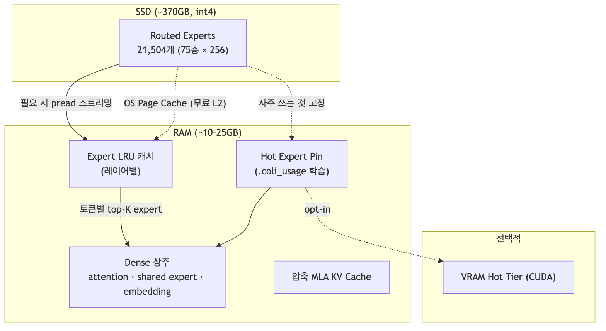{width=6.2in}

| 구성 요소 | 위치 | 근거 |
|---|---|---|
| Dense (attention, shared expert, embedding, ~17B) | **RAM 상주** (int4, ~9.9GB) | `external/colibri/README.md:19` |
| Routed Expert (21,504개, 75 MoE 레이어 × 256) | **SSD 저장 (~370GB) → 스트리밍** | `external/colibri/README.md:20` |
| Expert Cache | RAM 기반 **레이어별 LRU** | `external/colibri/c/glm.c:1334`(캐시 조회), `:1388`(LRU 승격) |
| Hot Expert | RAM/VRAM **pin** | `external/colibri/c/glm.c:2392`(pin_wire), `:2409`(pin_load) |
| KV Cache | **MLA 압축** 저장 | `external/colibri/c/glm.c:1130`(Lc/Rc 저장) |
| OS Page Cache | 무료 L2 캐시 | `external/colibri/README.md:20` |

### 이 서베이가 다루는 문서
- [`10-colibri-architecture.md`](./10-colibri-architecture.md) — colibri 코드 구조 전반
- [`20-moe-streaming.md`](./20-moe-streaming.md) — MoE 디스크 스트리밍(핵심)
- [`21-mla-kv-compression.md`](./21-mla-kv-compression.md) — MLA 기반 KV Cache 압축
- [`22-speculative-decoding.md`](./22-speculative-decoding.md) — MTP 기반 Speculative Decoding
- [`30-local-run-notes.md`](./30-local-run-notes.md) — 로컬 빌드/실행 노트
- [`40-analysis-tradeoffs.md`](./40-analysis-tradeoffs.md) — 장점·단점·trade-off 분석
- [`50-resource-requirements.md`](./50-resource-requirements.md) — 필요 자원 분석
- [`60-applying-to-other-models.md`](./60-applying-to-other-models.md) — 타 모델 적용 방안(일반)
- [`61-apply-gpt-oss-20b.md`](./61-apply-gpt-oss-20b.md) — gpt-oss-20b 적용 설계서
- [`62-apply-gemma4.md`](./62-apply-gemma4.md) — gemma4 적용 설계서(적합성 판정)
- [`70-executive-brief.md`](./70-executive-brief.md) — 경영·기술 통합 브리프

### 성능에 대한 정직한 시각
- 개발 머신(WSL2, 12코어, 25GB RAM, ~1GB/s NVMe) 기준 **cold ~0.05–0.1 tok/s**. 느리다.
- 병목은 대개 **디스크 대역폭**과 **작은 RAM으로 인한 캐시 용량 제한**이다.
- RAM이 크고 NVMe가 빠를수록(또는 hot expert pin) 빨라진다. 커뮤니티 측정치는 Apple M5 Max에서 ~1–2 tok/s.
  - 근거: `external/colibri/README.md:44`(Honest numbers), `:377`(Community benchmarks).

### 출처
- colibri 원본: https://github.com/JustVugg/colibri (커밋 `5254470`, 2026-07-13)
- 소개 블로그: 파파누보, "25GB RAM으로 744B AI 모델을 실행하다" (2026-07-13) — `../data/colibri/SOURCE.md` 참조


## 10 · colibri 코드 구조 분석

분석 대상: `external/colibri/` (JustVugg/colibri @ `5254470`, 2026-07-13, Apache-2.0)

### 요약 (3줄)
- 런타임은 **단일 C 파일 `c/glm.c`(~2,400줄) + 소규모 헤더**로 구성되며, BLAS·Python·GPU가 필수가 아니다.
- 추론 파이프라인은 `embed → (레이어별) attention → moe/dense_mlp → lm_head`이고, MoE 레이어에서 expert를 디스크에서 스트리밍한다.
- Python·셸 도구(변환·벤치·서버)는 런타임과 분리되어 있으며, 엔진의 실행 의존성이 아니다.

### 1. 저장소 레이아웃
```text
external/colibri/
├── Makefile                 # 루트 빌드 진입점 (c/로 위임)
├── c/
│   ├── glm.c                # 단일 파일 GLM 엔진 (핵심)
│   ├── st.h                 # safetensors 로더
│   ├── tok.h, tok_unicode.h # 바이트 레벨 BPE 토크나이저 (C 구현)
│   ├── json.h               # 최소 JSON 파서 (config)
│   ├── grammar.h            # GBNF 문법 강제 draft
│   ├── compat.h             # Windows(_WIN32) POSIX 호환 계층
│   ├── backend_cuda.{cu,h}  # 선택적 CUDA 백엔드 (resident tensor)
│   ├── olmoe.c              # 소형 OLMoE 엔진 (검증/A-B용)
│   ├── iobench.c            # 디스크 I/O 벤치마크
│   ├── coli                 # 사용자용 CLI 런처 (원본 바이너리는 vendoring 제외)
│   ├── openai_server.py     # OpenAI 호환 HTTP 게이트웨이
│   ├── resource_plan.py     # `coli plan` (메모리 계획)
│   ├── doctor.py            # `coli doctor` (실행 전 점검)
│   ├── tools/               # FP8→int4 변환, fixture, 벤치
│   └── tests/               # 의존성 없는 C/Python 테스트
├── web/                     # 브라우저 UI (React+TS, 순수 OpenAI API 클라이언트)
└── desktop/                 # Tauri 데스크톱 셸
```
근거: `external/colibri/README.md:426`(Repo layout).

### 1.5 추론 파이프라인 (한 토큰)

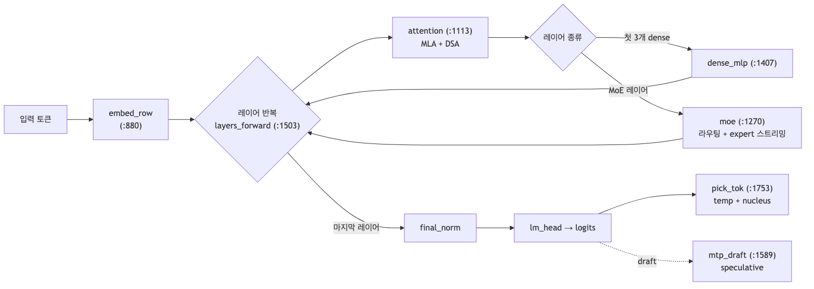{width=6.2in}

### 2. glm.c 내부 구조 (함수 지도)

#### 2.1 양자화 / 커널
- `matmul` (`glm.c:204`), `matmul_q` (`:210`), `matmul_qt` (`:475`) — f32 / int8 / QT(양자화 텐서) 행렬곱.
- `quantize_rows` (`:512`), `qt_alloc`/`qt_fill` (`:601`/`:608`) — per-row scale 양자화(int8/int4/int2).
- AVX2 정수 dot 커널을 shape별로 선택(측정 기반). 근거: `README.md:32`.

#### 2.2 모델 로딩
- `load_cfg` (`:652`) — config.json 파싱(레이어 수, head, kv_lora 등).
- `qt_from_disk`/`qt_load` (`:708`/`:722`) — safetensors에서 양자화 텐서 로드.
- `model_init` (`:738`) — dense 텐서를 RAM에 상주시키고 expert 캐시를 RAM에서 auto-size.

#### 2.3 순전파 파이프라인
- `embed_row` (`:880`) — 토큰 임베딩.
- `attention` (`:1113`) — **MLA attention**(q/kv-LoRA, 부분 RoPE), 압축 KV, DSA sparse, weight absorption. → [21 문서](./21-mla-kv-compression.md)
- `moe` (`:1270`) — **MoE 라우팅 + expert 스트리밍/캐시 + batch-union**. → [20 문서](./20-moe-streaming.md)
- `dense_mlp` (`:1407`) — 초기 3개 dense 레이어용 MLP.
- `layer_forward` (`:1489`) / `layers_forward` (`:1503`) — 레이어 스택 실행.

#### 2.4 Expert 스트리밍 서브시스템
- `expert_load` (`:897`) — expert 3개 텐서(gate/up/down)를 `pread`로 디스크에서 읽음. O_DIRECT/버퍼드/`posix_fadvise(DONTNEED)` 처리.
- `pipe_init`/`pipe_dispatch`/`pipe_wait` (`:1043`/`:1054`/`:1064`) — I/O 워커 pool로 load ‖ matmul 오버랩(lock-free, generation-tagged cursor).
- `expert_prefetch` (`:1070`) — `WILLNEED` 비동기 readahead.
- `pilot_prefetch` (`:1460`) / `la_predict` (`:1419`) — router-lookahead 기반 다음 레이어 expert 선반입.

#### 2.5 Speculative Decoding (MTP)
- `mtp_draft` (`:1589`) — GLM-5.2 native MTP head(레이어 78)로 draft 토큰 생성.
- `mtp_absorb` (`:1627`) — 검증된 토큰을 MTP head KV에 흡수.
- `ngram_draft` (`:1570`), `grammar_draft` (`:1699`) — n-gram / 문법 강제 draft 소스.
  → [22 문서](./22-speculative-decoding.md)

#### 2.6 KV 관리 · 실행 모드 · 서버
- `kv_alloc`/`kv_bind` (`:1516`/`:1533`) — 압축 KV 버퍼 할당/바인딩.
- `kv_disk_append`/`kv_disk_load` (`:2095`/`:2118`) — `.coli_kv` 지속화(대화 warm reopen).
- `run_text` (`:1951`), `generate` (`:1910`), `run_serve` (`:2173`) — 배치/생성/서버 루프.
- `pin_load`/`pin_wire` (`:2409`/`:2392`), `repin_pass` (`:2033`) — hot expert pin·라이브 재핀.
- `mem_available_gb` (`:2505`), `expert_avail` (`:2538`) — RAM 예산 기반 캐시 안전 상한(OOM 방지).

### 3. 도구 계층 (런타임 비의존)
- **변환**: `c/tools/convert_fp8_to_int4.py` — FP8 체크포인트를 샤드 단위로 다운로드→dequant(128×128 block scale)→int4 재양자화→샤드 삭제. 756GB를 한 번에 둘 필요 없음. 근거: `README.md:42`.
- **계획**: `coli plan` — safetensors 헤더만 읽어 dense/expert footprint, RAM reserve, expert-cache cap, VRAM hot tier를 JSON으로 출력. 근거: `README.md:107`.
- **점검**: `coli doctor` — 모델 디렉토리·config·토크나이저·헤더·RAM·CUDA 링크를 read-only로 검증. 근거: `README.md:116`.
- **서버**: `coli serve` — 표준 라이브러리만으로 OpenAI 호환 HTTP. 단일 모델 프로세스 + FIFO 큐, `--kv-slots`로 최대 16개 독립 KV 컨텍스트. 근거: `README.md:171`, `:218`.

### 4. 플랫폼 이식
- 모든 플랫폼 차이는 `c/compat.h`에 격리(POSIX I/O → Windows API: `pread`→`ReadFile+OVERLAPPED` 등). 엔진 소스는 불변.
- 근거: `README.md:133`.

### 한계 및 관찰
- 정수 커널이 shape 의존적이라, batched(S>1)/GPU 경로가 single-token 경로와 미세하게 다르게 반올림 → int4 argmax tie가 뒤집혀 **동일 프롬프트에서 스트림이 byte-identical하지 않을 수 있음**. 근거: `README.md:29`.
  - byte-exact 재현: `DRAFT=0`(no spec) + `IDOT=0 COLI_CUDA=0`(kernel/GPU 독립).
- 단일 파일 설계는 가독성 트레이드오프가 있으나, 런타임 의존성 최소화라는 목표에 부합.

### 출처
- 코드: `external/colibri/c/glm.c`, `external/colibri/README.md`
- vendoring 출처/커밋: `../external/README.md`


# 제2부 · 핵심 기술


## 20 · MoE 디스크 스트리밍

### 요약 (3줄)
- MoE는 토큰마다 소수 expert만 활성화되므로, 비활성 expert를 값싼 저장소(RAM/SSD)에 두고 필요할 때만 로드하는 **offloading**이 가능하다.
- colibrì는 이를 극단화해 **21,504개 routed expert(~370GB int4)를 SSD에 두고 스트리밍**하고, Dense는 RAM에 상주시킨다.
- 병목(디스크 I/O)을 줄이기 위해 **레이어별 LRU 캐시 + batch-union + 비동기 prefetch(WILLNEED) + router-lookahead + hot-expert pin + OS page cache**를 결합한다.

### 배경 / 문제의식
- MoE 모델은 총 파라미터는 거대하지만 토큰당 활성 파라미터는 작다(GLM-5.2: 744B 중 ~40B).
- 그래도 "전체 가중치"는 어딘가 저장돼야 한다. GPU VRAM에 다 올리면 비싸다.
- 선행 연구는 비활성 expert를 CPU RAM/SSD로 offload하고 on-demand 로드한다(예: Eliseev & Mazur, arXiv:2312.17238; DALI, arXiv:2602.03495).
  - 공통 난제: **활성 expert는 입력 의존적**이라 라우팅이 결정돼야 로드 가능 → 통신 지연이 latency를 지배.
  - 완화책: LRU 캐시, 라우팅 예측 기반 prefetch, batch 재사용, CPU에서 expert 연산.
  - 근거: `data/topics/moe-streaming/paper-moe-offloading-arxiv-2312.17238.txt`, `paper-dali-arxiv-2602.03495.txt`, `paper-cpu-gpu-collab-arxiv-2512.16473.txt`.

### colibrì의 구현 (코드 근거)
분석 대상: `external/colibri/c/glm.c`의 `moe()` (`:1270`)와 expert I/O 서브시스템.

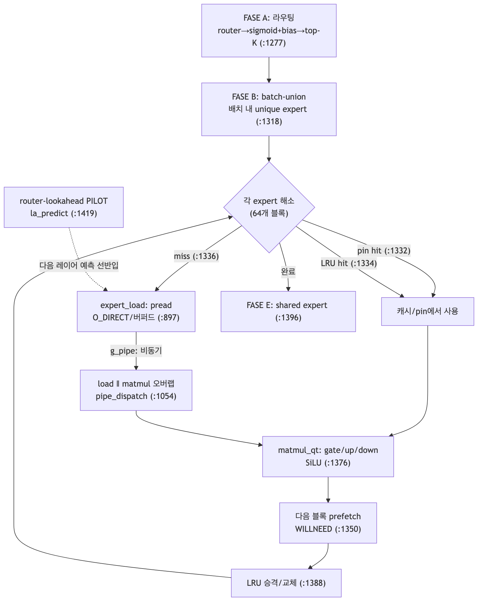{width=6.2in}


#### 1) 라우팅 (FASE A)
- 각 position에서 router 로짓 → sigmoid + bias → top-K 선택(DeepSeek-V3식 noaux_tc, `routed_scale`).
- `--topp`(adaptive expert top-p)로 실제 사용하는 expert 수 `keff`를 줄여 디스크 읽기 감소.
- 사용 통계(`eusage`, `eheat`)를 누적 → 나중에 hot-expert pin 학습에 사용.
- 코드: `glm.c:1277`~`1302`.

#### 2) Batch-union (FASE B)
- S>1(prefill, MTP 검증)에서 **배치 내 unique expert를 한 번만 읽어** 그 expert로 라우팅된 모든 position에 적용.
- 가중치를 position마다 다시 읽지 않음 → I/O 절약.
- 코드: `glm.c:1318`~`1324`.

#### 3) 해소: pin → cache → disk (FASE C/D)
- unique expert를 64개 블록 단위로 처리하며, 각 expert를 순서대로 조회:
  1. **pin**(hot-store)에 있으면 hit — `glm.c:1332`.
  2. 없으면 **레이어별 LRU 캐시** 조회, hit 시 `used=++eclock` 갱신 — `glm.c:1334`.
  3. 둘 다 miss면 디스크 로드 대상(`ws[]` 슬랩) — `glm.c:1336`.

#### 4) 디스크 로드 (`expert_load`, `:897`)
- expert 1개 = gate/up/down 3개 텐서. 파일 오프셋 정렬 후, **연속이면 1회 `pread`**, 아니면 3회.
- **O_DIRECT** 경로(4K 정렬)와 버퍼드 fallback 모두 지원 — `glm.c:937`~`950`.
- `g_drop`이면 `posix_fadvise(...DONTNEED)`로 page cache 압박을 피함 — `glm.c:962`~`966`.

#### 5) load ‖ matmul 오버랩 (PIPE)
- `g_pipe`일 때 I/O 워커 pool이 miss를 비동기로 읽고(`pipe_dispatch`, `:1054`), 메인 스레드는 필요한 expert만 `pipe_wait`(`:1064`)로 기다리며 matmul 수행.
- lock-free, **generation-tagged cursor**로 세대 간 안전성 보장(오래된 워커가 잘못된 배치 상태를 읽지 못함) — `glm.c:986`~`996` 주석.
- 코드: `glm.c:1338`~`1349`.

#### 6) 비동기 readahead / prefetch
- 현재 블록 계산 중 **다음 64개 블록**을 `expert_prefetch`(`WILLNEED`)로 선반입 — `glm.c:1350`~`1361`.
- **router-lookahead(`PILOT=1`)**: 다음 레이어 라우팅을 현재 레이어 post-attention 상태로 71.6% 예측 → 전용 I/O 스레드가 선반입. `la_predict`(`:1419`), `pilot_prefetch`(`:1460`).

#### 7) LRU 승격 (블록 끝)
- 이번 블록에서 로드한 miss expert를 캐시에 승격. 빈 슬롯 있으면 채우고, 없으면 `used`가 가장 오래된 슬롯을 교체(스왑 버퍼) — `glm.c:1388`~`1394`.

#### 8) Hot-expert pin & 학습 캐시
- `.coli_usage`에 라우팅 빈도를 누적, 시작 시 가장 뜨거운 expert를 여유 RAM에 pin(`pin_load`, `:2409`; `pin_wire`, `:2392`).
- 라이브 재핀(`--repin N`): 세션 heat map으로 cold pin을 hot streamed expert로 교체, 25% hysteresis + 4-swap 한도로 thrashing 방지(`repin_pass`, `:2033`).

#### 9) RAM 안전
- 시작 시 `MemAvailable` 기반으로 expert 캐시 크기를 자동 산정(작업셋+KV+MTP+재구성 버퍼 투영)해 OOM-killer 방지 — `mem_available_gb`(`:2505`), `expert_avail`(`:2538`). 근거: `README.md:41`, `:320`.

### colibrì가 선행 연구와 다른 점
- 대부분의 offloading은 **RAM↔GPU(PCIe)** 전송에 초점. colibrì는 **SSD↔RAM(CPU 추론)** 을 1차 경로로 삼는다.
  - 이유: expert를 매번 GPU로 올리면 디스크 병목을 PCIe 병목으로 바꿀 뿐 — `README.md:239`.
- int4 양자화로 expert당 ~19MB까지 줄여 SSD 스트리밍을 현실화(전송량이 관건).

### 한계 및 트레이드오프
- **cold decode는 디스크 바운드**: 토큰당 ~11GB 읽기 → 느린 드라이브에서 0.05–0.1 tok/s. 근거: `README.md:52`.
- 작은 RAM에서는 캐시 슬롯이 2개/레이어로 제한 → 캐시 hit이 낮아 디스크가 계속 병목. **RAM cap이 실질 제약**.
- prefetch는 디스크가 이미 포화면 이득이 적음(개발 머신에서 중립).
- SSD는 읽기 위주라 마모는 크지 않으나, 지속 발열과 (RAM 부족 시) swap write에 주의.

### 출처
- 코드: `external/colibri/c/glm.c`, `external/colibri/README.md`
- 논문: `data/topics/moe-streaming/` (SOURCE.md 참조)


## 21 · MLA 기반 KV Cache 압축

### 요약 (3줄)
- MLA(Multi-head Latent Attention)는 K/V를 head별 full-rank로 저장하는 대신 **저차원 latent 벡터 하나로 공동 압축**해 KV 캐시를 수십 배 줄인다.
- 핵심 트릭은 (1) 압축된 latent만 캐시, (2) **부분 RoPE**(위치 정보용 소수 차원만 분리), (3) 추론 시 **weight absorption**으로 head 재구성 없이 latent에 직접 질의.
- colibrì는 GLM-5.2의 MLA를 C로 구현해 토큰당 **576 float**만 저장(GLM-5.2의 64 head 기준 32,768 대비 **57× 감소**).

### 배경 / 문제의식
- 표준 MHA는 토큰·레이어마다 `2·n_h·d_h` 원소의 KV를 저장 → 장문에서 폭증(DeepSeek-V2 예: 32K 컨텍스트에 단일 시퀀스가 ~128GB).
- MQA/GQA는 head를 공유해 KV를 줄이지만 성능이 MHA에 못 미침.
- **MLA**(DeepSeek-V2, arXiv:2405.04434)는 low-rank 공동 압축으로 **MHA급 성능 + MQA급 캐시**를 달성.
  - 근거: `data/topics/mla-kv/paper-deepseek-v2-arxiv-2405.04434.txt`, `paper-mha2mla-acl-2025.txt`.

### 개념 비교 (MHA vs MLA)

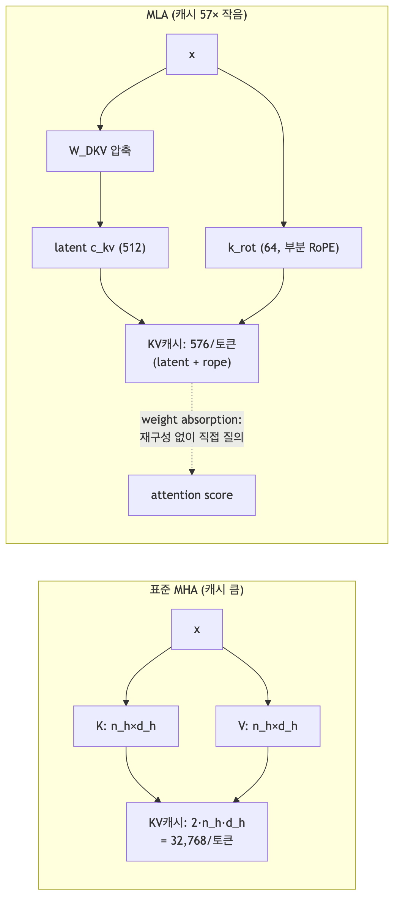{width=5.49in}

### MLA의 원리 (개념)
1. 입력 x를 `W_DKV`로 **latent `c_kv`(예: 512차원)** 로 압축 → 이것만 캐시.
2. 필요 시 `W_UK`, `W_UV`로 각 head의 k_nope/value를 재구성.
3. 위치 의존 성분은 분리(**decoupled/partial RoPE**): 소수 rope 차원(`d_h^R`)만 따로 두어 캐시. NoPE 차원은 압축·흡수 가능.
4. **Weight absorption**: `q·k_nope = (W_UK^T q)·c_kv` 항등식으로, 디코드 시 모든 context 토큰에 대해 k/v를 재구성하지 않고 query를 latent에 직접 투영.
   - DeepSeek-V2 설정: `d_c = 4·d_h = 512`, `d_h^R = d_h/2 = 64` → 576 원소/토큰/레이어. head 수에 무관하게 캐시 결정.

### colibrì의 구현 (코드 근거)
분석 대상: `external/colibri/c/glm.c`의 `attention()` (`:1113`).

#### 1) latent KV 캐시 저장
- 토큰별로 `kv_a`로 압축 → latent `Lc`(정규화 후)와 rope 성분 `Rc`를 캐시에 저장.
- query도 `q_a`(LoRA) → `q_b`로 확장, rope 차원만 `rope_interleave`.
- 코드: `glm.c:1122`~`1135`. (`Lc`=`m->Lc[layer]`, `Rc`=`m->Rc[layer]`)
- README: 토큰당 **576 float** vs 32,768 → **57× 작음**(GLM-5.2는 64 head, GQA 없음). 근거: `README.md:27`.

#### 2) 부분(interleaved) RoPE
- `rope_interleave` (`glm.c:632`)를 query의 rope 구간과 `Rc`(공유 k_rot)에만 적용 → NoPE/RoPE 분리.

#### 3) Weight absorption (디코드 경로)
- `absorb`가 켜지고 `kv_lora<=512`이면(작은 S: 디코드/MTP 검증), k/v를 재구성하지 않고:
  - `qabs`에 `kv_b` row를 흡수(`qt_addrow`) → latent와 직접 내적으로 score 계산 → softmax → latent 가중합 후 `kv_b`로 context 투영.
  - 비용: `O(T·kv_lora)` (기존 `O(T·H·(nope+vh))` 대비 감소).
  - 코드: `glm.c:1191`~`1229`. 검증: TF 32/32, 생성 20/20 (README:33).
- S가 크면(prefill) 표준 경로: `kv_b`로 전체 토큰 k_nope+value를 한 번 재구성 후 causal attention — `glm.c:1230`~`1260`.

#### 4) DSA sparse attention과의 결합
- lightning indexer가 per-query top-2048 causal key만 선택(`dsel`/`dnsel`) → attention이 선택된 key만 참조.
- 선택을 "전부 keep"으로 강제하면 dense와 token-exact 재현(검증). 코드: `glm.c:1136`~`1190`, `README.md:36`.

#### 5) 압축 KV 지속화
- `.coli_kv`에 압축 MLA KV를 turn마다 append(~182KB/token) → 재시작 시 warm 복원, 재-prefill 없음. `kv_disk_append`(`:2095`)/`kv_disk_load`(`:2118`), `README.md:37`.

### 한계 및 트레이드오프
- absorption 경로는 `kv_lora<=512`, 작은 S에서만 활성(디코드 특화). 큰 배치는 재구성 경로 사용.
- 최적 `d_c`(latent 차원)에 대한 체계적 ablation은 원논문에도 부재(휴리스틱). 근거: `data/topics/mla-kv/` Xu'Blog 요약.
- 압축은 미세한 수치 차이를 유발할 수 있으나 colibrì는 흡수 경로를 dense와 exact 검증했다고 보고.

### 출처
- 코드: `external/colibri/c/glm.c:1113`(attention), `README.md:27`,`:33`,`:36`
- 논문: `data/topics/mla-kv/` (SOURCE.md 참조)


## 22 · Speculative Decoding (MTP 기반)

### 요약 (3줄)
- Speculative decoding은 가벼운 draft로 여러 토큰을 **미리 제안**하고, target 모델이 **한 번의 배치 forward로 검증**해 맞는 prefix를 받아들여 step 수를 줄인다.
- **MTP(Multi-Token Prediction)** 는 별도 draft 모델 없이, 모델 자체의 multi-token 예측 head를 draft로 쓰는 self-speculative 방식이다(Medusa/EAGLE 계열과 유사).
- colibrì는 GLM-5.2의 **native MTP head(레이어 78)** 로 draft를 만들고 검증한다. **head는 int8이어야** acceptance가 살아난다(int4면 0–4%).

### 배경 / 문제의식
- 자기회귀 디코딩은 토큰마다 1 forward → 매번 파라미터를 메모리에서 끌어와야 해 지연이 크다.
- Speculative decoding 3단계: (1) draft로 γ개 제안, (2) target이 병렬 검증, (3) 일치 prefix 수락 + 불일치 시 fallback.
  - draft-model 방식(별도 소형 모델) / **self-speculative**(Medusa 다중 head, MTP, EAGLE)로 나뉨.
  - 검증 전략: **rejection sampling**(분포 보존, 무손실) vs **typical acceptance**(휴리스틱, 비탐욕 시 손실 가능).
  - 근거: `data/topics/speculative-decoding/paper-medusa.txt`, `primer-amanai-speculative-decoding.txt`.
- GLM-5.2는 MTP 레이어를 speculative decoding용으로 개선해 accepted length를 최대 20% 향상, rejection sampling 도입. 근거: `data/glm/notes.md`.

### 동작 흐름 (draft → verify → accept)

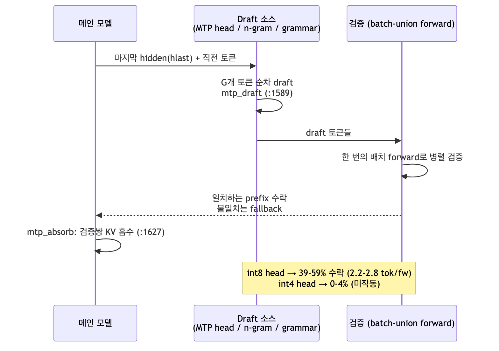{width=6.2in}

### colibrì의 구현 (코드 근거)
분석 대상: `external/colibri/c/glm.c`.

#### 1) MTP draft 생성 (`mtp_draft`, `:1589`)
- DeepSeek-V3식 체인: `h' = Layer78( eh_proj[ enorm(emb(tok)) ; hnorm(h) ] )`, `draft = argmax(lm_head(mtp_norm(h')))`.
- 직전 hidden `hlast`에서 시작해 G개 draft를 순차 생성(각 draft를 다음 입력으로 사용).
- MTP head의 KV는 레이어 `n_layers` 행에 존재하며 decode 전용 윈도우(prefill 불필요).
- 코드: `glm.c:1595`~`1620`.

#### 2) draft 검증 & 흡수
- 생성 루프(`run_text`/`generate`)에서 draft를 **batch-union forward**로 한 번에 검증 → 일치 prefix 수락.
- 검증된 (emb(token@pos+1), h_true@pos) 쌍을 MTP head KV에 흡수: `mtp_absorb` (`:1627`). 배치 1회 layer_forward로 처리(batch-union 덕에 expert 저렴).

#### 3) 추가 draft 소스 (합성)
- **n-gram draft** (`ngram_draft`, `:1570`): 최근 bigram 재등장 위치의 후속 토큰을 draft로.
- **문법 강제 draft** (`grammar_draft`, `:1699`): GBNF가 유일 합법 바이트만 허용하는 span(중괄호/따옴표/키명/enum)을 pre-accepted draft로 주입(≈1.0 acceptance). JSON/함수호출 등 제약 출력에서 강력. int4 MTP head에서도 동작. `GRAMMAR=file.gbnf`, `GRAMMAR_DRAFT=n`.
- 세 소스(MTP / n-gram / grammar)는 같은 batch-union forward에서 함께 검증 → 잘못된 draft는 rejected일 뿐 출력에 영향 없음.

#### 4) int8 head의 중요성
- int4 MTP head → draft acceptance 0–4%로 붕괴(speculation 미작동). int8 → **39–59% acceptance, 2.2–2.8 tok/forward**.
- 모델 다운로드 시 `out-mtp-*`가 int8인지 확인 필요. 근거: `README.md:29`,`:67`.

### 정확성(무손실) 관련 주의
- **정확 산술에서는 무손실**이나, colibrì의 정수 커널은 shape 의존적이라 batched(S>1)/GPU forward가 single-token 경로와 미세하게 다르게 반올림.
- int4 GLM-5.2는 argmax tie에 가까워, 이 반올림 차이가 토큰을 뒤집어 **탐욕 출력이 non-speculative와 byte-identical하지 않을 수 있음**(단, 매 토큰은 여전히 valid forward의 argmax → 연속은 정상).
- byte-exact: `DRAFT=0`(+ `IDOT=0 COLI_CUDA=0`). 샘플링 시 rejection sampling이 분포 보존. 근거: `README.md:29`.
- **cold cache 주의**: 검증되는 draft가 추가 expert를 라우팅(~660→~1100 expert-load/token)하므로, 캐시/pin이 데워지기 전엔 speculation이 순 time loss일 수 있음.

### 한계 및 트레이드오프
- 이득은 acceptance rate에 비례. head 정밀도(int8)와 캐시 온도가 실효 속도를 좌우.
- 50% 미만 acceptance면 adaptive guard가 문법 소스를 끔.

### 출처
- 코드: `external/colibri/c/glm.c:1570`~`1646`, `README.md:29`,`:67`
- 자료: `data/topics/speculative-decoding/`, `data/glm/notes.md`


# 제3부 · 로컬 실행과 정확성 검증


## 30 · 로컬 실행/빌드 노트 (Apple Silicon)

이 서베이를 진행한 로컬 환경에서 colibri 엔진을 실제 빌드하고 `coli doctor`로 준비 상태를 점검한 기록.

### 요약 (3줄)
- 이 머신은 **Apple Silicon(arm64) + Apple clang + Homebrew libomp** 환경이다.
- colibri Makefile이 macOS/arm64를 지원하므로 **AVX2 없이 NEON/스칼라 경로 + libomp 멀티스레드**로 빌드에 성공했다.
- 모델 가중치(~370GB)는 받지 않았으나, `coli doctor`가 정상 실행되어 **엔진 바이너리 ready**를 확인했다.

### 환경
| 항목 | 값 |
|---|---|
| CPU/arch | Apple Silicon (aarch64) |
| 컴파일러 | Apple clang 21.0.0 (진짜 gcc 아님) |
| OpenMP | Homebrew `libomp` @ `/opt/homebrew/opt/libomp` (설치됨 → 멀티스레드) |
| Python | 3.14.5 |
| 패키지 관리 | **uv 0.11.16** |
| AVX2 | 없음(arm64) → colibri의 정수 AVX2 커널은 NEON/스칼라 fallback |

### 의존성: uv
런타임 C 엔진과 `coli {doctor,plan,build,info}` CLI는 **순수 표준 라이브러리**라 추가 파이썬 의존성이 없다.
루트 [`pyproject.toml`](../pyproject.toml)에 선택적 의존성만 정의했다.

```bash
# 가상환경 생성 (Python 3.14)
uv venv --python 3.14

# CLI는 의존성 없이 바로 실행 가능
uv run --no-sync python external/colibri/c/coli --help

# 무거운 도구는 필요할 때만:
uv sync --extra convert   # coli convert (torch, safetensors, huggingface_hub, numpy)
uv sync --extra bench     # coli bench  (tokenizers, datasets)
```

### 빌드
```bash
make -C external/colibri/c glm
# 실제 실행된 컴파일 라인:
# clang -O3 -Xclang -fopenmp -I/opt/homebrew/opt/libomp/include ... glm.c -o glm -lm -L.../libomp/lib -lomp
```
- 산출물: `external/colibri/c/glm` (약 207KB). **바이너리이므로 커밋 대상 아님**(.gitignore 처리).

### coli doctor 결과 (모델 미보유)
```text
colibri doctor · .../glm52_i4
[fail] model.path         model directory does not exist
[fail] model.config       config.json is missing or invalid
[fail] model.tokenizer    tokenizer.json is missing
[skip] storage.persistence persistence requires a model directory
[  ok] engine.binary      engine executable is ready      ← 빌드 검증됨
[skip] accelerator.cuda   no NVIDIA GPU detected; CPU path is available
[fail] model.shards       missing config.json
[skip] storage.disk       storage check requires a valid model
[skip] memory.ram         RAM projection requires a valid model
[skip] placement.plan     placement requires a valid model
result error
```
- `engine.binary … ready`, `accelerator.cuda … CPU path available`는 기대대로 통과.
- `model.*`는 가중치를 받지 않았으므로 fail(정상). 실제 추론까지 하려면
  `mateogrgic/GLM-5.2-colibri-int4-with-int8-mtp`(~370GB)를 NVMe에 받고 `COLI_MODEL`을 지정해야 한다.

### 다음 단계(실제 추론 시)
```bash
COLI_MODEL=/nvme/glm52_i4 uv run --no-sync python external/colibri/c/coli doctor   # 준비 재점검
COLI_MODEL=/nvme/glm52_i4 uv run --no-sync python external/colibri/c/coli plan      # 자원 계획
COLI_MODEL=/nvme/glm52_i4 uv run --no-sync python external/colibri/c/coli chat      # 대화
```


## 31 · 엔진 정확성 실검증 (로컬 실행 결과)

370GB 모델 없이, 이 로컬(Apple Silicon)에서 colibri **엔진 코어의 정확성**을 실제로 검증한 기록.

### 요약 (3줄)
- 의존성 없는 **C 코어 테스트 4종 전부 통과**(json/safetensors/tier/grammar).
- tiny GLM oracle로 실제 `glm.c` 엔진이 transformers 오라클과 **token-exact 일치: 32/32 positions**.
- arm64에서 `idot: neon` 커널 경로로 MLA·MoE·shared expert·DSA(no-op) 전 경로가 정확히 동작함을 확인.

### 1. 무엇을 확인하려 했나 (검증 목적)
"370GB GLM-5.2 가중치 없이도 **엔진이 올바르게 동작하는가**"를 값싸게 증명:
1. **정수/로더/문법 파서의 정확성** (C 단위 테스트)
2. **실제 forward 경로의 수치 정확성** — MLA attention, MoE 라우팅, shared expert, 양자화 dequant-on-use가 참조 구현과 token-exact인가
3. **로컬 툴체인 정합성** — arm64 + clang + libomp + NEON fallback이 컴파일만이 아니라 **정확한 출력**을 내는가

### 2. C 코어 단위 테스트 (의존성 0)
```bash
make -C external/colibri/c test-c
```
결과:
```text
json tests: ok
safetensors primitive tests: ok
tier tests: ok
test_grammar: ok
```
- 검증 대상: `json.h`(config 파서), `st.h`(safetensors 로더), `tier.h`(자원 tier), `grammar.h`(GBNF 문법 draft).

### 3. Token-exact 검증 (tiny GLM oracle)
#### 3.1 오라클 생성 (torch/transformers 임시환경, uv)
```bash
cd external/colibri/c
uv run --python 3.12 --with torch --with "transformers>=5.13" --with safetensors --with numpy \
    python tools/make_glm_oracle.py
# → glm_tiny/ (랜덤 가중치 tiny GLM, 실제 glm_moe_dsa 아키텍처) + ref_glm.json 생성
```
- tiny 구성(실제 아키텍처 유지): hidden 128, 5층(3 dense+2 sparse), 8 expert top-2, 1 shared, q_lora 64/kv_lora 32, MLA, DSA index_topk=4096(≫seq → 전체 선택=dense와 동일).

#### 3.2 엔진 teacher-forcing 실행
```bash
SNAP=./glm_tiny TF=1 ./glm 64 16 16
```
결과(발췌):
```text
[DSA] indexer active: top-4096 sparse attention beyond 4096 context tokens
[MTP] absent (draft=0)
[RAM_GB=12.9 auto] cap=64 ok (projected peak 3.7 GB)
== GLM C engine (glm_moe_dsa), cache=64 experts/layer | experts@16-bit dense@16-bit | idot: neon ==
loaded in 0.00s | resident dense: 1.57 MB | layers=5 experts=8 | MTP absent (draft=0)
PREFILL (teacher-forcing) C vs oracle: 32/32 positions | 3577.4 pos/s
```
- **32/32 positions**: C 엔진의 32개 위치 예측이 transformers 오라클과 **완전 일치**.
- `idot: neon`: arm64 NEON 정수 커널 경로가 동작(AVX2 fallback 확인).
- RAM 자동 캡(12.9GB 감지 → peak 3.7GB projection)도 정상 작동.

### 4. 이 검증이 증명하는 것 / 아닌 것
- **증명함**:
  - `glm.c`의 MLA attention(q/kv-LoRA, 부분 RoPE, weight absorption), MoE 라우팅(sigmoid+bias, top-k, shared expert), DSA 인덱서(전체 선택 시 dense 동치)가 **수치적으로 정확**하다.
  - 이 로컬 arm64 빌드가 정확한 출력을 낸다.
- **증명 안 함**(별도 자원 필요):
  - 대규모 int4 양자화 품질(본 오라클은 16-bit dense tiny 모델).
  - 디스크 스트리밍 성능(tiny 모델은 expert가 작아 disk 0.000s) — 대형 모델·실 NVMe 필요.
  - MTP speculative(tiny 오라클엔 MTP head 없음, `draft=0`).

### 5. 재현 절차 (요약)
```bash
# 1) 빌드
make -C external/colibri/c glm
# 2) C 테스트
make -C external/colibri/c test-c
# 3) 오라클 + token-exact
cd external/colibri/c
uv run --python 3.12 --with torch --with "transformers>=5.13" --with safetensors --with numpy python tools/make_glm_oracle.py
SNAP=./glm_tiny TF=1 ./glm 64 16 16      # expect 32/32
```
- 생성물(`glm_tiny/`, `ref_glm.json`)은 재현 가능하며 저장소에 커밋하지 않는다(vendored `.gitignore`가 `glm_tiny/` 제외).

### 출처
- 코드: `external/colibri/c/glm.c`, `tools/make_glm_oracle.py`, `Makefile`, `setup.sh`
- 실행 환경: `30-local-run-notes.md`


# 제4부 · 논리 분석: 장단점·자원


## 40 · 논리적 분석: 장점 · 단점 · Trade-off

colibrì 접근법을 시스템 관점에서 면밀히 분석한다. 근거는 `external/colibri/`(코드·README)와 `data/`(수집 자료).

### 요약 (3줄)
- colibrì의 본질은 **"메모리 용량 문제를 디스크 대역폭 문제로 치환"** 하는 것이다 — MoE의 희소 활성화 덕에 성립한다.
- 최대 장점은 **접근성**(H100급 없이 744B 구동)과 **의존성 제로**(단일 C), 최대 단점은 **낮은 처리량**(디스크 바운드).
- 모든 최적화는 결국 "디스크를 얼마나 안 읽느냐"(캐시 hit·양자화·speculation)로 수렴하며, 각 기법은 명확한 trade-off를 가진다.

### 1. 근본 통찰: 무엇을 무엇으로 바꾸는가
- 전통적 제약: **모델 크기 > 메모리 용량** → 실행 불가.
- colibrì의 치환: 안 쓰는 파라미터(routed expert)를 SSD에 두고, **필요 시 대역폭으로 지불**.
- 이 치환이 유효한 이유(MoE 희소성):
  - 744B 중 토큰당 활성 ~40B, 그중 토큰마다 바뀌는 routed expert는 ~11GB (`README.md:17`).
  - dense(~17B)는 재사용되므로 RAM 상주가 합리적.
- **결론**: colibrì는 "용량(GB) 병목"을 "대역폭(GB/s) 병목"으로 바꾼 것이다. 용량은 SSD로 값싸게 확장되지만, 대역폭은 느리다 → 이 한 문장에 모든 장단점이 파생된다.

### 2. 장점 (Strengths)

| # | 장점 | 근거 | 논리 |
|---|---|---|---|
| S1 | **극한의 접근성** | `README.md:5`,`:56` | 25GB RAM + NVMe로 프론티어급 744B 실행. GPU 불필요 |
| S2 | **의존성 제로 / 이식성** | `README.md:22`, `compat.h` | 단일 C 파일 + 헤더. BLAS·Python·GPU 런타임 불요. Linux/macOS/Windows 네이티브 |
| S3 | **비용 대비 규모** | `README.md:56` | "H100 팬 하나보다 싼 기계에서 정답 생성" |
| S4 | **정확성 우선 설계** | `README.md:26`,`:33` | transformers oracle에 token-exact 검증(TF 32/32, greedy 20/20) |
| S5 | **점진적 가속(학습형 캐시)** | `README.md:324`, `glm.c:2409` | `.coli_usage`로 hot expert를 학습·pin → 쓸수록 빨라짐 |
| S6 | **읽기 전용 스트리밍(SSD 수명)** | `README.md:58` | expert 읽기는 마모가 작음(쓰기 아님). swap만 피하면 됨 |
| S7 | **운영 편의(plan/doctor)** | `README.md:107`,`:116` | 실행 전 자원 계획·준비 점검을 read-only로 제공 |
| S8 | **표준 호환(OpenAI API)** | `README.md:171` | 기존 앱 연동 용이 |

### 3. 단점 (Weaknesses)

| # | 단점 | 근거 | 논리 |
|---|---|---|---|
| W1 | **낮은 처리량** | `README.md:53` | cold ~0.05–0.1 tok/s. 대화형으로는 느림 |
| W2 | **cold-start I/O 폭증** | `README.md:52` | 토큰당 ~11GB 랜덤 읽기(75층×8 expert) |
| W3 | **작은 RAM에서 캐시 무력화** | `README.md:398` | 24GB RAM은 2 slot/layer로 캐시 hit 낮음 → 디스크가 계속 병목 |
| W4 | **저장 공간 요구** | `README.md:48` | int4라도 ~370GB 로컬 NVMe 필요(네트워크/9p 불가) |
| W5 | **양자화 품질 불확실성** | `README.md:402` | int4 컨텍스트 62.5% (n=40, ±14pp) — 아직 결론 아님 |
| W6 | **비결정성(byte 재현성)** | `README.md:29` | shape 의존 정수 커널로 batched/GPU/MTP 경로가 스트림을 미세하게 바꿈 |
| W7 | **단일 시퀀스 실행** | `README.md:199` | 동시 요청은 큐잉(진짜 continuous batching 아님) |
| W8 | **CPU matmul 상한** | `README.md:372` | 캐시가 채워지면 이번엔 AVX2 커널 속도가 병목(≈250 GFLOP/s) |
| W9 | **가독성/유지보수** | `glm.c` ~2,400줄 단일 파일 | 이식성의 대가로 단일 파일 복잡도 |

### 4. Trade-off 심층 분석

각 최적화는 "디스크 읽기 감소"를 위해 **다른 자원을 지불**한다.

#### T1. Expert LRU 캐시 크기 ↔ RAM
- 캐시를 키우면 hit↑ → 디스크 읽기↓ → 속도↑. 대가는 RAM.
- 자동 상한(`expert_avail`, `glm.c:2538`)이 OOM을 막지만, RAM이 작으면 근본적으로 hit이 낮다(W3).
- **결정 규칙**: 여유 RAM 전부를 캐시/pin에 투입하는 것이 거의 항상 이득(`README.md:320`).

#### T2. 양자화 비트수(int2/4/8) ↔ 품질 · 전송량
- 낮은 비트 → expert 크기↓ → 전송량↓ → 속도↑. 대가는 정확도(W5).
- int4가 현재 스윗스팟(expert당 ~19MB). MTP head만은 **int8 필수**(int4면 speculation 붕괴, `README.md:67`).
- **비대칭 양자화 결정**: 같은 모델 안에서도 역할별로 비트를 달리 준다(expert=int4, MTP head=int8).

#### T3. Speculative Decoding(MTP) ↔ cold 캐시
- warm 캐시에서는 유효 비용을 절반가량으로(2.2–2.8 tok/fw). 그러나 **cold에서는 검증 draft가 추가 expert를 라우팅**(~660→~1100 load/token, `README.md:29`) → 순 손해 가능.
- **조건부 이득**: speculation은 "캐시가 데워진 뒤" 켜야 이득. 자동 guard(<50% acceptance면 off)로 완화.

#### T4. Prefetch(PILOT/WILLNEED) ↔ 디스크 포화도
- 예측 선반입은 compute와 I/O가 균형일 때만 이득. 디스크가 이미 포화면 중립~손해(`README.md:322`).
- **환경 의존**: 빠른 CPU + 중간 디스크에서 최대 효과.

#### T5. Weight Absorption(MLA) ↔ 배치 크기
- 작은 S(decode/MTP 검증)에서는 k/v 재구성을 생략해 `O(T·kv_lora)`로 절감(`glm.c:1191`).
- 큰 S(prefill)에서는 재구성 경로가 더 효율 → `absorb` 자동 분기.
- **배치별 최적 경로 분기**가 핵심.

#### T6. 정확성(재현성) ↔ 속도
- 최고 속도 설정(MTP on, CUDA expert, batched)은 byte-exact 재현성을 포기(W6).
- byte-exact가 필요하면 `DRAFT=0 IDOT=0 COLI_CUDA=0` → 느려짐.
- **용도별 선택**: 연구 재현 vs 실사용 속도.

#### T7. GPU(CUDA expert tier) ↔ CPU 커널 성능
- expert를 매번 GPU로 올리면 디스크 병목이 PCIe 병목이 될 뿐(`README.md:239`) → resident tensor만 GPU.
- CPU가 강하면(AVX-512/VNNI) GPU tier 이득 ≈ 0%(`README.md:395`, #101). GPU는 CPU가 약할 때만 값어치.
- **GPU는 기본 가속기가 아니라 조건부 도구**.

### 5. 병목 이동 지도 (핵심 멘탈 모델)

{width=6.2in}
- 실측 근거: 9950X 디스크 교체로 66% disk→57% matmul 전환(`README.md:392`), 9800X3D는 10GB/s에서도 여전히 disk-bound(`README.md:395`).
- **교훈**: colibrì 튜닝은 "지금 병목이 어디인가"를 먼저 측정(`iobench`, profile line)하고 그 병목을 공략하는 순서로 진행해야 한다.

### 6. 언제 쓰고, 언제 쓰지 말아야 하나
- **적합**: 로컬/오프라인 프라이버시, 배치·비대화형 작업, 고가 GPU 부재, 실험·연구, "느려도 되는" 고품질 답.
- **부적합**: 저지연 대화형 프로덕션, 고동시성 서빙, RAM·NVMe 여유 없는 환경, byte-exact 대량 재현이 필수인 파이프라인.

### 출처
- 코드: `external/colibri/c/glm.c`, `external/colibri/c/olmoe.c`, `README.md`
- 자료: `../data/` (SOURCE.md들)


## 50 · 필요 자원 분석

colibrì로 GLM-5.2(744B, int4)를 구동할 때의 자원 요구를 항목별로 정리하고, 하드웨어 등급별 기대치를 제시한다.

### 요약 (3줄)
- **필수 4요소**: (1) 로컬 NVMe ~370GB, (2) RAM ≥16GB(권장 클수록 좋음), (3) AVX2/NEON CPU + OpenMP, (4) OS(Linux/WSL2/macOS/Win11).
- 속도를 좌우하는 두 축은 **RAM 용량**(캐시 hit)과 **NVMe 랜덤 읽기 대역폭**이며, 그 다음이 **CPU matmul**.
- 최소 사양은 "돌아간다", 실사용 체감은 "RAM·NVMe·코어 셋을 함께 올려야" 나온다.

### 1. 저장(Storage)
| 항목 | 요구 | 근거 |
|---|---|---|
| 모델 용량(int4 컨테이너) | **~370GB** 로컬 여유 | `README.md:48` |
| 변환 중 임시(선택) | 샤드 단위(~5GB씩) 처리, 756GB 동시 불요 | `README.md:42` |
| 파일시스템 | ext4/NTFS/APFS 등 **로컬**. 네트워크/9p 마운트 금지 | `README.md:336` |
| 성능 지표 | **랜덤 읽기 대역폭(GB/s)**, 19MB×64 병렬 (`iobench`) | `README.md:343` |
- 디스크 성능 측정: `./iobench <shard> 19 64 8 1`(O_DIRECT, 실제 cold 수치) — `README.md:346`.
- cold decode는 토큰당 ~11GB를 읽으므로 **디스크 대역폭이 cold tok/s의 상한**을 사실상 결정.

### 2. 메모리(RAM)
| 항목 | 값 | 근거 |
|---|---|---|
| dense 상주(int4) | ~9.9GB | `README.md:49` |
| 최소 실행 | ≥16GB | `README.md:336` |
| chat 중 peak RSS(자동 캡) | ~20GB @ 25GB 머신 | `README.md:51` |
| 캐시/pin 여유 | 클수록 hit↑ (선형 이득) | `README.md:320` |
- RAM은 **expert LRU 캐시 + hot pin**의 크기를 결정 → 사실상 "cold 읽기를 얼마나 무료 캐시 hit으로 바꾸느냐".
- 자동 캡(`glm.c:2538`, `mem_available_gb :2505`)이 OOM을 막고 `MemAvailable`에서 안전 상한 산정.
- **작은 RAM의 함정**: 24GB에서는 2 slot/layer로 캡되어, 디스크가 빨라도 cold 유지(`README.md:398`).

### 3. 연산(CPU / 선택적 GPU)
| 항목 | 요구 | 근거 |
|---|---|---|
| 명령어셋 | x86 **AVX2**(정수 dot) 또는 ARM **NEON**(자동 fallback) | `Makefile`, `README.md:32` |
| 병렬 | **OpenMP**(gcc libgomp / clang+libomp) | `Makefile:7-19` |
| matmul 상한 | AVX2 커널 ~250 GFLOP/s, 토큰당 ~80 GFLOP | `README.md:372` |
| 가속(선택) | CUDA(resident tensor/hot expert tier), Metal(커뮤니티) | `README.md:239`,`:386` |
- GPU는 **조건부**: CPU가 약할 때만 이득. AVX-512/VNNI CPU면 GPU expert tier ≈ 0%(`README.md:395`).

### 4. OS / 툴체인
- Linux, WSL2, macOS, **Windows 11 네이티브(MinGW-w64)** 지원(`README.md:133`).
- 런타임은 순수 C. **Python은 변환기/서버/doctor 등 도구에서만**(우리 환경은 uv로 관리).
- 변환(`coli convert`)만 torch/safetensors/huggingface_hub/numpy 필요(`README.md:90`).

### 5. 하드웨어 등급별 기대치 (예측 + 실측)

> 예측치는 back-of-envelope(`README.md:365`), 실측치는 커뮤니티 벤치(`README.md:377`).

| 등급 | 사양 예 | 기대 tok/s | 성격 | 근거 |
|---|---|---|---|---|
| 최소 | 25GB RAM, ~1GB/s NVMe(WSL2 VHDX) | 0.05–0.1 (cold) | 검증된 baseline · 매우 느림 | `README.md:369` |
| 입문 Apple | M4 Pro, 48GB, Metal | ~0.30 | 소형 RAM에서도 CPU 대비 개선 | `README.md:388` |
| 중급 | 네이티브 Linux, PCIe4 NVMe(3–5GB/s), 32GB | ~0.5–1 | 실용 하한 | `README.md:370` |
| 고급 Apple | M5 Max, 128GB unified, Metal, pin 40GB+ | ~1.8–2.1 | 현재 최속 datapoint | `README.md:386` |
| 고급 x86 | PCIe5 NVMe(8–12GB/s), 64GB, pin ~40GB | ~2–4 | matmul 바운드로 이동 | `README.md:371` |
| 대용량 RAM | 128–430GB RAM, hit 98% | ~1–4 | 디스크 제거 → RAM·matmul 바운드 | `README.md:396` |
| 인터랙티브 | 위 + 24–32코어 또는 AVX-512/VNNI | ~5–15 | 커널이 승수 | `README.md:373` |

### 6. 실전 권장 구성(용도별)

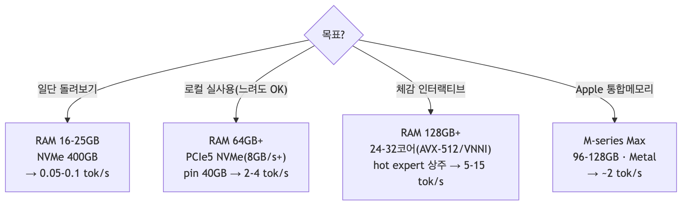{width=6.2in}

### 7. 우리 로컬 환경의 판정
- Apple Silicon + libomp로 **엔진 빌드/`coli doctor`는 성공**했으나(`30-local-run-notes.md`),
  **실제 추론은 미실시**: ~370GB int4 가중치를 둘 NVMe 여유가 없어서다(사용자 확인).
- 이는 W4(저장 요구)의 직접 사례. 엔진·툴체인은 준비 완료 상태이므로, NVMe 확보 시 즉시 실행 가능.

### 8. 자원 계획 자동화(도구)
```bash
# 헤더만 읽어 dense/expert footprint, RAM reserve, 캐시 cap, VRAM tier를 산정
COLI_MODEL=/nvme/glm52_i4 uv run --no-sync python external/colibri/c/coli plan --json
# 실행 전 준비 점검(모델·config·토크나이저·RAM·CUDA)
COLI_MODEL=/nvme/glm52_i4 uv run --no-sync python external/colibri/c/coli doctor --json
```

### 출처
- `external/colibri/README.md`(§Honest numbers, §predictions, §Community benchmarks), `Makefile`, `glm.c`


# 제5부 · 타 모델 적용


## 60 · 타 모델 적용 방안

colibrì의 "디스크 스트리밍" 접근을 다른 모델에 적용하려면 무엇이 필요한지 분석한다.
저장소 자체가 이미 **두 모델(GLM-5.2, OLMoE)** 을 같은 코어로 지원한다는 점이 출발점이다.

### 요약 (3줄)
- 스트리밍의 전제는 **MoE 희소 활성화**다 — 이것만 있으면 attention 방식(MHA/GQA/MLA)과 무관하게 코어가 재사용된다(`olmoe.c`가 증거).
- MLA/DSA/MTP는 **모델 고유 최적화**이며, 대상 모델이 지원할 때만 얹는 선택 레이어다.
- 적용 난이도는 "모델 구조가 얼마나 표준적인가 + 파라미터 레이아웃이 얼마나 명확한가"로 결정된다.

### 1. 저장소가 증명하는 일반화 (GLM-5.2 vs OLMoE)

| 구성요소 | GLM-5.2 (`glm.c`) | OLMoE (`olmoe.c`) | 성격 |
|---|---|---|---|
| Attention | MLA (q/kv-LoRA, 부분 RoPE) + DSA sparse | 표준 MHA/GQA(`n_kv_heads`) | **모델 고유** |
| KV 압축 | 압축 latent(576/token) | 일반 K/V 캐시 | 모델 고유 |
| Speculative | native MTP head(int8) | 없음 | 모델 고유(선택) |
| **Expert 스트리밍** | ✅ pread + 레이어별 LRU | ✅ pread+fadvise + 레이어별 LRU | **공통 코어(재사용)** |
| Expert 양자화 | int2/4/8, dequant-on-use | int8(1B/param), dequant-on-use | 공통 |
| 병렬 | OpenMP matmul(no BLAS) | OpenMP matmul(no BLAS) | 공통 |

- `olmoe.c:2-3` 주석: "GLM-5.2로 스케일하기 전에 **코어를 검증**하는 Stage A".
- `olmoe.c:32-35` 주석: expert를 int8로 양자화(4B→1B/param)하는 것이 "GLM-5.2를 15GB에 담는 메커니즘".
- **결론**: 스트리밍+LRU+양자화 코어는 이미 모델 독립적으로 재사용되고 있으며, 나머지(attention/spec)는 어댑터.

### 2. 어떤 모델이 잘 맞는가 (적합성 체크리스트)

| 조건 | 이유 | 이상적 |
|---|---|---|
| **MoE 구조** | 스트리밍의 전제(희소 활성화) | 필수 |
| **높은 sparsity**(활성/전체 비율 낮음) | 토큰당 읽을 expert↓ → 빠름 | 활성 5–10% 이하 |
| **fine-grained experts**(작은 expert 다수) | LRU·prefetch 입도 세밀, 캐시 효율↑ | 수백 expert/layer |
| **양자화 내성** | int4로 크기↓·품질 유지 | int4에서 품질 안정 |
| **KV 절감 attention**(MLA/GQA) | 긴 컨텍스트 RAM 절감(스트리밍과 독립적 이득) | MLA 최상, GQA 차선 |
| **명확한 파라미터 레이아웃** | expert 텐서를 파일 오프셋으로 pread | safetensors, expert별 분리 |
| **native draft head**(MTP/Medusa/EAGLE) | speculation으로 처리량 보완 | 있으면 가점 |

- Dense 모델은 부적합: 매 토큰 전체 파라미터가 활성 → 스트리밍하면 토큰당 "전체 모델"을 읽어야 함(치명적).
- 후보 계열: DeepSeek-V2/V3(MLA+MoE), Mixtral/OLMoE(GQA+MoE), Qwen-MoE 등.

### 3. 적용 절차 (신규 모델 온보딩)

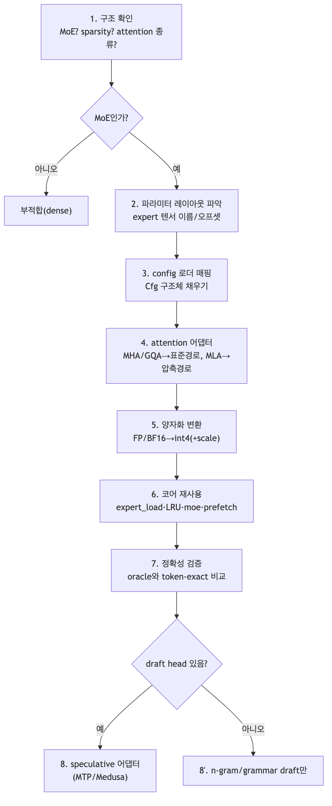{width=6.2in}

#### 각 단계의 재사용/신규 구분
- **재사용(공통 코어)**: `expert_load`(`glm.c:897`), LRU 캐시/batch-union/`moe`(`:1270`), prefetch(`:1070`,`:1460`), 양자화 커널(`:475`,`:512`), RAM 안전 캡(`:2538`), safetensors 로더(`st.h`), 토크나이저(`tok.h`).
- **신규(모델 어댑터)**: config 매핑(`load_cfg`), attention(`attention` 대체), expert 텐서 이름 규칙(`expert_load`의 `nm[]`), 양자화 변환 스크립트(`tools/convert_*`), (선택) draft head.

### 4. 세부 적용 포인트

#### 4.1 파라미터 레이아웃 / 변환
- expert 가중치가 **파일에서 개별 텐서로 분리**돼 있어야 offset pread가 가능(`glm.c:905`의 이름 규칙 `model.layers.%d.mlp.experts.%d.<proj>.weight`).
- 변환기는 **샤드 단위 스트리밍 변환**(다운로드→dequant→int4 재양자화→삭제)으로 원본 전체를 동시에 두지 않도록(`convert_fp8_to_int4.py`, `README.md:42`) 설계 권장.
- per-row scale + int4/int8 컨테이너로 통일(`quantize_rows`, `glm.c:512`).

#### 4.2 Attention 어댑터
- **MLA**: 압축 KV + weight absorption 경로 재사용 가능(`glm.c:1113`). 대상 모델이 MLA면 거의 그대로.
- **GQA/MHA**: `olmoe.c`의 표준 K/V 경로 참고. KV 절감은 스트리밍과 독립이므로, GQA만으로도 실행은 가능(RAM만 더 씀).
- 부분 RoPE·정규화 위치 등 세부는 모델별로 맞춰야 함.

#### 4.3 Speculative(선택)
- 대상 모델에 **draft head가 있으면** MTP식 어댑터로 큰 이득(`glm.c:1589`). head는 정밀도 민감(int8 권장).
- 없으면 **n-gram/grammar draft**만으로도 부분 이득(`glm.c:1570`,`:1699`) — 특히 구조화 출력(JSON)에서 유효.

#### 4.4 정확성 검증(필수)
- 소형 랜덤 fixture 또는 tiny-oracle로 **token-exact 비교**(TF/greedy)를 먼저 통과시키고 대형으로 확장(`olmoe.c` Stage A 방식, `README.md:26`).

### 5. 접근법 자체를 다른 프레임워크로 이식할 때
- colibrì 코드를 쓰지 않고 **아이디어만** 가져올 경우(예: llama.cpp/vLLM 확장):
  - 핵심은 (a) expert offload + on-demand load, (b) 라우팅 예측 prefetch, (c) 레이어별 LRU + hot pin, (d) 역할별 비대칭 양자화.
  - 선행연구와 정합: LRU·prefetch·batch 재사용은 MoE offloading 문헌의 표준 기법(`data/topics/moe-streaming/`의 arXiv:2312.17238, 2512.16473, 2602.03495).
  - colibrì의 차별점은 **SSD를 1차 경로로** 삼고 GPU/PCIe를 부차로 둔 것, 그리고 순수 C 무의존 구현.

### 6. 리스크 / 주의
- 양자화 품질은 모델마다 다름 → int4가 안 통하면 int8/그룹 스케일로 조정(용량↑).
- expert 크기가 크면(coarse-grained) 캐시 입도가 나빠져 hit이 낮아짐.
- 파라미터가 하나의 큰 텐서로 뭉쳐 있으면(분리 안 됨) offset pread 설계가 어려움 → 변환 단계에서 재배치 필요.
- 라이선스: 대상 모델 가중치/코드 라이선스 확인 필수.

### 출처
- 코드: `external/colibri/c/glm.c`, `external/colibri/c/olmoe.c`, `tools/convert_fp8_to_int4.py`
- 선행연구: `../data/topics/moe-streaming/`(SOURCE.md), `../data/topics/mla-kv/`, `../data/topics/speculative-decoding/`


## 61 · 적용 설계서: gpt-oss-20b

colibrì 코어를 **gpt-oss-20b**(OpenAI open-weight MoE)에 이식하기 위한 구체 설계.
전제 프레임워크는 [`60`](./60-applying-to-other-models.md)의 온보딩 7단계.

### 요약 (3줄)
- gpt-oss-20b는 **MoE라 아키텍처상 적합**하나(32 expert top-4, GQA, 네이티브 4비트), 4비트로 **≈16GB면 통째로 RAM 적재**가 가능하다.
- 따라서 실익은 "대형 모델 스트리밍"이 아니라 **순수 C·무의존 포터블 엔진** 또는 **8GB급 초저사양 구동**에 있다(→ 스트리밍은 옵션).
- 이식의 실제 난이도는 **MXFP4 양자화 변환**, **attention sinks(softmax 분모 학습 bias)**, **sliding-window/dense 교대**, **YaRN**, GQA 경로 정합이며, expert 스트리밍 코어는 거의 그대로 재사용.

### 1. 대상 사양 (확인된 아키텍처)
| 항목 | 값 | 비고 |
|---|---|---|
| 총/활성 파라미터 | 20.9B / 3.6B | MoE 가중치가 90%+ |
| 레이어 | 24 | decoder-only |
| hidden_size | 2880 | |
| experts / top-k | 32 / 4 | 레이어당 |
| attention | GQA: 64 Q-head, 8 KV, head_dim 64 | |
| attention sinks | softmax 분모에 학습 bias(off-by-one) | 특수 |
| 위치 | RoPE + YaRN(128k) | |
| 패턴 | sliding window(128) ↔ full dense 교대 | GPT-3식 |
| norm / act | RMSNorm / QuickGELU gated | |
| 양자화 | MoE weight MXFP4(4.25 bit/param) | 네이티브 |
| vocab | 201,088 | |
- 근거: `data/topics/apply-gpt-oss/SOURCE.md` (OpenAI 모델카드 arXiv:2508.10925, HF, NVIDIA).

### 2. 적합성 판정
| 기준(`60 §2`) | gpt-oss-20b | 판정 |
|---|---|---|
| MoE 구조 | 예(32e top-4) | ✅ |
| sparsity | 3.6B/20.9B ≈ 17% 활성 | △ (GLM-5.2의 5%보다 높음 → 토큰당 읽을 비중↑) |
| fine-grained | 32 expert(중간 입도) | △ |
| 양자화 내성 | MXFP4 네이티브 학습 | ✅ |
| KV 절감 attention | GQA(8 KV) | ✅ (MLA만큼은 아님) |
| 분리된 expert 레이아웃 | HF safetensors | ✅ (변환 필요) |
| native draft head | 없음 | ➖ (n-gram/grammar draft만) |
- **핵심 반전(용량)**: MXFP4 4비트 기준 **≈16GB**. 대부분의 타깃에서 RAM 전량 적재가 더 빠르다.
  스트리밍은 RAM<~10GB인 극저사양에서만 실질 의미.

### 3. 재사용 vs 신규 (매핑)
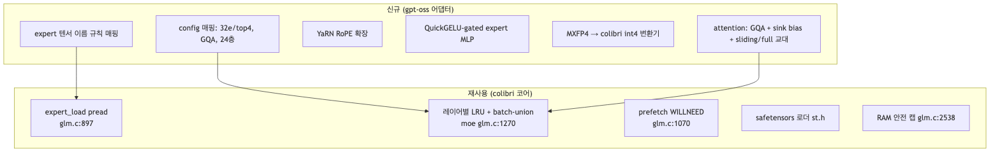{width=6.2in}

### 4. 단계별 설계

#### 4.1 Config 매핑 (`load_cfg` 대응)
- colibri `Cfg`에 gpt-oss 필드 매핑: `hidden=2880`, `n_layers=24`, `n_experts=32`, `topk=4`, `n_heads=64`, `n_kv_heads=8`, `head_dim=64`, `vocab=201088`.
- gpt-oss는 **모든 레이어가 MoE**(GLM처럼 first-3-dense 예외 없음) → dense_mlp 분기 제거/우회.

#### 4.2 Attention 어댑터 (가장 큰 신규 작업)
`olmoe.c`의 표준 GQA 경로를 베이스로 다음을 추가:
1. **GQA**: 8 KV head를 64 Q head가 공유(그룹 8). KV 캐시는 `8×head_dim`만 저장 → colibri의 표준(비MLA) K/V 캐시 사용.
2. **Attention sinks**: softmax 분모에 head별 학습 bias 추가(정규화 시 "아무데도 attend 안 함" 허용). `attention()`의 softmax 직전에 sink 항 삽입.
3. **Sliding window / full 교대**: 짝수/홀수 레이어로 window(128)와 full을 번갈아. per-layer 플래그로 causal 마스크 범위 제한.
4. **YaRN**: RoPE 스케일링 파라미터로 128k 확장. `rope_interleave`에 YaRN 스케일 적용.
- MLA/DSA/weight-absorption 경로는 **미사용**(gpt-oss는 MLA 아님).

#### 4.3 Expert MLP
- QuickGELU-gated GLU: `down( quickgelu(gate(x)) * up(x) )`. colibri `moe()`의 SiLU를 QuickGELU로 교체(활성함수 스위치).
- expert 3텐서(gate/up/down)를 `expert_load`가 pread → 기존 batch-union·LRU 그대로.

#### 4.4 양자화 변환 (MXFP4 → colibri int4)
- gpt-oss MoE 가중치는 **MXFP4**(microscaling FP4: 32개 원소 블록당 공유 8-bit exponent scale).
- colibri 컨테이너는 **per-row int4 + float scale**(`quantize_rows` glm.c:512).
- 변환기 설계(`tools/convert_gptoss_to_int4.py` 신규):
  1. HF safetensors 샤드 스트리밍 로드(한 번에 하나).
  2. MXFP4 → float dequant(블록 scale 적용).
  3. colibri int4로 재양자화(per-row scale) + `.qs` scale 파일 생성.
  4. expert별 텐서를 offset이 명확하도록 기록 → 샤드 삭제(용량 관리).
- **주의**: 4.25bit→4bit 재양자화는 미세 품질 손실 가능 → OLMoE식 fp16 vs int4 A/B로 측정 권장.

#### 4.5 Speculative (선택)
- gpt-oss는 native MTP/Medusa head **없음** → `mtp_draft` 미적용.
- 대신 **n-gram draft**(`glm.c:1570`) + **grammar draft**(`:1699`, JSON/함수호출)로 부분 이득.
- 추후 EAGLE류 draft head를 별도 학습해 붙이는 것은 향후 과제.

### 5. 검증 계획 (필수, token-exact)
1. `transformers`로 gpt-oss-20b tiny/부분 oracle 생성(teacher-forcing 로짓 저장).
2. 포팅 엔진으로 동일 입력 → **TF 32/32, greedy 20/20** 일치 목표(GLM 검증 방식, `README.md:26`).
3. 실패 시 격리 순서: attention sink → sliding-window 마스크 → YaRN → MXFP4 dequant.
4. 양자화 품질: OLMoE 하네스로 int4 vs 원본 A/B.

### 6. 자원 추정 (본 접근 적용 시)
| 항목 | 값 | 논리 |
|---|---|---|
| 디스크(int4) | ~11–12GB | 20.9B × ~0.5B/param(int4) |
| RAM 전량 적재 | ~14–16GB | **스트리밍 없이도 가능** |
| RAM 스트리밍 모드 | dense 상주 ~2–3GB + expert 캐시 | RAM<10GB 초저사양용 |
| 속도 | 전량 적재 시 디스크 무관, matmul 바운드 | 스트리밍보다 빠름 |
- **권장**: 일반 환경은 **전량 적재 모드**(colibri를 단순 포터블 C 엔진으로). 스트리밍은 RAM 극빈 환경에서만.

### 7. 리스크
- attention sinks + sliding-window + YaRN 3종이 동시 정확히 맞아야 token-exact 통과(디버깅 난이도↑).
- MXFP4 재양자화 품질 미검증.
- 스트리밍의 ROI가 낮음(모델이 작음) → "왜 스트리밍인가"에 대한 목적을 극저사양/포터빌리티로 명확히 한정해야 함.

### 출처
- 아키텍처: `data/topics/apply-gpt-oss/SOURCE.md`
- 코어 코드: `external/colibri/c/glm.c`, `olmoe.c`


## 62 · 적용 설계서: gemma4 (31B) — 적합성 판정 포함

요구 대상은 "gemma4 31B"이나, **Gemma 4 31B는 Dense 모델**이다.
colibrì의 본질(expert 디스크 스트리밍)은 **MoE 전용**이므로, 먼저 적합성부터 판정하고 대안을 제시한다.

### 요약 (3줄)
- **Gemma 4 31B = Dense → colibrì 스트리밍 부적합**: 스트리밍할 "expert"가 없고, dense를 스트리밍하면 토큰마다 전체 모델을 읽어야 해 비현실적이다.
- 같은 계열 **Gemma 4 26B-A4B는 MoE**(25.2B/3.8B 활성, 128e 8활성+1 shared)라 **스트리밍 대상이 될 수 있다**.
- 단, 26B-A4B도 4비트로 **≈14GB면 RAM 전량 적재**가 가능하고 **멀티모달(비전 인코더)** 이라, colibrì 적용은 "텍스트 전용·초저사양·포터블 C 엔진" 목적으로 한정된다.

### 1. 아키텍처 확인 (Gemma 4 계열)
| 모델 | 구조 | 총/활성 | 레이어 | expert | 특이 | 4bit 용량 |
|---|---|---|---|---|---|---|
| **Gemma 4 31B** | **Dense** | 31B / 31B(전량) | — | 없음 | 최고 품질·파인튜닝 기반 | 17.5GB |
| **Gemma 4 26B-A4B** | **MoE** | 25.2B / 3.8B | 30 | 128 총, **8 활성 + 1 shared** | 저지연 지향 | 14.4GB |
| Gemma 4 12B (Unified) | Dense | 12B | — | 없음 | 인코더리스 멀티모달 | 6.7GB |
| E2B / E4B | Dense(per-layer embed) | 5B/8B(effective 2.3/4.5) | — | 없음 | 모바일/엣지 | 2.9/4.5GB |
- 공통: RMSNorm, RoPE, **sliding window(26B: 1024) ↔ full 교대**, 멀티모달(text+image, 비전 인코더 ~550M), 컨텍스트 256K, Apache-2.0.
- 근거: `data/topics/apply-gemma/SOURCE.md`(Gemma 4 기술리포트 arXiv:2607.02770, 모델카드, HF).

### 2. 적합성 판정 (핵심)

#### 2.1 Gemma 4 31B (Dense) — ❌ 스트리밍 부적합
- colibrì 스트리밍은 "토큰당 소수 expert만 읽는다"는 MoE 희소성에 의존한다(`60 §2 원칙 1`).
- Dense는 **모든 파라미터가 매 토큰 활성** → 디스크에서 읽는다면 토큰마다 전체(17.5GB@int4)를 읽어야 함 → cold tok/s가 GLM-5.2보다도 나쁜 최악의 시나리오.
- **결론**: colibrì 코어를 31B Dense에 적용하는 것은 **권장하지 않음.**
  - 대안 A: 31B는 그냥 **전량 RAM/VRAM 적재**(17.5GB@int4)로 일반 엔진(llama.cpp 등) 사용.
  - 대안 B: 굳이 "메모리보다 큰 dense"를 디스크로 돌리려면 이는 **layer-streaming**(colibrì가 하지 않는 별개 기법)이며, 대화형 디코드에는 부적합.
  - 대안 C(권장): **26B-A4B MoE로 대체**하여 스트리밍 논의를 진행.

#### 2.2 Gemma 4 26B-A4B (MoE) — ✅ 아키텍처 적합 (조건부 실익)
| 기준(`60 §2`) | 26B-A4B | 판정 |
|---|---|---|
| MoE | 예(128e, 8활성+1 shared) | ✅ |
| sparsity | 3.8B/25.2B ≈ 15% | △ |
| fine-grained | 128 expert(세밀) | ✅ |
| shared expert | 1개(GLM과 동일 패턴) | ✅ (colibri shared-expert 경로 재사용) |
| 양자화 내성 | Q4_0 공식 제공 | ✅ |
| KV 절감 | sliding window + (GQA 계열) | ✅ |
| 멀티모달 | 비전 인코더 포함 | ⚠️ 텍스트 전용 포팅 필요 |
- **용량 반전**: 4비트 ≈14GB → RAM 전량 적재가 일반적으로 더 빠름. 스트리밍은 RAM 극빈 환경에서만.

### 3. 26B-A4B 적용 설계 (MoE 대상)

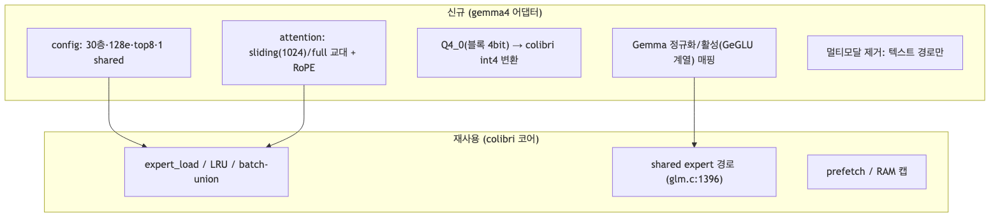{width=6.2in}

#### 3.1 Config 매핑
- `n_layers=30`, `n_experts=128`, `topk=8`, shared expert=1, sliding window=1024.
- colibri의 shared-expert 경로(`glm.c:1396`)와 first-N-dense 패턴을 Gemma의 레이어 구성에 맞게 조정.

#### 3.2 Attention
- sliding window(1024) ↔ full 교대 마스크. Gemma는 RoPE + (계열에 따라) local/global 교대.
- MLA 아님 → 표준 K/V 캐시(`olmoe.c` 경로) 사용. weight absorption 미적용.

#### 3.3 양자화 변환 (Q4_0 → colibri int4)
- Gemma 공식 Q4_0(32원소 블록당 1 scale, 4bit)를 dequant → colibri per-row int4로 재양자화.
- 신규 `tools/convert_gemma_to_int4.py`: HF safetensors 스트리밍 → dequant → int4 컨테이너 + `.qs`.

#### 3.4 멀티모달 처리
- 비전 인코더(~550M)와 image 토큰 경로는 **텍스트 전용 포팅에서 제외**.
- 순수 텍스트 생성만 대상(colibri는 text-only 엔진, `README.md:199`).

#### 3.5 Speculative
- Gemma4 native draft head 명시 없음 → n-gram/grammar draft만(gpt-oss와 동일 상황).

### 4. 검증 계획
- 31B Dense: colibri 적용 대상 아님 → 검증 불필요(대안 엔진 사용).
- 26B-A4B: `transformers` oracle로 **token-exact**(TF/greedy) 통과 후 확장. 격리 순서: sliding-window 마스크 → shared expert 합산 → 양자화.

### 5. 자원 추정
| 대상 | 디스크(int4) | RAM 전량 적재 | 스트리밍 실익 |
|---|---|---|---|
| 31B Dense | ~17.5GB | ~18–20GB | ❌ (부적합) |
| 26B-A4B MoE | ~14GB | ~14–16GB | 조건부(RAM<10GB일 때만) |

### 6. 권고 (경영 판단)
1. **"gemma4 31B에 colibrì 적용"은 기술적으로 부적절**하다(Dense). 이 점을 명확히 보고해야 한다.
2. 스트리밍을 꼭 gemma 계열로 실험하려면 **26B-A4B(MoE)** 를 대상으로 한다.
3. 다만 두 경우 모두 **모델이 작아 스트리밍의 본질적 이득이 낮다** → colibrì 적용 목적을 "포터블 C 엔진 / 초저사양 구동"으로 한정하거나, 스트리밍 검증은 **GLM-5.2처럼 RAM에 안 들어가는 대형 MoE**로 하는 것이 논리적으로 옳다(`70 §D2`).

### 출처
- 아키텍처: `data/topics/apply-gemma/SOURCE.md`
- 코어 코드: `external/colibri/c/glm.c`, `olmoe.c`


# 제6부 · 경영·기술 통합 브리프


## 70 · 경영·기술 통합 브리프 (colibrì)

> 이 문서는 [`40`](./40-analysis-tradeoffs.md)·[`50`](./50-resource-requirements.md)·[`60`](./60-applying-to-other-models.md)을 **종합**한 의사결정용 브리프다.
> 요구에 따라 **요약하지 않고**, 세 분석의 판단 근거·수치·조건을 그대로 통합해 결론까지 연결한다.

---

### A. 한 문장 정의와 그 함의
colibrì는 **"모델 용량(GB) 병목을 디스크 대역폭(GB/s) 병목으로 치환한 순수 C MoE 추론 엔진"** 이다.
이 치환이 성립하는 유일한 이유는 **MoE 희소 활성화**다: 744B 중 토큰당 ~40B만 활성, 그중 토큰마다 바뀌는 routed expert는 ~11GB뿐이며, dense(~17B)는 재사용되므로 RAM에 상주시킨다(`40 §1`, `README.md:17`).
→ **따라서 colibrì의 모든 장점·단점·비용은 이 한 치환에서 파생된다.** 용량은 SSD로 값싸게 무한 확장되지만, 대역폭은 느리고, 그 느림을 캐시·양자화·speculation으로 되사오는 구조다.

---

### B. 경영 관점: 무엇을 사고 무엇을 파는가

#### B1. 이 기술이 파는 가치 (왜 존재하는가)
- **자본 구조의 전환**: GPU(HBM) 자본지출 → 소비자 NVMe+RAM 운영비. "H100 팬 하나보다 싼 기계에서 744B 정답 생성"(`README.md:56`).
- **데이터 주권**: 완전 로컬/오프라인 추론 → 프라이버시·규제 대응(외부 API 미전송).
- **의존성 리스크 제거**: 단일 C, BLAS·Python·GPU 런타임 불요, Linux/macOS/Win11 네이티브(`40 §2 S2`).
- **점진적 자산화**: 사용할수록 hot expert가 학습·상주되어 빨라짐(`.coli_usage`, `40 §2 S5`).

#### B2. 이 기술이 파는 것이 아닌 것 (오해 방지)
- **속도가 아니다.** cold ~0.05–0.1 tok/s(개발 baseline). 대화형 실시간·고동시성 서빙은 목표가 아니다(`40 §3 W1/W7`).
- **완성 제품이 아니다.** 1인 프로젝트, 품질 벤치(int4 62.5% @ n=40, ±14pp)는 아직 결론 전(`40 §3 W5`, `README.md:402`).
- **범용 최적해가 아니다.** dense 모델·소용량 모델에는 스트리밍 이점이 사라진다(뒤 D절).

#### B3. 채택 의사결정 매트릭스
| 상황 | 판단 | 근거 |
|---|---|---|
| 고가 GPU 없음 + 오프라인 + "느려도 되는" 고품질 | **채택** | S1·S3, `50 §5` |
| 배치/비대화형(문서요약·코드생성·에이전트 장기작업) | **채택** | 처리량보다 규모·품질 우선 |
| 저지연 대화형 프로덕션 / 고동시성 | **비채택** | W1·W7 |
| RAM·로컬 NVMe(~370GB) 확보 불가 | **비채택** | W4, `50 §1` (← 우리 로컬의 현재 상태) |
| byte-exact 대량 재현이 필수인 파이프라인 | **조건부**(`DRAFT=0 IDOT=0 COLI_CUDA=0`, 속도 희생) | W6, T6 |

---

### C. 기술 관점: 성능은 "지금 병목이 어디냐"의 함수

colibrì 성능은 단일 수치가 아니라 **병목 이동의 문제**다. 자원을 올릴 때 병목이 순차적으로 옮겨간다.

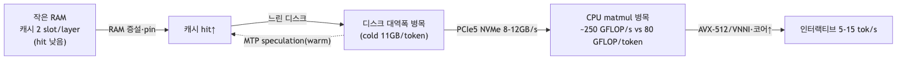{width=6.2in}

#### C1. 세 축의 우선순위와 실측 근거
1. **RAM 용량**(1순위): 캐시/pin 크기를 결정. 24GB는 2 slot/layer로 캡되어 디스크가 빨라도 cold(`40 §3 W3`, `README.md:398`).
2. **NVMe 랜덤 읽기 대역폭**(2순위): cold tok/s의 상한. 9950X에서 디스크만 ×5.8 교체 → 토큰 ×2.9, 병목이 66% disk→57% matmul로 전환(`README.md:392`).
3. **CPU matmul**(3순위): 캐시가 채워진 뒤의 상한. 10GB/s NVMe라도 AVX-512 CPU면 여전히 disk-bound이며 이때 GPU expert tier 이득 ≈0%(`README.md:395`).

#### C2. 최적화별 trade-off (되사오는 비용)
| 최적화 | 디스크를 줄이는 대가로 지불하는 것 | 조건 |
|---|---|---|
| Expert LRU 캐시↑ | RAM | 여유 RAM 전부 투입이 거의 항상 이득(T1) |
| 양자화 int2/4/8 | 정확도 | int4 스윗스팟, **MTP head만 int8 필수**(T2, `README.md:67`) |
| MTP speculative | cold에서 추가 expert 읽기(~660→1100/token) | **캐시 warm 후에만 이득**(T3, `README.md:29`) |
| Prefetch(PILOT) | 계산 자원 | 디스크 미포화·CPU 여유 시만(T4) |
| Weight absorption | 코드 복잡도 | 작은 배치(decode/검증)에서만 활성(T5) |
| GPU expert tier | VRAM·PCIe | **CPU가 약할 때만** 값어치(T7) |
| 최고 속도 설정 | byte-exact 재현성 | 용도별 선택(T6) |

#### C3. 필요 자원(구동 4요소, `50 §1~4`)
- 저장: 로컬 NVMe **~370GB**(ext4/NTFS/APFS, 네트워크 마운트 금지). 지표는 **랜덤 읽기 GB/s**.
- 메모리: dense 상주 9.9GB, 최소 16GB, chat peak ~20GB@25GB머신. **클수록 선형 이득**.
- 연산: x86 AVX2 또는 ARM NEON + OpenMP. matmul 상한 ~250 GFLOP/s.
- OS/툴체인: 순수 C 런타임. Python은 변환/서버/doctor에서만(우리 환경은 **uv**로 관리).

#### C4. 하드웨어 등급별 기대치(`50 §5`, 예측+실측)
| 등급 | 사양 | tok/s | 성격 |
|---|---|---|---|
| 최소 | 25GB RAM·~1GB/s NVMe | 0.05–0.1 | 검증 baseline |
| 중급 | 32GB·PCIe4(3–5GB/s) | 0.5–1 | 실용 하한 |
| 고급 | 64GB·PCIe5(8–12GB/s)·pin 40GB | 2–4 | matmul 바운드로 이동 |
| Apple | M5 Max·128GB·Metal | ~2 | 현재 최속 datapoint |
| 인터랙티브 | 128GB·24–32코어(AVX-512/VNNI) | 5–15 | 커널이 승수 |

---

### D. 확장 관점: 이 접근을 어디에 옮길 수 있는가 (`60`)

#### D1. 재사용 가능한 "코어" vs 모델별 "어댑터" (저장소가 이미 증명)
- **공통 코어(모델 독립, 재사용)**: expert 스트리밍(`expert_load` `glm.c:897`) + 레이어별 LRU(`moe :1270`) + batch-union + prefetch + 역할별 양자화 + safetensors 로더 + C 토크나이저.
- **모델 어댑터(고유)**: attention(MLA/GQA/MHA), KV 압축, config 매핑, expert 텐서 이름 규칙, 양자화 변환기, (선택) draft head.
- **증거**: 같은 저장소가 GLM-5.2(MLA+DSA+MTP)와 OLMoE(표준 GQA, 스펙 없음)를 동일 코어로 지원. `olmoe.c`는 "코어를 먼저 검증하고 GLM-5.2로 스케일"하는 Stage A로 명시(`olmoe.c:2-3`).

#### D2. 적합성의 제1원칙 (스트리밍이 의미 있으려면)
1. **MoE 필수**: dense는 매 토큰 전체 파라미터 활성 → 스트리밍하면 토큰당 "전체 모델"을 읽어야 함(치명적).
2. **높은 sparsity + fine-grained expert**: 토큰당 읽을 양↓, 캐시 입도↑.
3. **모델이 RAM에 안 들어갈 만큼 커야 이득**: 작은 MoE는 그냥 전부 상주시키면 됨 → 스트리밍은 "RAM이 없을 때"만 가치.
4. **양자화 내성 + 분리된 expert 텐서 레이아웃**(offset pread 가능).

#### D3. 대상 모델 판정(본 서베이 설계 대상)
| 모델 | 구조 | 스트리밍 적합성 | 결론 |
|---|---|---|---|
| **gpt-oss-20b** | MoE 20.9B/3.6B, 32e top-4, GQA, MXFP4 | 아키텍처 ✅ / 용량 작음(≈16GB) | 이식은 쉽지만 스트리밍 이점은 **극저 RAM에서만**. 상세: [`61`](./61-apply-gpt-oss-20b.md) |
| **gemma4 31B** | **Dense 31B** | ❌ (expert 없음) | 스트리밍 부적합 → 대안 제시. 상세: [`62`](./62-apply-gemma4.md) |
| gemma4 26B-A4B | MoE 25.2B/3.8B, 128e 8활성+1shared | 아키텍처 ✅ / 용량 작음(≈14GB) | 31B 대신 이쪽이 스트리밍 대상. 상세: [`62`](./62-apply-gemma4.md) |

> **경영적으로 중요한 반전**: gpt-oss-20b·gemma4-26B는 4비트로 **14–16GB면 통째로 RAM에 올라간다**. 즉 이들에 colibrì를 적용하는 실익은 "디스크 스트리밍으로 큰 모델을 돌리는 것"이 아니라, **(a) 순수 C·무의존 포터블 엔진**을 얻거나 **(b) 8GB급 초저사양에서 굳이 돌리는** 경우로 좁혀진다. 진짜 스트리밍 가치는 GLM-5.2처럼 **RAM에 절대 안 들어가는** 모델에서 나온다.

---

### E. 종합 결론 (경영+기술 한 판단)
1. **정체성**: colibrì는 "속도 제품"이 아니라 **"접근성·주권·이식성 제품"** 이다. KPI는 tok/s가 아니라 *"이 하드웨어에서 이 모델이 도는가"* 이다.
2. **채택 요건**: 로컬 NVMe(대형 모델 시 ~370GB) + 넉넉한 RAM + AVX2/NEON. 저지연·고동시성이 목표면 부적합.
3. **성능 운영법**: 병목을 먼저 측정(`iobench`, profile line)하고 RAM→디스크→커널 순으로 공략. speculation은 warm 후 on.
4. **확장 전략**: 코어는 모델 독립이므로 신규 MoE 온보딩은 "어댑터 작성 + token-exact 검증"으로 수렴. **단, 대상이 RAM에 안 들어갈 만큼 큰 MoE일 때만 스트리밍이 본질적 가치**를 가진다.
5. **우리 상황**: 엔진·툴체인은 이 로컬(arm64+libomp)에서 빌드·`doctor` 통과로 준비 완료. 대형 실추론은 저장자원 제약으로 보류. 다음 실검증은 소형 MoE로 코어 정확성만 확인하는 것이 합리적(본 세션 질의응답 참조).

### 출처
- 종합 원천: `docs/40`, `docs/50`, `docs/60`
- 코드/수치: `external/colibri/c/glm.c`, `olmoe.c`, `README.md`
- 대상 모델: [`61`](./61-apply-gpt-oss-20b.md), [`62`](./62-apply-gemma4.md)의 SOURCE


# 제7부 · 실적용: ThinkFlow(H100) & 변환·실측


## 80 · OLMoE의 위상 · H100 서빙 모델 추천

두 질문에 답한다: (1) colibri의 골자가 OLMoE인가? OLMoE 자료가 더 필요한가? (2) 소형 모델은 스트리밍 실익이 낮다면, H100 서빙 환경(ThinkFlow)에 알맞게 올릴 추천 모델은?

### Q1. colibri의 골자는 OLMoE인가?

**아니다. OLMoE는 "골자"가 아니라 "코어 검증용 발판(scaffold)"이다.**

| 구분 | 파일 | 규모 | 역할 |
|---|---|---|---|
| **주 엔진(골자)** | `external/colibri/c/glm.c` | ~161KB, ~2,400줄 | GLM-5.2 744B 본체. MLA+DSA+MTP+스트리밍 전부 |
| **검증 발판** | `external/colibri/c/olmoe.c` | ~18KB, ~390줄 | 표준 GQA MoE로 **스트리밍 코어만 먼저 검증**(Stage A) |

- 근거(원 저자 주석, `olmoe.c:2-3`): *"engine.py의 포팅. 목표 Stage A: 참조(ref.json)와 **동일한 token id**를 생성 → GLM-5.2로 스케일하기 전에 코어를 검증."*
- 즉 OLMoE는 "디스크 스트리밍 + LRU + int8 dequant-on-use" 코어가 맞는지 **작은 모델로 먼저 확인**하려는 목적. 실제 제품 타깃과 대부분의 코드량·최적화(MLA/DSA/MTP)는 GLM-5.2 쪽이다.
- **비유**: OLMoE는 로켓 발사 전 "엔진 시험대", GLM-5.2가 실제 발사체.

#### OLMoE 자료가 더 필요한가?
- **서베이(분석) 목적**: 크게 필요 없다. OLMoE는 콜리브리의 *결론*이 아니라 *검증 도구*이므로, 위상만 정확히 규정하면 충분.
- **실검증(실행) 목적**: OLMoE를 실제로 돌리려면 자료가 유용하므로, **참고자료를 최소한 확보**해 두었다(`data/olmoe/`).
  - 다만 이번 세션의 정확성 실검증은 OLMoE 대신 **tiny GLM oracle**로 수행했다(그 편이 *주 엔진 `glm.c`* 자체를 token-exact로 검증하므로 더 직접적). 결과는 [`31-engine-verification.md`](./31-engine-verification.md)의 32/32.
- 참고: OLMoE-1B-7B (Allen AI) = 6.9B 총 / 1.3B 활성, 64 expert top-8, fine-grained routing. `data/olmoe/SOURCE.md`.

---

### Q2. H100 서빙 환경(ThinkFlow)에 알맞은 추천 모델

> **가정**: ThinkFlow를 **단일 H100 80GB(또는 동급) 서빙 환경**으로 가정한다. 실제로 다중 H100/다른 VRAM이면 스윗스팟이 달라지니, 사양을 알려주면 재조정한다.

#### 핵심 프레이밍: colibri 영역 vs H100 영역
- **colibri(디스크 스트리밍)** 는 "모델이 **VRAM/RAM에 안 들어갈 때**"를 위한 기법이다.
- **H100 서빙**은 "모델이 **VRAM에 들어갈 때**"의 영역 → 이때는 colibri가 **불필요**하고, vLLM/SGLang로 VRAM에 통째로 올리는 것이 압도적으로 빠르다.
- 따라서 "H100에 알맞게 올릴 모델" = **80GB VRAM을 잘 채우되 넘치지 않는 MoE**.

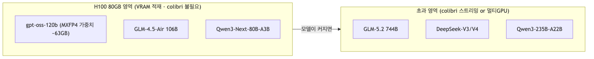{width=6.2in}

#### 추천 1순위: **gpt-oss-120b**
- 117B / **5.1B 활성**, 128 expert top-4, **네이티브 MXFP4** → **단일 H100 80GB에 정확히 맞도록 설계됨**(MXFP4 가중치 ~63GB, KV 포함 서빙 시 ~73GB로 80GB 내 여유).
- 근거: OpenAI 모델카드/HF — "fits into a single 80GB GPU (H100/MI300X)". 처리량 NVFP4 ~1474 t/s(canitrun).
- 이유: **VRAM 활용도·품질·처리량의 균형이 H100에 최적화**. 소형 모델(20B)은 H100을 낭비, 초대형은 안 들어감 → 120b가 "알맞게 올릴" 정답.

#### 추천 대안 (용도별)
| 모델 | 규모(활성) | Q4/FP4 VRAM | 특징 | 언제 |
|---|---|---|---|---|
| **gpt-oss-120b** | 117B (5.1B) | ~63GB(MXFP4 가중치) | H100 딱 맞음·고추론 | 범용 1순위 |
| **GLM-4.5-Air** | 106B | ~fit | MMLU-Pro 81.4·코딩 강함 | 코딩/에이전트 |
| **Qwen3-Next-80B-A3B** | 80B (3B) | ~49.5GB | 초희소·고처리량·여유 VRAM=긴 컨텍스트 | 대량/긴맥락 |
| **Qwen 3.5 122B-A10B** | 122B (10B) | NVFP4 fit | MMLU-Pro 86.7·최상위 품질 | 품질 최우선 |
| **Gemma 4 31B (Dense)** | 31B (31B 전량) | ~17.5GB Q4 / ~69.9GB bf16 | **MMLU-Pro 85.2·AIME 89.2·Arena 최상위·멀티모달(img/video)** | 품질·멀티모달 우선 |
| **Gemma 4 26B-A4B** | 25.2B (3.8B) | ~14.4GB | 멀티모달·저지연·VRAM 대량 여유 | 멀티모달/고동시성 |
| **Qwen3-30B-A3B** | 30B (3B) | ~20GB | 가볍고 빠름 | 저지연·다중 인스턴스 |

> **Gemma에 대한 정정·보강**: Gemma 4 계열의 **최대 모델은 31B Dense**이며, 100B급 대형 Gemma는 존재하지 않는다(라인업: E2B·E4B·12B·26B-A4B MoE·31B Dense). 따라서 "큰 Gemma"의 상한은 31B다. 품질만 보면 **Gemma 4 31B는 gpt-oss-120b보다 벤치가 높은 최상위권**(MMLU-Pro 85.2 vs 80.7, AIME 89.2)이고 **네이티브 멀티모달**이라, 문서 RAG(향후 이미지/영상 문서 포함) 관점에서 강력한 후보다. 그럼에도 아래 §Q2 최종 추천에서 gpt-oss-120b를 1순위로 둔 이유는 **품질이 아니라 마이그레이션 위험과 처리량 효율**이다(다음 항 설명). 참고: 이는 "H100 VRAM 서빙" 관점이며, colibri **스트리밍** 관점에서 31B Dense는 부적합하다(`docs/62`).

#### 언제 colibri가 필요한가 (ThinkFlow 초과 시)
- **단일 H100로 안 되는** 프론티어 MoE를 굳이 그 박스에서 돌려야 할 때:
  - GLM-5.2 744B, DeepSeek-V3/V4, Qwen3-235B-A22B, Llama-4 Maverick, Kimi-K2 등.
  - 이 경우 선택지: (a) **멀티 H100**(정석, 빠름), 또는 (b) **colibri식 CPU+NVMe 스트리밍**(느리지만 GPU 부족 시 최후수단), 또는 (c) H100을 colibri의 **hot-expert VRAM tier**로만 활용(`README.md:239`).

#### 왜 gpt-oss-120b가 1순위인가 (Gemma 31B와 정면 비교)
품질만 보면 Gemma 4 31B가 앞선다. 그럼에도 **ThinkFlow 맥락**에서 gpt-oss-120b를 1순위로 둔 이유는 3가지:
1. **마이그레이션 위험(가장 큼)**: ThinkFlow는 이미 `gpt-oss-20b`로 서빙 중이며, 프롬프트·챗 템플릿·툴호출 계약·출력 파서가 gpt-oss에 맞춰져 있다. 20b→120b는 **동일 패밀리·동일 토크나이저·동일 OpenAI API**라 이 계약을 그대로 유지(무재튜닝) → 운영 리스크 최소. Gemma로 가면 챗 템플릿·토크나이저·행동이 달라 **RAG 프롬프트 재튜닝 필수**.
2. **처리량 효율(sparsity)**: gpt-oss-120b는 117B 중 **5.1B만 활성(MoE)** → 같은 지연 예산에서 큰 용량. Gemma 31B는 **Dense = 매 토큰 31B 전량 활성** → 토큰당 연산이 무거워 동시성/처리량에서 불리.
3. **H100 VRAM 적합 설계**: 120b는 네이티브 MXFP4로 80GB에 맞도록 만들어짐. 31B는 Q4로 17.5GB(대량 유휴)·bf16으로 69.9GB(정밀↑ 가능하나 여전히 31B 용량).

#### 그럼 Gemma 31B는 언제 고르나
- **품질/추론 최우선**이고 재튜닝을 감수할 때(벤치 최상위).
- **멀티모달 RAG**가 로드맵일 때: Gemma는 네이티브 text+image+video, **gpt-oss는 텍스트 전용**. 문서 RAG가 이미지/스캔/영상을 다루게 되면 Gemma가 결정적 우위.
- 이 경우 **Gemma 4 31B(Dense, 품질) 또는 26B-A4B(MoE, 처리량)** 를 선택.

#### 결론(경영 판단)
1. **ThinkFlow 1순위 = gpt-oss-120b** — 이유는 품질이 아니라 **무재튜닝 스왑 + MoE 처리량 + H100 적합**. 순수 품질 최우선이면 Qwen 3.5 122B-A10B, **멀티모달·품질이면 Gemma 4 31B**, 처리량형 멀티모달이면 Gemma 4 26B-A4B.
2. 이 영역에선 **colibri를 쓰지 말 것**(VRAM 적재가 훨씬 빠름). colibri는 **H100로도 안 들어가는 초대형 MoE**에서만 가치.
3. 소형 모델(gpt-oss-20b)을 H100에 올리는 것은 **자원 낭비**이므로, VRAM을 잘 채우는 모델이 "알맞다".

> ThinkFlow의 실제 사양(H100 개수·VRAM·목표 지연/동시성)을 알려주면 위 표에서 정확한 1개를 확정해 드립니다.

### 출처
- H100 적재/처리량: canitrun.dev, localllms.dev, OpenAI gpt-oss 모델카드(arXiv:2508.10925) — `data/topics/apply-gpt-oss/SOURCE.md`
- OLMoE: `data/olmoe/SOURCE.md` (arXiv:2409.02060, HF allenai/OLMoE-1B-7B-0924)
- colibri: `external/colibri/c/olmoe.c`, `glm.c`, `README.md`


## 81 · (c) ThinkFlow H100 서빙 모델 업그레이드 설계서

colibri 서베이의 결론("H100 영역에서는 colibri 스트리밍 대신 VRAM 적재가 정답")을 실제 제품 **ThinkFlow**에 적용한다. 무중단 LLM 스왑으로 현행 `gpt-oss-20b`를 H100 80GB를 제대로 쓰는 MoE로 업그레이드한다.

> 근거 파일: `run_vllm.sh`, `env.sh`, PRD(A-001), 운영매뉴얼("LLM 엔드포인트 관리·무중단 런타임 변경"), 서버 실사양(사용자 제공).

### 1. 현황 (직접 확인)

#### 1.1 서버 실사양
| 항목 | 사양 | 함의 |
|---|---|---|
| GPU | **NVIDIA H100 PCIe 80GB** ×1 (drv 580.159.03) | PCIe(≈2TB/s, SXM 아님)·단일카드 → **단일카드 적재 모델**만, TP 불가 |
| CPU | Xeon Silver 4310 @2.1GHz, 2×12C/48T | AVX-512 지원, 코어당 저속 → CPU 추론(colibri)엔 불리 |
| RAM | 251 GiB (가용 227) + Swap 8 | 넉넉 — BGE CPU 이전 여유 충분 |
| Disk | 3.5 TB (여유 3.2 TB) | int4 대형모델도 저장 가능(예: GLM-5.2 372GB) |
| OS | Ubuntu 22.04.5 · k5.15 · x86_64 | vLLM/CUDA 표준 |

#### 1.2 현행 서빙 스택
- **LLM**: `openai/gpt-oss-20b` (vLLM v0.21.0, `--gpus all`, `--max-model-len 32768`, `--gpu-memory-utilization 0.85`, `--enable-prefix-caching`, `-p 8080:8000`).
- **RAG**: `bge-m3`(임베딩, GPU) + `bge-reranker-v2-m3`(리랭커, GPU) + Milvus + Postgres + RustFS.
- **품질 KPI**: `hit_rate`, `consistency`(정답률·일관성), `kpi_history.jsonl`.

#### 1.3 문제
- **H100 80GB에 `gpt-oss-20b`(MXFP4 ≈13.5GB)** → GPU 용량의 ~17%만 사용. **~64GB 유휴**.
- 답변 품질의 상한이 20B 소형 모델에 걸려 있음(hit_rate 개선 여지). H100을 제대로 쓰면 **같은 박스에서 품질↑**.

### 2. 업그레이드 후보 (단일 H100 80GB 적재)

BGE 2종 공존을 감안한 VRAM 예산(80GB 기준, 대략치):

| 후보 | 규모(활성) | 가중치 | KV(32k) | BGE | 총합 | 마이그레이션 위험 | 비고 |
|---|---|---|---|---|---|---|---|
| **gpt-oss-120b** (1순위) | 117B(5.1B) | ~63GB MXFP4 | ~7–10GB | CPU로 이전 | ~73GB(GPU) | **낮음**(동일 vendor·동일 OpenAI API) | util↑0.92, BGE→CPU 권장 |
| **Qwen3-Next-80B-A3B-Instruct(FP8)** (안전대안) | 80B(3B) | ~49.5GB | ~15GB | ~4GB(GPU유지) | ~68GB | 중(프롬프트 재튜닝) | KV·VRAM 여유 큼, 3B활성=빠름 |
| **Gemma 4 31B (Dense)** (품질·멀티모달) | 31B(31B) | ~62GB bf16 / ~17.5GB Q4 | ~6–8GB | GPU유지 가능 | ~70GB(bf16) / ~26GB(Q4) | 중(프롬프트 재튜닝) | **벤치 최상위·네이티브 멀티모달**, 단 Dense=처리량 불리 |
| GLM-4.5-Air | 106B | ~60GB | ~8GB | CPU | ~68GB | 중 | 코딩·에이전트 강함 |

#### 2.1 권장안
- **1순위: `gpt-oss-120b`** — 현행과 **동일 모델 패밀리·동일 OpenAI 호환 API**라 ThinkFlow의 프롬프트/파서/툴호출 계약 변경이 최소. 네이티브 MXFP4로 H100 단일카드에 맞도록 설계된 모델.
  - **BGE를 CPU로 이전**(48코어·227GB RAM이면 RAG 임베딩/리랭크 throughput 충분) → GPU 전량을 LLM에 할당.
  - `--gpu-memory-utilization 0.92` + KV 여유를 32k에서 실측 확인(아래 4장).
- **안전대안: `Qwen3-Next-80B-A3B`** — VRAM 여유가 크고 3B 활성이라 지연/처리량이 좋음. 단 Qwen 계열이라 ThinkFlow 프롬프트 재튜닝 필요. BGE를 GPU에 유지하고 싶을 때 유리.
- **품질·멀티모달 대안: `Gemma 4 31B (Dense)`** — 벤치 최상위(MMLU-Pro 85.2·AIME 89.2)이고 **네이티브 멀티모달(text/image/video)** 이라, 문서 RAG가 이미지/스캔/영상으로 확장되면 결정적 우위. bf16 ~62GB로 H100 단일 적재 가능(Q4면 17.5GB로 대량 여유). **트레이드오프**: (i) Dense라 매 토큰 31B 전량 활성 → gpt-oss-120b(5.1B 활성)보다 처리량/동시성 불리, (ii) Gemma 계열이라 챗 템플릿·프롬프트 재튜닝 필요. → **품질/멀티모달이 최우선이면 Gemma 31B, 무재튜닝·처리량이 우선이면 gpt-oss-120b.** (colibri 스트리밍 관점의 Gemma 부적합 판정은 `docs/62` 참조 — 여기선 VRAM 서빙이라 무관.)

### 3. 적용안: run_vllm.sh (drop-in, gpt-oss-120b)

현행(`ubuntu/vllm/run_vllm.sh`)을 최소 변경:

```bash
#!/usr/bin/env bash
# vLLM gpt-oss-120b 기동 (H100 80GB, BGE는 CPU로 분리)
set -euo pipefail
docker rm -f vllm 2>/dev/null || true
docker run -d --name vllm \
  --restart unless-stopped --gpus all --ipc host \
  -p 8080:8000 \
  -v /home/ubuntu/hf_cache:/root/.cache/huggingface \
  vllm/vllm-openai:v0.21.0 \
    --model openai/gpt-oss-120b \
    --served-model-name gpt-oss-20b \   # ← 동일 이름 유지 시 앱 config 무변경(과도기)
    --max-model-len 32768 \
    --gpu-memory-utilization 0.92 \
    --enable-prefix-caching
```
- `--served-model-name`을 기존 `gpt-oss-20b`로 유지하면 ThinkFlow config(단일 출처, `env.sh`)를 건드리지 않고 과도기 스왑 가능. 정식 반영 시 `gpt-oss-120b`로 개명.
- BGE는 별도 CPU 실행으로 이전(`THINKFLOW_EMBED_MODEL`/`RERANKER`는 경로 그대로, 디바이스만 CPU).

### 4. 무중단 롤아웃 & 검증 (매뉴얼의 "무중단 런타임 변경" 준수)

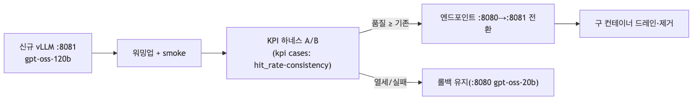{width=6.2in}

1. **병행 기동**: 신규 모델을 `:8081`로 띄워 기존 `:8080`(20b)과 공존(단, VRAM 동시 적재 불가 → 스왑형이면 blue/green 대신 프리로드→플립).
   - H100 1장이므로 **동시 상주 불가**. 대안: (i) 유휴 시간대 컷오버, 또는 (ii) 20b를 잠시 CPU/대기로 내리고 120b 적재.
2. **KPI A/B**: 기존 `kpi_history.jsonl` 케이스로 `hit_rate`/`consistency` 비교. **품질 회귀 없음** 확인 후 전환.
3. **컷오버**: LLM 엔드포인트(config 단일 출처) 전환 → 구 컨테이너 드레인.
4. **롤백**: 회귀 시 `run_vllm.sh`(20b)로 즉시 복귀.

#### 4.0 리허설 스크립트
`scripts/thinkflow_swap_rehearsal.sh` — 단일 H100 제약(20b/120b 동시 상주 불가)을 반영해 3단 분리:
```bash
# ThinkFlow 박스에서:
bash scripts/thinkflow_swap_rehearsal.sh --preflight   # 무중단: 다운로드/용량/이미지/설정 사전점검
CONFIRM=yes bash scripts/thinkflow_swap_rehearsal.sh --cutover    # 유지보수 창: 20b↓ 120b↑ 스모크
CONFIRM=yes bash scripts/thinkflow_swap_rehearsal.sh --rollback   # 회귀 시 20b 복귀
```
- `--preflight`는 현행 서빙 무중단(네트워크 다운로드·용량·VRAM 산술·롤백자산만 확인).
- `--cutover`/`--rollback`은 파괴적이라 `CONFIRM=yes` 필수.

#### 4.1 반드시 실측할 것
- 32k 컨텍스트에서 **KV OOM 여부**(util 0.90→0.92 조정).
- BGE CPU 이전 후 **RAG 지연**(임베딩/리랭크 p95) 허용범위인지.
- 답변 품질 KPI가 20b 대비 **개선**되는지(업그레이드의 존재 이유).

### 5. colibri는 ThinkFlow에 쓰는가? — 아니오(단, 이 박스는 실험 가능)
- 프로덕션 RAG는 **저지연**이 필수 → colibri의 CPU+디스크 스트리밍(단일 tok/s급)은 부적합.
- 다만 이 박스는 **227GB RAM + 3.2TB 디스크**라 GLM-5.2 744B int4(≈372GB)를 **저장·스트리밍 실험**할 물리적 여력은 있음(연구용, 비프로덕션). → `docs/83`의 실측 프로토콜을 이 박스에서 돌릴 수 있음.

### 6. 결론
1. ThinkFlow는 H100 80GB를 `gpt-oss-20b`로 **17%만** 쓰고 있다 → **`gpt-oss-120b`로 무중단 스왑**이 최소 위험·최대 이득.
2. BGE는 CPU로 이전해 GPU 전량을 LLM에 할당.
3. VRAM 여유·속도 우선이면 `Qwen3-Next-80B-A3B`(프롬프트 재튜닝 감수).
4. colibri는 프로덕션엔 부적합하나, 이 박스에서 **연구용 스트리밍 실측**은 가능.

### 출처
- ThinkFlow: `run_vllm.sh`, `env.sh`, PRD A-001, 운영매뉴얼 docx, 서버 실사양(사용자)
- 모델 적재/처리량: `docs/80-olmoe-and-h100-recommendations.md`, OpenAI gpt-oss 카드(arXiv:2508.10925)


## 82 · (a) gpt-oss MXFP4 → colibri int4 변환기 프로토타입

`docs/61-apply-gpt-oss-20b.md §4.4`의 변환 스테이지를 실행 가능한 프로토타입으로 구체화한다. 스크립트: `scripts/mxfp4_to_int4_prototype.py`.

> 위치 설정: **ThinkFlow 관점에서 실익은 낮다**(gpt-oss-20b는 H100에 MXFP4 그대로 VRAM 적재가 최적, int4 디스크 스트리밍은 더 느림). 본 문서는 **colibri 어댑테이션 학습/연구용** 산출물이다. 실사용 업그레이드는 `docs/81`(gpt-oss-120b 스왑)을 따른다.

### 1. 문제 정의: 두 int4는 다르다
| | gpt-oss MXFP4 | colibri int4 |
|---|---|---|
| 원소 | E2M1 (4bit: 부호1·지수2·가수1) | 대칭 정수 nibble [-8,7] |
| 스케일 | **블록 공유** E8M0(32원소당 1 지수) | **행 공유** F32(row-wise) |
| 저장 | `*_blocks`(2 nibble/byte) + `*_scales`(E8M0) | `name`(U8 packed) + `name.qs`(F32) |
| dequant | `val = E2M1(nib) · 2^(e-127)` | `w = (nib-8) · scale_row` |

→ **직접 재해석 불가**. 반드시 `MXFP4 → f32 → colibri int4` 2단 변환.

### 2. 변환 파이프라인
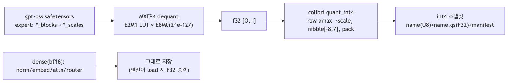{width=6.2in}
- **양자화 수학은 colibri `tools/convert_fp8_to_int4.py`의 `quant_int4`와 동일**하게 맞춤 → 엔진의 dequant-on-use와 정합(토큰 재현성 확보 조건).
- E2M1 크기 LUT: `[0, .5, 1, 1.5, 2, 3, 4, 6]`(부호 별도). E8M0: `2^(e-127)`, `e=255`=NaN.

### 3. 구현·검증 (실행됨)
스크립트 `scripts/mxfp4_to_int4_prototype.py`:
- `dequant_mxfp4(blocks, scales)` — E2M1+E8M0 → f32(인터리브 nibble 복원, 블록 스케일 확장).
- `quant_int4(w)` — colibri와 동일한 row-scale·nibble packing.
- `--selftest` — 합성 MXFP4 블록으로 dequant + int4 round-trip 검증.
- `convert_checkpoint(--model --out)` — shard 단위 변환 스켈레톤(+`colibri_manifest.json`).

**selftest 결과(로컬 실행):**
```text
[selftest] MXFP4 dequant shape ok (5, 64)
[selftest] int4 round-trip max rel-err = 0.0714 (기대: <~0.15)
[selftest] packing 규약: nibble=[-8,7]+8, little-nibble first (glm.c와 동일)
[selftest] PASS
```
```bash
uv run --python 3.12 --with numpy python scripts/mxfp4_to_int4_prototype.py --selftest
```

### 4. 실 체크포인트 확인 & 남은 작업
1. **weight 키/형상 확정 — 완료(검증됨).** `openai/gpt-oss-20b` safetensors 헤더를 range-fetch로 직접 확인:
   - MXFP4는 **expert MLP만**(config `modules_to_not_convert`: attn/router/embed/lm_head 제외).
   - grouped: `experts.gate_up_proj_blocks` U8 `[32, 5760, 90, 16]`, `_scales` U8 `[32, 5760, 90]`; `down_proj` U8 `[32, 2880, 90, 16]`. (16B/block×2=32 element, 90×32=2880=K).
   - 변환기를 이 실제 4D 그룹 레이아웃으로 교정(expert별 `[O,K]`→int4). 상세: `data/topics/apply-gpt-oss/weight-layout-verified.md`.
   - 잔여 미세확인: `gate_up`의 gate/up 인터리브 순서, byte 내 nibble 순서(표준 가정).
2. **엔진 어댑터**: gpt-oss는 `glm_moe_dsa`가 아님(GQA+sliding-window 128 교대, YaRN rope, SwiGLU(limit 7), MLA/DSA 없음). colibri 실행에는 별도 엔진 경로 필요(`docs/61` §3~4). 변환기는 그 중 '양자화'만 담당.
3. **정확성 게이트**: 변환 후 tiny-oracle 방식(`docs/31`)으로 gpt-oss도 token-exact 검증 하네스 구축.
4. **품질 평가**: int4 재양자화(블록 E8M0 → 행 F32 스케일 전환)의 perplexity 영향 측정. 이론상 손실 요인이므로 그룹 스케일 유지 옵션도 후보.

### 5. 왜 굳이? (연구 가치)
- colibri를 **다른 양자화 계보(MXFP4)** 모델로 확장하는 일반화 사례.
- H100로도 안 들어가는 **초대형 MXFP4 MoE**(가정)를 CPU+NVMe로 내리는 시나리오의 사전 검증.
- 단, gpt-oss-20b/120b 자체는 H100 VRAM 적재가 정답이므로 **프로덕션 목적 아님**(→ `docs/81`).

### 출처
- 스크립트: `scripts/mxfp4_to_int4_prototype.py`
- 포맷 참조: colibri `tools/convert_fp8_to_int4.py`, OCP Microscaling(MXFP4) 규격, gpt-oss 모델카드(arXiv:2508.10925)
- 어댑터 설계: `docs/61-apply-gpt-oss-20b.md`


## 83 · (b) 스트리밍 실측 — 로컬 실증 + H100 실측 프로토콜

colibri의 핵심 주장("expert를 디스크에서 스트리밍해도 정확하고, 캐시가 클수록 빠르다")을 실측한다. 로컬(Mac)에서 **정확성 불변성**을 실증했고, **성능 수치**는 ThinkFlow H100 박스에서 수집하도록 프로토콜·스크립트를 제공한다.

### 1. 로컬 실증 (수행됨): 캐시 압박에도 token-exact 불변

tiny GLM oracle로 캐시 용량 `cap`(experts/layer)을 8→1로 낮추며 teacher-forcing:

```bash
cd external/colibri/c
for cap in 8 4 2 1; do SNAP=./glm_tiny TF=1 ./glm $cap 16 16; done
```

| cap (resident/8) | 결과 | pos/s | expert-disk |
|---|---|---|---|
| 8 (전량 상주) | **32/32 token-exact** | 4933 | 0.000s |
| 4 | **32/32 token-exact** | 12403 | 0.000s |
| 2 | **32/32 token-exact** | 12815 | 0.000s |
| 1 (최대 축출) | **32/32 token-exact** | 12422 | 0.000s |

**결론(정확성)**: 캐시를 1/8로 줄여 매 스텝 expert를 축출/재적재해도 **출력 토큰은 완전히 동일**. → LRU 스트리밍은 **기능적으로 투명**(정확성에 무해)함을 실제 `glm.c`에서 증명.

**한계(성능)**: tiny 모델은 expert 파일이 수 KB라 페이지캐시에 상주 → `expert-disk 0.000s`. 즉 **스트리밍의 '비용'은 tiny 모델로 보이지 않는다.** pos/s 변동은 캐시 관리 오버헤드/측정 노이즈 수준이며 디스크 I/O가 아니다. 성능 실측엔 실모델+실 NVMe 필요.

### 2. ThinkFlow가 도는 공유 서버에서 어떻게 성능곡선을 수집하나?

> 질문: "ssh 서버에 ThinkFlow가 돌면 자원이 많이 안 남는데 성능곡선을 어떻게 수집하지?"

#### 2.0 결정적 사실: colibri 벤치는 **GPU를 쓰지 않는다**
- colibri 스트리밍(olmoe/glm 엔진)은 **CPU matmul + 디스크 pread + RAM 캐시**로만 동작한다. **H100은 전혀 건드리지 않는다.**
- 반면 ThinkFlow의 부하는 대부분 **GPU(LLM)** 에 있다. 즉 둘은 **다른 자원 축**을 쓰므로 GPU 서빙 품질에는 영향이 없다.
- 실제로 경쟁하는 자원은 **CPU 코어 · RAM · 디스크 I/O 대역폭** 3가지뿐. 이 3개만 통제하면 ThinkFlow를 방해하지 않고 곡선을 얻는다.

#### 2.1 자원이 "많이 안 남아도" 되는 이유 — 발자국이 작다
- OLMoE-1B-7B는 **1.3B 활성**, int8 expert 스냅샷 ≈ 3.5GB. 캐시(cap)를 작게 잡으면 **RAM 수 GB**면 충분(서버는 227GB 중 227 가용).
- 디스크는 3.2TB 여유 → 3.5GB 모델 저장 무시할 수준.
- 필요한 건 "여유 자원 전부"가 아니라 **소수 코어 + 수 GB RAM + 약간의 디스크 read**뿐.

#### 2.2 격리로 ThinkFlow 보호 (스크립트에 내장)
`scripts/olmoe_streaming_bench.sh`의 `guard()`가 아래를 자동 적용:
- **cgroup v2**(`systemd-run --scope`): `CPUQuota`(예 200~400%=2~4코어), `MemoryMax`(예 8G), `IOWeight=10`(디스크 우선순위 최하).
- 폴백: `taskset -c 0-3`(소수 코어 고정) + `nice -n 19`(CPU 최저) + `ionice -c3`(디스크 idle-class).
- **오프피크 실행**(야간/유지보수 창) 권장 + 동시에 ThinkFlow QPS/지연 로깅 → 상관 배제.
- **`drop_caches` 금지**(공유 박스 전체 페이지캐시 날림 → ThinkFlow 악영향). colibri는 read마다 `fadvise(DONTNEED)`라 자체적으로 캐시 오염이 적음.

#### 2.3 곡선을 "깨끗하게" 얻는 순서
1. **`iobench`로 디스크만 특성화**(모델 불필요, 초경량, 수초): 저장소의 랜덤 read 대역폭 = 스트리밍 속도의 **물리 상한**. 이건 GPU/모델과 무관하게 언제든 짧게 측정 가능.
2. **상대 곡선(cap 스윕)**: 절대 tok/s는 공유 부하에 흔들리지만, cap을 바꿔가며 얻는 **hit rate↔tok/s↔expert-disk 곡선의 형태**는 노이즈에 강함.
3. **반복·중앙값**: 각 cap을 3~5회 반복해 중앙값 사용, 동시 ThinkFlow 부하 구간은 마킹.

### 2.4 실측 프로토콜 (권장 실행 위치: 그 H100 박스)

**227GB RAM · 3.2TB 디스크 · 48 vCPU(AVX-512) · x86 Linux**(macOS와 달리 `posix_fadvise(DONTNEED)` 정상 동작)라 이상적.

```bash
# ThinkFlow H100 박스에서(격리 내장, 소수 코어·저 IO 우선순위):
BASE=/home/ubuntu/bench CORES=0-3 MEM=8G bash scripts/olmoe_streaming_bench.sh
```
단계:
1. `make -C external/colibri/c olmoe` (AVX2/512 네이티브 빌드).
2. `tools/convert_olmoe.py --repo allenai/OLMoE-1B-7B-0924-Instruct --out olmoe_i4`
   - OLMoE = 64 experts/layer, top-8 → expert row-wise 양자화(스크립트는 int8; `--ebits`).
3. **cap 스윕**(64→32→16→8→4): `SNAP=olmoe_i4 ./olmoe <cap> 8`
   - cap<64면 축출 발생 → miss → 디스크 read.

#### 2.1 기록할 지표(표로)
| cap | hit rate % | expert-disk (s) | tok/s | RSS (GB) |
|---|---|---|---|---|
| 64 | (전량 상주 기준선) | ~0 | 최고 | 최대 |
| 32 | ↓ | ↑ | ↓ | ↓ |
| … | | | | |

- `olmoe`/`glm` 엔진은 `expert hit rate %`, `tok/s`, `RSS`, `PROFILE(expert-disk)`를 출력.
- **저장소 영향 분리**: 동일 cap에서 (a) 웜 캐시 vs (b) `echo 3 > /proc/sys/vm/drop_caches` 후 콜드 비교 → 실디스크 대역폭 노출.

#### 2.2 기대 곡선(가설, 실측으로 확정)
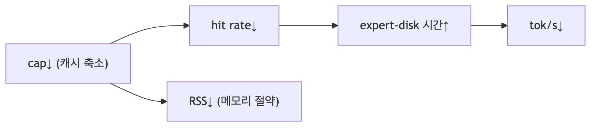{width=6.2in}
- 즉 **메모리↔속도 trade-off 곡선**을 수치화 → `docs/40`(tradeoff)·`docs/50`(자원)의 정성 주장을 정량 근거로 대체.

### 3. 산출물 연결
- 정확성 불변성(로컬) → `docs/31-engine-verification.md` 보강.
- 성능 곡선(H100) → 수집 후 `docs/40`/`docs/50` 표 갱신 권장.

### 4. 왜 로컬(Mac)에서 성능을 안 재는가
- Mac은 RAM ~16GB·NEON·macOS I/O(fadvise 미지원, `F_NOCACHE`/mlock 경로) → **콜리브리의 Linux NVMe 성능과 비대표적**. 정확성만 로컬로, 성능은 타깃 박스에서.

### 출처
- 로컬 실행 로그(cap 스윕): 본 세션.
- 엔진: `external/colibri/c/olmoe.c`, `glm.c` (hit rate/PROFILE 출력).
- 변환: `external/colibri/c/tools/convert_olmoe.py`; OLMoE: `data/olmoe/SOURCE.md`.
- 스크립트: `scripts/olmoe_streaming_bench.sh`.


## 84 · (1) ThinkFlow gpt-oss-120b 스왑 운영자 런북/체크리스트

`docs/81`의 설계를 **운영자가 그대로 따라 실행**할 수 있는 체크리스트로 확정한다. 실행은 사용자가 직접(단일 H100이라 컷오버는 유지보수 창 필요). 스크립트: `scripts/thinkflow_swap_rehearsal.sh`.

### 0. 현재 상태 근거 (사용자 제공)
- GPU 80GB 중 **99.4% 예약**(20b vLLM의 KV 과다예약) · **사용률 0%**(idle) · 43°C/79W.
- CPU 97% idle · RAM 228GB 가용 · Swap 0.
- 함의: **120b를 올리려면 20b 컨테이너를 내려 VRAM을 비워야 한다**(동시 상주 불가). 컷오버는 짧은 창이면 충분(연산 idle이라 트래픽 적은 시간 선택 용이).

### 1. 사전 준비 (무중단 · 언제든 가능)
- [ ] 저장소 확보: `git clone https://github.com/atozwizard/Colibri_Survey && cd Colibri_Survey`
- [ ] `bash scripts/thinkflow_swap_rehearsal.sh --preflight` 실행하여 아래 자동 점검 통과:
  - [ ] hf_cache 디스크 여유 ≥ 70GB (서버 3.2TB → 여유)
  - [ ] `vllm/vllm-openai:v0.21.0` 이미지 존재
  - [ ] **120b 가중치 사전 다운로드**(`openai/gpt-oss-120b`, ~63GB) — 네트워크만, GPU/서빙 무관
  - [ ] VRAM 산술 sanity (util 0.92 → 73.6GB 예약, 가중치 ~63GB, KV 여유 ~10GB)
  - [ ] 롤백 자산(`/home/ubuntu/vllm/run_vllm.sh`, 20b) 존재
- [ ] **BGE를 CPU로 이전** 결정 시: `THINKFLOW_EMBED_MODEL`/`RERANKER` 디바이스를 CPU로(경로 동일). 48코어면 RAG 임베딩/리랭크 throughput 충분.
- [ ] KPI A/B 기준선 확보: 현행 20b로 `kpi` 케이스 돌려 `hit_rate`/`consistency` 스냅샷 저장.

### 2. 컷오버 (유지보수 창 · 파괴적 · CONFIRM=yes)
> 트래픽 최저 시간대 선택. 예상 다운타임 = 120b 로드 시간(수십 초~수 분).

- [ ] 공지/점검 배너(운영콘솔).
- [ ] `CONFIRM=yes bash scripts/thinkflow_swap_rehearsal.sh --cutover`
  - 20b 컨테이너 정지 → VRAM 해제
  - 120b 기동(`--served-model-name gpt-oss-20b` 유지 시 앱 config 무변경 과도기)
  - `/v1/models` 워밍업 대기 → 스모크(`/v1/chat/completions`)
- [ ] 스모크 응답 정상 확인(한국어 질의 1건).
- [ ] `nvidia-smi`로 VRAM 여유·OOM 없음 확인(32k 컨텍스트 요청 1건으로 KV 압박 테스트).

### 3. 품질 검증 (전환 확정 전)
- [ ] KPI 하네스로 120b `hit_rate`/`consistency` 측정 → 1의 20b 기준선과 **A/B 비교**.
- [ ] 판정:
  - 품질 **≥ 기존** → 전환 확정(4단계).
  - 품질 **열세/오류** → 즉시 롤백(5단계).
- [ ] RAG 지연(BGE CPU 이전 시 임베딩/리랭크 p95) 허용범위 확인.

### 4. 전환 확정
- [ ] LLM 엔드포인트(config 단일 출처) 정식 반영. 원하면 `--served-model-name`을 `gpt-oss-120b`로 개명.
- [ ] 점검 배너 해제, 모니터링 정상 확인.
- [ ] 구 컨테이너/리소스 드레인.

### 5. 롤백 (회귀 시)
- [ ] `CONFIRM=yes bash scripts/thinkflow_swap_rehearsal.sh --rollback` (20b 복귀)
- [ ] 스모크 + KPI 재확인.

### 6. 사후
- [ ] 24~48h 모니터링(지연/에러율/hit_rate 추이).
- [ ] VRAM 과다예약 재점검: 120b에 맞춰 `--gpu-memory-utilization` 재튜닝(현재 20b는 99.4% 예약 = 과다).
- [ ] 결과를 `docs/81`에 실측치로 추기(예상 대비 KV 여유·품질 델타).

### 대안 (스왑 없이도 개선)
- 스왑이 부담이면, 최소 조치로 **현행 20b의 `--gpu-memory-utilization`을 낮춰**(99.4%→적정) VRAM 여유를 확보하는 것만으로도 안정성↑. 단 품질 상한(20B)은 그대로 → 품질 목표가 크면 120b 스왑 권장.

### 참조
- 설계: `docs/81-thinkflow-upgrade-design.md`
- 스크립트: `scripts/thinkflow_swap_rehearsal.sh`
- 모델 근거: `docs/80-olmoe-and-h100-recommendations.md`


## 85 · 2모델 교차검증(골든셋 라우팅 평가) 자원 분석

질문: ThinkFlow의 **2모델 교차검증(골든셋 라우팅 평가)** 프로세스에서 두 모델을 올린다면, **colibri로 gpt-oss-120b와 Gemma 4 31B를 동시에 쓸 수 있나?** 불가하면 예상 필요자원은?

### 요약 (3줄)
- **colibri로 두 모델 동시 호스팅은 불가.** Gemma 31B는 **Dense → colibri(MoE expert 스트리밍) 원천 부적합**, gpt-oss-120b는 MoE지만 **colibri 어댑터 미구현**(현재 glm/olmoe 전용).
- 게다가 이 박스에선 **두 모델이 각각은 단일 H100(80GB)에 들어간다**(120b MXFP4 ~63GB, Gemma 31B bf16 ~62GB / Q4 ~17.5GB) → colibri("VRAM 초과" 전용)의 존재 이유 자체가 없음.
- 진짜 제약은 "**동시**"뿐: 63+62(또는 +17.5)는 80GB를 초과해 **한 H100에 동시 상주는 불가**. 골든셋 평가는 오프라인 배치이므로 **순차 스왑**이 가장 합리적.

### 1. colibri 적용 가능성 판정

| 모델 | 구조 | colibri 적용 | 이유 |
|---|---|---|---|
| **Gemma 4 31B** | **Dense** | ❌ 불가 | 스트리밍할 expert 없음. dense를 디스크 스트리밍하면 토큰마다 전체(17.5GB@int4)를 읽어야 함(=layer-streaming, colibri 미지원). `docs/62 §2.1` |
| **gpt-oss-120b** | MoE(128e/5.1B활성) | △ 이론상 가능, 현재 불가 | MoE라 원리는 맞으나 **엔진 어댑터 미구현**(GQA+sliding window, glm_moe_dsa 아님). `docs/61`, `docs/82` |

→ **"colibri로 120b + Gemma 31B 둘 다"는 불가.** 하나(Gemma)는 구조적으로, 하나(120b)는 구현 미비로.

### 2. 왜 애초에 colibri가 불필요한가 (핵심)
colibri는 "모델이 **VRAM/RAM에 안 들어갈 때**"의 기법이다(`docs/40`, `docs/70`). 그런데 이 박스(H100 80GB)에서:
- gpt-oss-120b: MXFP4 ~63GB → **단일 H100에 들어감**.
- Gemma 4 31B: bf16 ~62GB(또는 Q4 17.5GB) → **단일 H100에 들어감**.

즉 **각각은 그냥 vLLM로 VRAM에 올리는 게 압도적으로 빠르다.** 문제는 오직 **둘을 동시에** 올릴 수 없다는 것(합계 초과).

### 3. 2모델 동시 상주 가능성 (단일 H100 80GB)
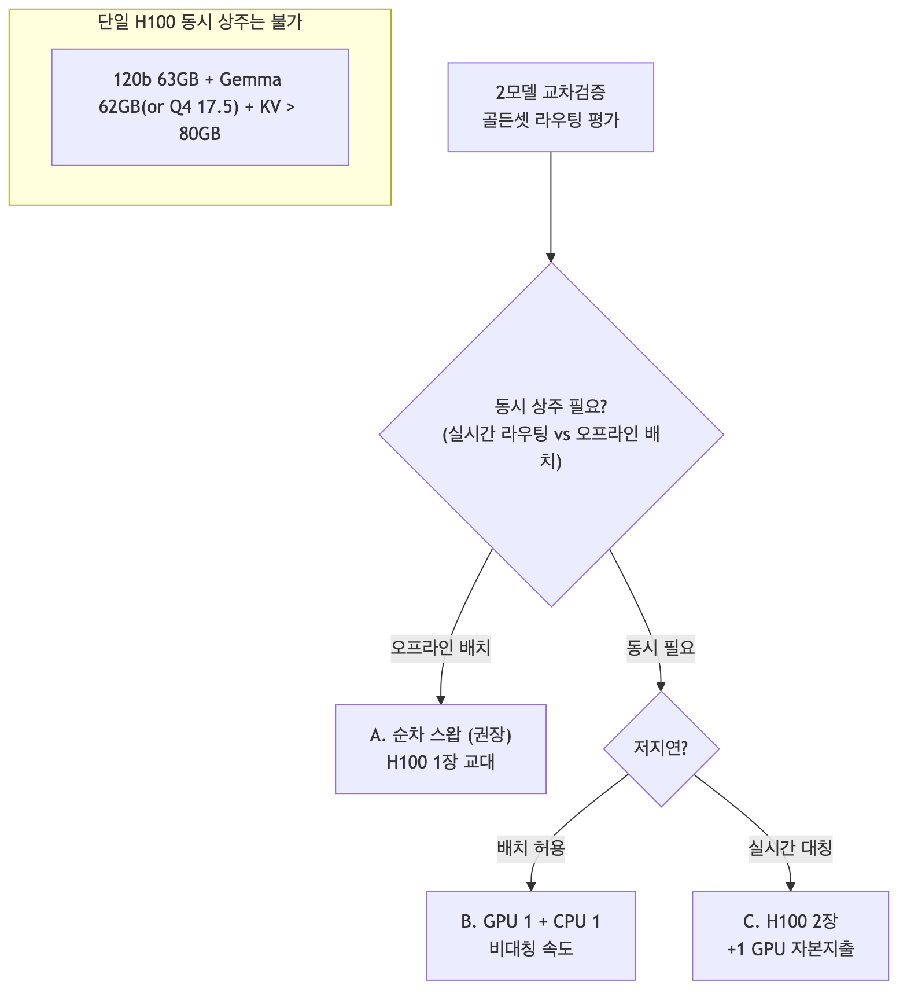{width=6.2in}
VRAM 산술(단일 80GB):
- 120b(63) + Gemma Q4(17.5) = **80.5GB (KV·BGE 이전에 이미 초과)** → 불가.
- 120b(63) + Gemma bf16(62) = 125GB → 크게 초과.

### 4. 실행 구성별 예상 필요자원

| 구성 | GPU | 추가 RAM | 디스크 | 동시성 | 추가 HW | 적합 상황 |
|---|---|---|---|---|---|---|
| **A. 순차 스왑(GPU)** | H100 80GB ×1(교대) | 낮음 | 두 모델 ~80GB | ❌ | **없음** | **오프라인 골든셋 평가(권장)** |
| **B. GPU 1 + CPU 1** | H100 80GB ×1 | +20~65GB | ~80GB | ✅(비대칭) | **없음** | 동시 필요·지연 관대 |
| **C. H100 2장** | H100 80GB ×2 | 낮음 | ~80GB | ✅(대칭) | **H100 1장** | 실시간·저지연 대칭 |

#### 4.A 순차 스왑 (권장 — 골든셋 평가는 배치)
- **필요자원**: H100 80GB 1장(한 번에 하나). RAM/디스크 여유(현 박스로 충분). **추가 하드웨어 0.**
- 절차: Phase1 `gpt-oss-120b` 적재 → 골든셋 전량 추론·기록 → 스왑 → Phase2 `Gemma 31B` 적재 → 동일 골든셋 추론 → 두 결과셋을 **오프라인 교차검증**(agreement/consistency/judge).
- 비용: 단계 전환 시 모델 재적재(수십 초~수 분). 동시성 없음(배치라 무방).
- 도구: `scripts/thinkflow_swap_rehearsal.sh`(모델명만 바꿔 재사용).

#### 4.B 동시 (GPU 1 + CPU 1)
- **GPU 측**: 한 모델(예 Gemma 31B bf16 62GB, 또는 gpt-oss-120b 63GB) — vLLM.
- **CPU 측**: 나머지 모델을 CPU 추론.
  - `gpt-oss-120b`(MoE): int4 ~63GB를 **251GB RAM에 전량 적재**(디스크 스트리밍 최소). 48스레드 CPU matmul → **추정 3~8 tok/s**. colibri 어댑터가 있으면 colibri, 없으면 llama.cpp/vLLM-CPU(gpt-oss 지원 시).
  - `Gemma 31B`(Dense): llama.cpp CPU, Q4 ~17.5GB RAM → **추정 2~5 tok/s**.
- **필요자원**: H100 1장(62~63GB) + CPU 모델용 RAM(20~65GB) + 다수 코어. **현 박스(251GB RAM·48코어)로 수용, 추가 HW 0.**
- 주의: CPU 측 throughput이 낮아 **골든셋 규모가 크면 시간 소요**. 실시간 라우팅엔 부적합.

#### 4.C 실시간 대칭 (H100 2장)
- 두 모델을 각 GPU에 상주 → 동시·저지연·대칭. **H100 1장 추가 자본지출** 필요.
- 또는 한 장에 소형 양자화 2개(예 Gemma Q4 17.5 + 다른 소형)만 가능 — 120b는 이 방식 불가.

### 5. colibri가 그래도 기여할 수 있는 유일 지점
- 구성 B에서 **gpt-oss-120b를 CPU 측에 올릴 때** colibri(어댑터 구현 시)가 후보. 그러나:
  - 이 박스는 120b가 **GPU에 통째로 들어가므로**(63<80GB), colibri CPU 스트리밍은 **더 느린 선택** → 실익 없음.
  - colibri가 실제로 유리한 지점은 **H100로도 안 들어가는 초대형 MoE**(GLM-5.2 744B 등)를 이 박스에서 굳이 돌릴 때뿐.

### 6. 권고
1. **2모델 교차검증엔 colibri를 쓰지 말 것.** Gemma(dense)는 부적합, 120b는 어댑터 미비이며, 무엇보다 **각 모델이 H100에 들어가므로 스트리밍이 불필요**.
2. **오프라인 골든셋 평가 → 구성 A(순차 스왑)** 가 정답: 추가 하드웨어 0, 가장 단순·정확.
3. **동시 실행이 꼭 필요하면 → 구성 B**(GPU+CPU, 비대칭 속도, 현 박스 수용) 또는 **구성 C**(H100 2장, 자본지출).
4. 라우팅 평가 특성(배치·지연 관대)상 A로 충분하며, 실시간 A/B 트래픽 분기가 필요할 때만 B/C를 검토.

### 출처
- 모델 크기·구조: `docs/80`, `docs/62`, `data/topics/apply-gpt-oss/`, `data/topics/apply-gemma/`
- colibri 적용 원칙: `docs/60`, `docs/61`, `docs/62`, `docs/82`
- 스왑 도구: `scripts/thinkflow_swap_rehearsal.sh`


# 제8부 · 상태·마감·참고문헌


## 90 · 서베이 상태 · 마감 · 재개 안내

colibri 서베이의 최종 상태를 정리한다. **문서/코드 산출물은 완결**되었고, 유일하게 남은 것은 *선택적* 서버 성능 실측(정성 주장에 실수치를 채우는 보강)이다.

### 1. 완료 상태 (Status)

| 영역 | 산출물 | 상태 |
|---|---|---|
| 개요·아키텍처 | `00`, `10` | ✅ 완료 |
| 핵심 기술(MoE 스트리밍·MLA·speculative) | `20`, `21`, `22` | ✅ 완료 |
| 로컬 빌드/실행 | `30` | ✅ 완료 |
| **엔진 정확성 실검증** | `31` | ✅ **실행됨**(C테스트 4종 + tiny GLM oracle 32/32) |
| 분석(tradeoff·자원·타모델) | `40`, `50`, `60`, `61`, `62` | ✅ 완료 |
| 경영·기술 통합 브리프 | `70` | ✅ 완료 |
| OLMoE 위상 · H100 추천 | `80` | ✅ 완료 |
| **(c) ThinkFlow 업그레이드 설계+런북** | `81`, `84` | ✅ 완료(실행은 운영자) |
| **(a) MXFP4→int4 변환기** | `82` + `scripts/mxfp4_to_int4_prototype.py` | ✅ 레이아웃 검증+selftest PASS |
| **(b) 스트리밍 실측** | `83` + `scripts/olmoe_streaming_bench.sh` | 🟡 로컬 정확성 증명 완료 / **서버 성능수치 보류** |

### 2. 검증으로 증명된 사실 (근거 있는 결론)
1. **엔진 정확성**: `glm.c`가 transformers GlmMoeDsa 오라클과 token-exact(32/32). (`31`)
2. **스트리밍 투명성**: 캐시 cap을 8→1로 줄여도 출력 불변(32/32) → LRU 축출/재적재는 정확성에 무해. (`83 §1`)
3. **gpt-oss 변환 경로**: 실제 MXFP4 레이아웃(expert MLP만, grouped `[E,O,90,16]`) 확인 + int4 변환 수학 검증(round-trip rel-err 0.071). (`82`, `data/topics/apply-gpt-oss/weight-layout-verified.md`)
4. **적용 판단**: colibri는 "VRAM 초과" 영역 전용 → ThinkFlow(H100에 들어가는 모델)엔 부적합, 대신 서빙 모델 업그레이드가 정답. (`80`, `81`)

### 3. 보류된 유일한 항목: 서버 성능 실측 (선택)
- **무엇**: OLMoE 실가중치로 cap↔hit-rate↔tok/s↔expert-disk **성능 곡선** 수집.
- **왜 보류**: 필수 아님. 서베이 결론은 이미 확립. 이는 `40`/`50`의 정성 표를 정량화하는 보강일 뿐.
- **왜 쉬움(재개 시)**: colibri 벤치는 **GPU 무관**(CPU+디스크+RAM만). ThinkFlow 서버는 CPU 97% idle·RAM 228GB 여유 → GPU가 꽉 차 있어도 무방해.

#### 재개 절차 (원할 때)
```bash
# ThinkFlow H100 박스에서 한 줄(격리 내장: 2~4코어, 저 IO 우선순위):
git clone https://github.com/atozwizard/Colibri_Survey && cd Colibri_Survey
CORES=0-3 MEM=8G bash scripts/olmoe_streaming_bench.sh
# 결과(cap, hit_rate, tok/s, expert-disk, RSS)를 docs/40·50 표에 추기.
```

### 4. (1) ThinkFlow 스왑 — 운영자 실행 대기
- 실행 가능 상태로 확정됨: 런북 `docs/84` + 스크립트 `scripts/thinkflow_swap_rehearsal.sh`.
- 권장 순서: `--preflight`(무중단, 지금) → 유지보수 창에서 `--cutover` → KPI A/B → 확정/롤백.

### 5. 저장소 지도 (요약)
- `docs/` 00~90: 분석·설계·검증 문서.
- `scripts/`: 변환기 프로토타입 / 스트리밍 벤치 / 스왑 런북 스크립트.
- `data/`: GLM·colibri·토픽별·OLMoE·gpt-oss 레이아웃 근거 자료.
- `external/colibri/`: 벤더링된 원본 소스(+ 로컬 빌드 산출물은 `.gitignore`).

### 6. 결론
서베이는 **문서·코드·로컬검증 기준으로 완결**되었다. 서버 성능 실측과 120b 스왑은 *운영 실행 단계*로, 준비물(스크립트·런북·프로토콜)이 모두 갖춰져 필요 시 즉시 재개 가능하다.


## 99 · 참고문헌 (References)

### colibrì
- JustVugg, **colibri** (GitHub), Apache-2.0. https://github.com/JustVugg/colibri — 커밋 `5254470` (2026-07-13), `external/colibri/`에 vendored.
- 파파누보, "25GB RAM으로 744B AI 모델을 실행하다" (2026-07-13). https://digitalbourgeois.tistory.com/m/3364 — `data/colibri/tistory-3364-snapshot.md`
- jamilxt, "Colibri: Running a 744B AI Model on Your Laptop" (DEV). https://dev.to/jamilxt/colibri-running-a-744b-ai-model-on-your-laptop-dpp

### GLM-5.2
- Zhipu AI, **GLM-5.2** (Hugging Face). https://huggingface.co/zai-org/GLM-5.2 (MIT), arXiv:2602.15763
- Zhipu AI, **GLM-5** (GitHub). https://github.com/zai-org/GLM-5
- Z.ai, "GLM-5.2: Built for Long-Horizon Tasks". https://z.ai/blog/glm-5.2
- IndexShare, arXiv:2603.12201

### MLA / KV 압축
- DeepSeek-AI, **DeepSeek-V2** (MLA 최초 제안), arXiv:2405.04434. — `data/topics/mla-kv/paper-deepseek-v2-arxiv-2405.04434.txt`
- **MHA2MLA** (ACL 2025). https://aclanthology.org/2025.acl-long.1597.pdf — `data/topics/mla-kv/paper-mha2mla-acl-2025.txt`
- Chris McCormick, "The Inner Workings of MLA". http://mccormickml.com/2025/04/26/inner-workings-of-mla/
- Xu'Blog, "MLA: DeepSeek V2/V3 Engineering View". https://xuquant.com/en/posts/foundation-models/deepseek_series1_mla/

### MoE offloading / 스트리밍
- Eliseev & Mazur, "Fast Inference of MoE LM with Offloading", arXiv:2312.17238. — `data/topics/moe-streaming/paper-moe-offloading-arxiv-2312.17238.txt`
- "Efficient CPU-GPU Collaborative Inference for MoE-based LLMs", arXiv:2512.16473. — `data/topics/moe-streaming/paper-cpu-gpu-collab-arxiv-2512.16473.txt`
- "DALI: Workload-Aware Offloading for MoE on Local PCs", arXiv:2602.03495. — `data/topics/moe-streaming/paper-dali-arxiv-2602.03495.txt`

### Speculative Decoding / MTP
- Cai et al., **MEDUSA**. https://dl.acm.org/doi/10.5555/3692070.3692273 — `data/topics/speculative-decoding/paper-medusa.txt`
- Aman's AI Journal, "Speculative Decoding" primer. https://aman.ai/primers/ai/speculative-decoding/ — `data/topics/speculative-decoding/primer-amanai-speculative-decoding.txt`
- NVIDIA, "An Introduction to Speculative Decoding". https://developer.nvidia.com/blog/an-introduction-to-speculative-decoding-for-reducing-latency-in-ai-inference/
